## VDTuner复现指导手册

[TOC]

### 假设和心理预期

**假设**：已经使用**vscode/AI IDE**连接上了**linux**服务器，linux服务器**常见工具**和**conda**配置好了，也能正常**联网**，docker也配置了且有权限，这一步不再演示。同时，我们假设所有的python库都安装好了，从0复现的时候，需要手动去安装一些库，例如**botorch**，这里不再演示。
**预期**：按照手册配置环境大约需要**1**个小时，如果运气好(bug少)可能更短一些，运行完整实验(GloVe 数据集，200次迭代)大约需要30000秒，即**8.33小时**，即半天，不过，我们先只需要能跑起来即可，无需跑通。如果要跑通整个数据集，可以在**晚上没人**的时候开始跑，第二天来检查。

**关键难点：**服务器没有sudo权限（需要使用无sudo的命令），而且时不时连不上GitHub等网站（有时候需要手动下载）。

### 下载github仓库(预计，1分钟都不到)

选择一个合适的路径，建议放在/home/目录，这样的好处是大部分路径都和GitHub仓库的一致，只需要把github仓库中的`/home/ytn/仓库名`换成`/home/xxx/VDTuner`即可.

```shell
git clone https://github.com/tiannuo-yang/VDTuner
```

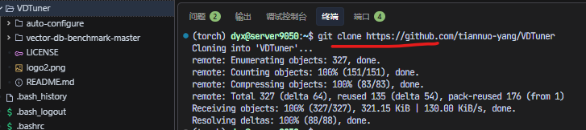

### 项目结构介绍

VDTuner包含两个文件夹，一个是auto-config文件夹，也就是我们的vdtuner，负责调优。另一个是benchmark文件夹，负责跑benchmark。

这个benchmark来自**另一个**仓库，而不是VDTuner自己制作的，它的链接：`https://qdrant.tech/benchmarks/`。它不仅可以跑不同的数据集，而且可以**选不同的向量数据库**,也就是**引擎（Engine）**，在VDTuner当中选择的是**milvus**而不是其他向量数据库，选择单机场景（**single-node**）而非分布式。

简单来说**VDTuner需要调用benchmark**来评估MOBO模型的好坏。

```text
.
├── auto-configure/                 <-- [大脑] VDTuner 的核心代码目录
│   ├── configure.py                <-- [关键] 配置文件，这里必须填所有的绝对路径！
│   ├── vdtuner/
│   │   ├── main_tuner.py           <-- [主程序] 整个优化的入口，修改迭代次数就在这
│   │   └── utils.py                <-- [工具] 负责调用 benchmark 脚本，也含有绝对路径配置
│   ├── index_param.json            <-- 索引参数搜索空间
│   ├── system_param.json           <-- 系统参数搜索空间
│   └── whole_param.json            <-- 汇总的搜索空间
│
└── vector-db-benchmark-master/     <-- [手脚] 负责实际跑 Milvus 和发请求
    ├── run_engine.sh               <-- [执行脚本] VDTuner 通过命令行调用这个脚本来跑测试
    ├── run.py                      <-- Python入口，解析命令行参数
    ├── datasets/                   <-- [数据] 数据集下载后存放的位置
    │   └── random-100/             <-- 自带的微型测试数据
    ├── engine/
    │   └── servers/
    │       └── milvus-single-node/ <-- [服务端] Milvus 的 Docker 配置
    │           ├── docker-compose.yml
    │           ├── milvus.yaml     <-- [目标] VDTuner 会不断修改这个文件来调优
    │           └── milvus.yaml.backup <-- [备份] 原始配置，用于恢复
    └── experiments/
        └── configurations/
            └── milvus-single-node.json <-- [实验配置] 定义并发数、数据集参数
```

### docker下载镜像

首先进入到milvus-single-node，意思是，我们要跑单机的milvus。

```shell
cd ~/VDTuner/vector-db-benchmark-master/engine/servers/milvus-single-node
```

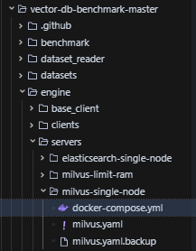

其中应该有3个文件，分别是：`docker-compose.yml  milvus.yaml  milvus.yaml.backup`。

其中VDTuner 会**不断修改**milvus.yaml文件来调优，打开milvus.yaml就可以看到索引、参数，计算相似度的方法。

如果 VDTuner 决定把索引换成 **IVF_FLAT**，它就会把这一行改成 `{"nlist": 1024, ...}`。


为了能着恢复默认的.yaml文件，这里有一个备份`milvus.yaml.backup`，如果没有备份过，需要手动备份一下`cp milvus.yaml milvus.yaml.backup`。

关键是来看`docker-compose.yml`，首先我们需要改其中`volumes`的路径，把`/home/ytn/仓库名`换成`/home/xxx/VDTuner`，不然路径出错了。


```yml
/home/dyx/VDTuner
```

后面的指令执行后，会有一个`volumes`文件夹出现在`milvus-single-node`文件夹当中。

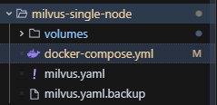

接下来，需要执行下面的指令来**启动 Milvus 服务**。确保执行的路径中含有`docker-compose.yml`文件，其中milvus的配置由`milvus.yaml`指定。

```shell
docker compose up -d
```

*   **up**: 启动。它会自动完成三个动作：下载镜像（Pull）、创建容器（Create）、启动容器（Start）。
*   **-d**: **Detached (后台运行)**。
    *   如果你不加 `-d`，容器的日志会直接霸占你的屏幕，你一按 `Ctrl+C`，容器就挂了。
    *   加了 `-d`，它就在后台默默工作，把控制权还给你。

然而，这条命令可能会遇到一些错误：

**情况1：之前的容器还有残留**，需要手动停止，之后执行

```shell
docker compose down -v
```

1.  **执行 `docker compose down -v`：** 
    *   **后果：** 存储在 Milvus 容器外部的**所有数据卷**都会被删除。这意味着存储在这些数据卷中的**所有向量数据(如，词向量妈妈[20,30,8...])、元数据和索引(如表名、向量维度)都会被永久清除**。
    *   **结果：** 重新 `docker compose up` 启动后，Milvus 数据库将是一个**全新的、空的状态**。后面会看到这个`-v`是**有必要**的，确保删除按照之前索引构建的向量，如果不删除，可能会加载旧索引构建的向量进行向量查找。

2.  **执行 `docker compose down`（不加 `-v`）：**
    *   **后果：** 容器和网络会被停止和删除，但是关联的**数据卷会被保留下来**。
    *   **结果：** 重新 `docker compose up` 启动后，Milvus 会重新挂载（re-mount）之前的数据卷，因此**原有的向量数据和元数据都会保留**，服务状态得以恢复。

**情况2：连不上网**

可以检查是否能连接google

```shell
curl www.google.com
```

如果不行，需要使用本地代理(如何获取代理不说了)，指定代理端口为自己的代理端口，例如7890，我这里是33210

本地端：

```shell
ssh -vvv -N -R 33210:localhost:33210 -p 端口号 用户名@ip地址
```

服务器端：

```shell
export http_proxy=http://127.0.0.1:33210; #HTTP
export https_proxy=http://127.0.0.1:33210; #HTTPS
```

之后检查，发现可以联网：

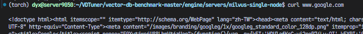

**情况3：可以联网，但是镜像就是下不下来**

原因分析：虽然终端(shell)里的代理已经修改了，然而，后台的**守护进程**（真正干活的）代理没有修改，除非去修改doker配置文件，然而这很繁琐

说人话：就算是`curl www.google.com`成功了，**如果本来不行现在还是不行。**

解决方案，使用类似于**毫秒镜像**(收费不贵，先去毫秒镜像`https://1ms.run/`把这个搞定)这样的网站作为下载源。

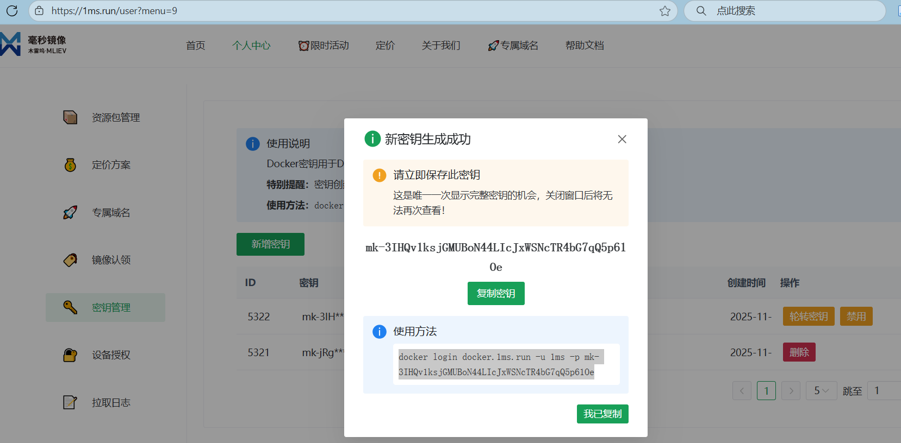

登录毫秒镜像，生成一个密钥。，然后服务器shell中登录。

```shell
docker login docker.1ms.run -u 1ms -p [你的毫秒镜像密钥]
```

然后把`docker-compose.yml`中的三个img换成毫秒镜像的通道。

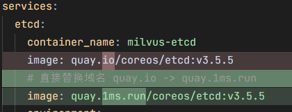

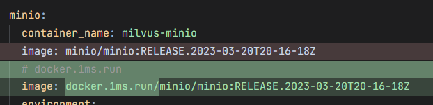

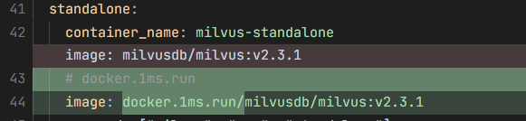

```yml
image: quay.1ms.run/coreos/etcd:v3.5.5
image: docker.1ms.run/minio/minio:RELEASE.2023-03-20T20-16-18Z
image: docker.1ms.run/milvusdb/milvus:v2.3.1
```

再次执行`docker compose up -d`，会发现成功了。

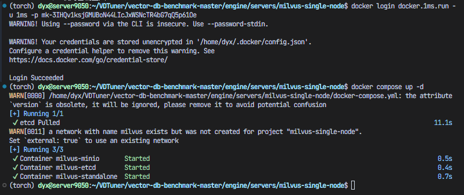

之后执行

```shell
 docker compose ps
```

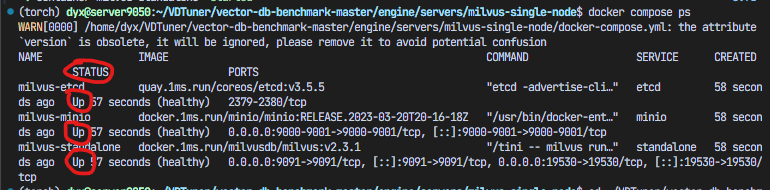

发现状态栏都是UP，说明容器健康

### 跑通最小的benchmark：random-100

我们需要跑通`run_engine.sh`，而`run_engine.sh`的核心就是运行`run.py`，**简单说，我们需要跑一个脚本，这个脚本中使用python运行run.py。**

然而，这里的`run.py`当中其实有一个雷，就是这句话，这里想要指定作者的python路径，就会找不到，注释之后，就可以自动寻找我们的路径。

```python
# sys.path.append('/home/ytn/.local/lib/python3.11/site-packages')
```

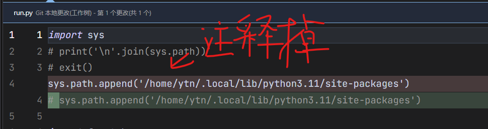

`run.py`是整个 benchmark 的入口。它**不关心具体的数据库细节**，只负责流程控制：

1. 读取配置（我们要测谁？**测什么数据？**）。
2. 下载数据。
3. 指挥具体的客户端去干活。

在正式开始调优之前，需要先测试一下能否跑数据集，然而，完整跑一整个数据集太慢了，所以我们指定

```shell
random-100
```

作为我们的数据集，相当于测试随机的100维向量。

首先去到数据集目录

```shell
cd ~/VDTuner/vector-db-benchmark-master
```


准备执行./run_engine.sh，需要加一个可执行权限（如果没有加）。

```shell
chmod +x ./run_engine.sh
```

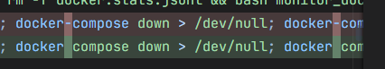

>因为是在实验室服务器上，我**没有 sudo 权限**，所以原仓库里那种暴力重启 Docker、sudo 删除文件的脚本是跑不通的。
>
>同时，由于这份代码使用的是老版本docker，使用的是`docker-compose`，而我们是新版的docker，应该用`docker compose`，中间不用`-`而要用空格。
>
>这里写了一个更优化的版本，去掉了sudo。首先关闭milvus，删掉之前插入的向量，然后根据milvus.yaml，重启milvus，然后开始测试数据集。

将下面的脚本`run_engine_test.sh`放到`run_engine.sh`相同目录

赋予执行权限，然后执行

```shell
chmod +x ./run_engine_test.sh
./run_engine_test.sh
```

需要拷贝的脚本

```shell
#!/usr/bin/env bash
set -e

# 获取脚本所在目录
SOURCE_DIR=$(cd $(dirname ${BASH_SOURCE[0]}); pwd)
# 默认值设置
SERVER_PATH=${1:-"milvus-single-node"}
ENGINE_NAME=${2:-"milvus-p10"}
DATASETS=${3:-"random-100"} # 默认先用 random-100 跑通
SERVER_HOST="127.0.0.1"

# 定义 Milvus 目录
MILVUS_DIR="$SOURCE_DIR/engine/servers/$SERVER_PATH"
MONITOR_DIR="$SOURCE_DIR/monitoring"

echo "======================================="
echo "🛠️  开始测试流程"
echo "Engine: $ENGINE_NAME | Dataset: $DATASETS"
echo "======================================="

# 1. 启动 Docker 资源监控 (后台运行)
# 注意：确保 monitor_docker.sh 有执行权限
echo ">>> [Step 1] 启动后台监控..."
if [ -f "$MONITOR_DIR/monitor_docker.sh" ]; then
    # 清理旧日志
    rm -f "$MONITOR_DIR/docker.stats.jsonl"
    # 后台运行
    nohup bash -c "cd $MONITOR_DIR && ./monitor_docker.sh" > /dev/null 2>&1 &
    MONITOR_PID=$!
    echo "    监控进程 PID: $MONITOR_PID"
else
    echo "⚠️  未找到监控脚本，跳过监控步骤。"
fi

# 2. 重置 Milvus 环境 (Down -> Clean -> Up)
echo ">>> [Step 2] 重置 Milvus..."
cd "$MILVUS_DIR"
docker compose down -v  # 停止并删卷
sleep 5                 # 稍微缓冲一下

# 启动容器
docker compose up -d

# 3. 等待启动 (你的经验数据：90s，这里为了测试可以用短一点，比如 random-100 可能 30s 就够)
echo ">>> [Step 3] 等待服务启动 (90s)..."
sleep 90

# 4. 运行 Python 测试
echo ">>> [Step 4] 运行 Benchmark..."
# 代理设置
export no_proxy="localhost,127.0.0.1,::1"

# 切换回根目录运行脚本
cd "$SOURCE_DIR"
# 这里的 python 路径按你服务器实际情况写
python run.py --engines "$ENGINE_NAME" --datasets "${DATASETS}" --host "$SERVER_HOST"

# 5. 测试结束，停止监控和容器
echo ">>> [Step 5] 收尾工作..."

# 杀掉监控进程
if [ -n "$MONITOR_PID" ]; then
    kill $MONITOR_PID || true
    # 移动监控日志
    mkdir -p "$MONITOR_DIR/results"
    # 构造文件名
    LOG_NAME=$(echo "$ENGINE_NAME" | sed -e 's/[^A-Za-z0-9._-]/_/g')
    mv "$MONITOR_DIR/docker.stats.jsonl" "$MONITOR_DIR/results/${LOG_NAME}-docker.stats.jsonl" 2>/dev/null || true
    echo "    监控日志已保存。"
fi

# 停止容器 (可选，如果你想保留现场查看日志，可以注释掉这行)
# cd "$MILVUS_DIR" && docker compose down

# 6. 打印结果
echo "📊 测试结果摘要:"
# 获取最新的结果文件
RES_FILE=$(ls -t results/ | grep -v 'upload' | head -n 1)
if [ -n "$RES_FILE" ]; then
    cat "results/$RES_FILE" | grep -E "mean_precisions|rps|p95_time" | sed 's/.*: \([0-9.]*\),/\1/'
else
    echo "0 0 0"
fi
```

测试发现可以跑通：


**现象分析**：之所以能输出召回率、速率（RPS）、p95_time(95%的查询都不超过的时间)，是因为脚本当中对所有的results进行了排序，按照修改时间排，获取了最近的那一个日志，然后从中挑选出了mean_precisions/rps/p95_time等信息，然后打印了出来。

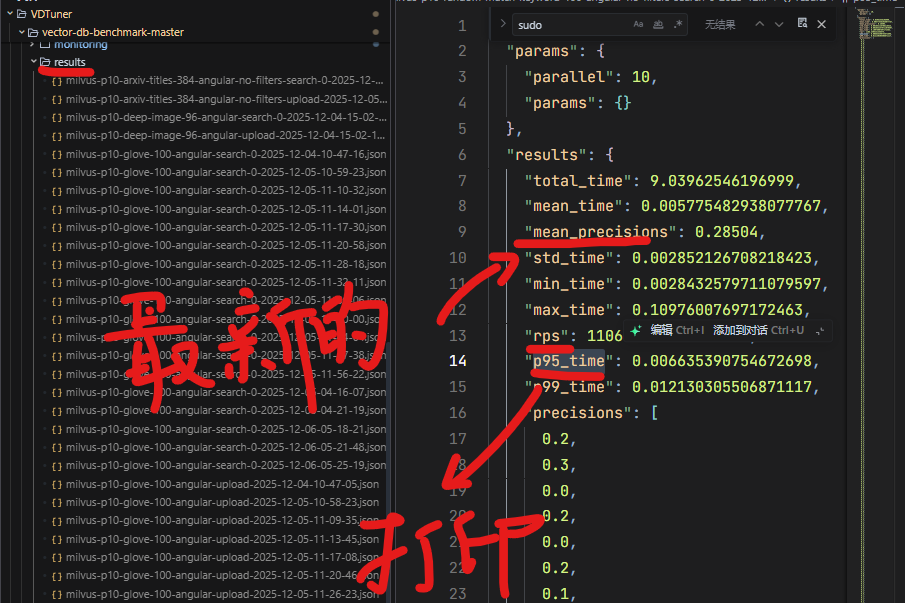

**提示**：经过我的测试，docker启动milvus服务之后，等待90秒是必须的，只设60秒会导致连接失败。


由于调优的时候rps是不计算milvus服务重启的时间的，所以增加到90s不会影响到rps。

### 理解跑数据集的逻辑

首先是数据集，去到**datasets文件夹**当中，其中有所有下载的数据集。

可以查看`datasets.json`，其中有所有可以下载的数据集（都没有下载，需要先下载，然后才能跑数据集）

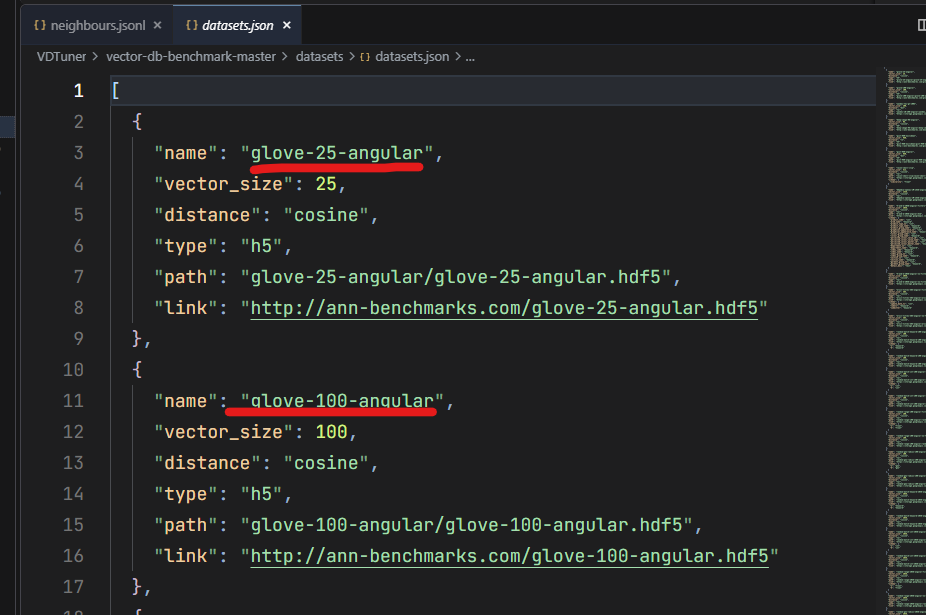

唯一下载好的是random-100数据集。

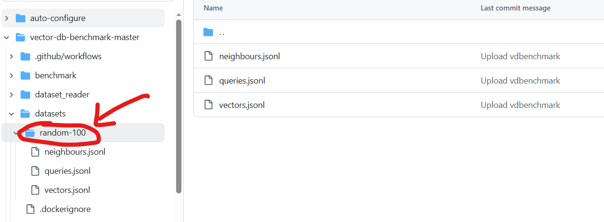

首先，random-100是一个直接放到了GitHub仓库中的默认数据集，不需要下载，没有下不下来的风险。

这个数据集当中有3个文件，第一个是**数据库向量**文件，也就是vectors.jsonl，其中有100个维度为100的向量。

然后是**查询向量文件`vectors.jsonl`**，总共有10个维度为100的查询向量。

最后是**标准答案**，也就是10个向量的最近邻居（K=1，所以每个向量的查询结果只有一个向量）

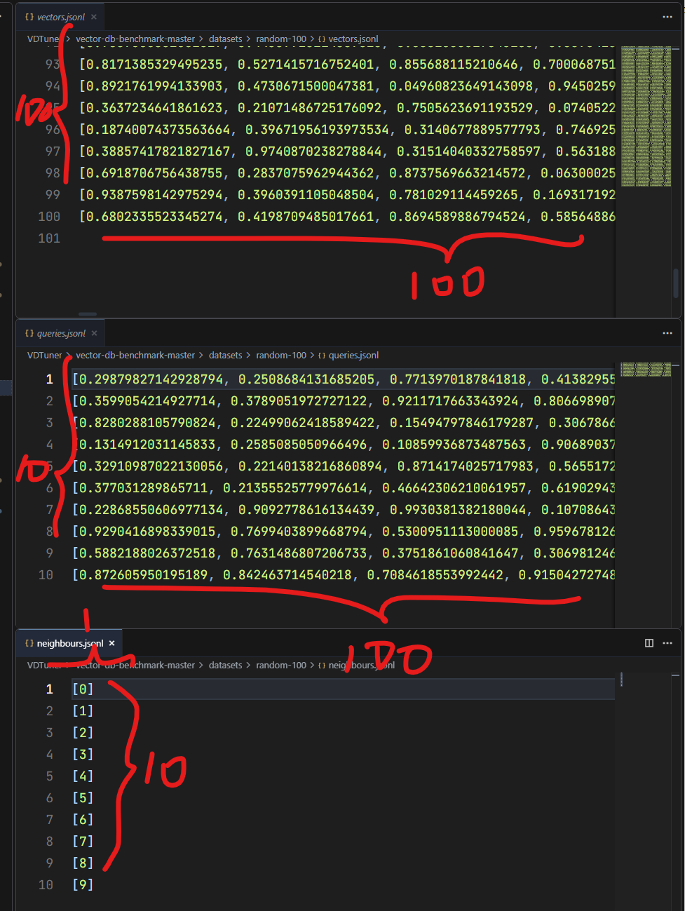

然后我们来看查询的结果，去到**results**文件夹当中，可以发现其中存储了一些结果，例如：
`milvus-p10-random-100-search-0-2025-12-03-06-42-53.json`

格式是**向量数据库名-数据集名-查询/构建-时间**

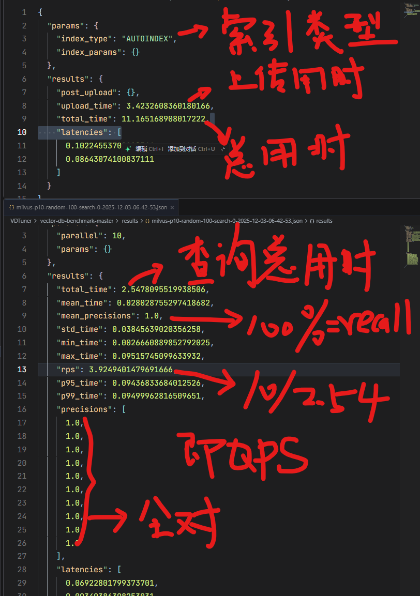

### 即使跑过，也再跑一遍

原版的代码中有一个小问题：就是，如果指定向量数据库（milvus），指定数据集（random100），只要跑过一次，就不会继续运行，而是会说，**结果已经存在了，所以不运行了。**
类似于这样的提示：

```shell
/home/dyx/VDTuner/vector-db-benchmark-master/datasets/random-100 already exists
Skipping run for milvus-p10 since it already ran 1 search configs previously
>>> [Step 5] 收尾工作...
```

然而，这是**不好的**，因为VDTuner进行向量数据库系统调优的时候，针对的是同一个数据库（milvus），而且是固定一个数据集，例如glove，不断修改milvus的配置，如果这样跑了一次就跑不了。

原版的`run_engine.sh`采取的方案是每次清空`results/*`文件夹，这样的问题是，每次的结果都被删除了。

因而，在我们的脚本`run_engine_test.sh`不选择去删除results/*文件夹，而是去修改一下python代码，无论results当中有什么东西，都重跑一次。

而修改这个东西也是特别简单的，只需要修改

```shell
/home/dyx/VDTuner/vector-db-benchmark-master/engine/base_client/client.py
```

当中的这一行，把skip_if_exists给成`False`

```python
        skip_if_exists: bool = False,
```

这样，即使结果存在，也不会跳过了。

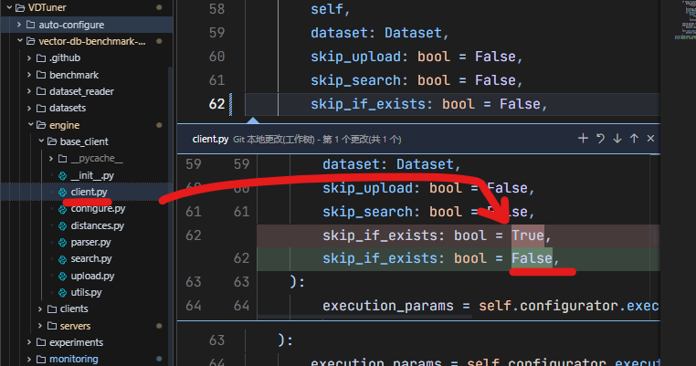

### 明确论文中跑了哪几个数据集

首先要明确，VDTuner论文中总共跑了多少个数据集，总共3个核心数据集，作者还额外测评了2个，所以总共是5个。

其中第一个数据集的名字是：**glove-100-angular**

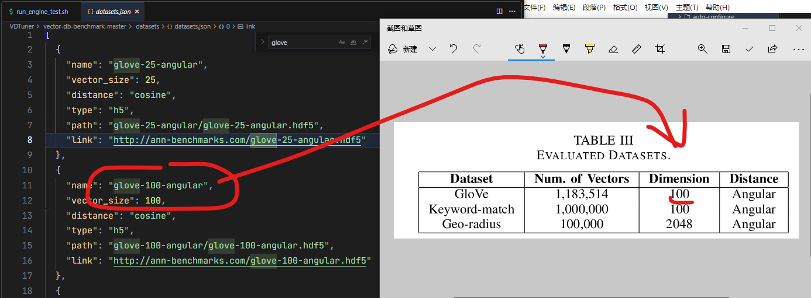

这是由于论文中提到了维度是100，而datasets.json当中有25、100的两个数据集，所以应该是100。

第二个数据集的名字是：**random-match-keyword-100-angular-no-filters**

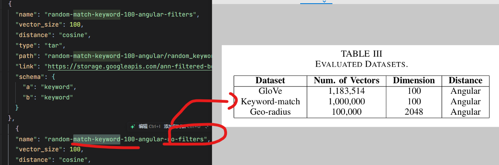

这里有一个备选项，就是filters，在向量数据库当中，filters的意思是，不仅根据向量相似度查询，而且外加一些限制条件，进行过滤。

然而，VDTuner在测试纯粹的、无附加条件的向量搜索性能的数据集，所以应该是no-filters

第三个数据集的名字是：**random-geo-radius-2048-angular-no-filters**

同样，应该是no-fiters

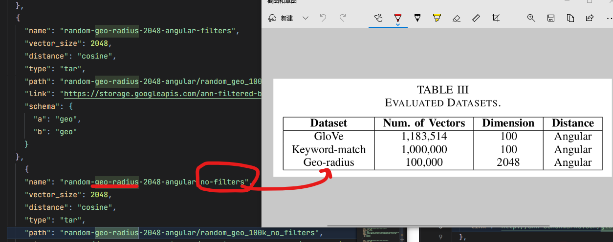

第四个数据集的名称是：**arxiv-titles-384-angular-no-filters**

同样应该是**no-filters**

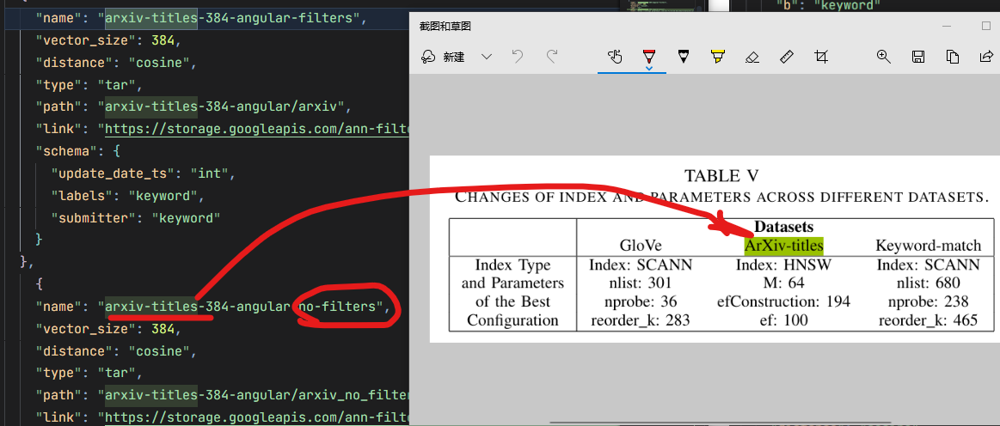

第五个数据集的名称是：**deep-image-96-angular**

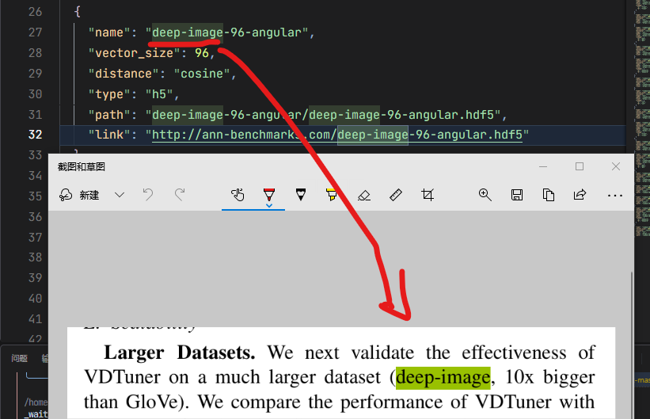

### 跑通论文中的数据集glove-100-angular

我们需要运行脚本，这一次需要指定数据集

如果没有后缀，就是用milvus跑random100，但是强调数据集之后就是用milvus跑glove-100-angular

运行：

```shell
./run_engine_test.sh milvus-single-node milvus-p10 glove-100-angular
```

然而，有可能遇到这样的一个情况，就是超时了，卡在下载数据集了，解决方案是：使用本地代理，或者等个10分钟，可能需要比较长的时间

```shell
>>> [Step 3] 等待服务启动 (90s)...
>>> [Step 4] 运行 Benchmark...
Running experiment: milvus-p10 - glove-100-angular
established connection
Downloading http://ann-benchmarks.com/glove-100-angular.hdf5...
```

当然，如果就是下载不下来也不是没有可能，此时，需要手动下载，而手动下载的方法也不难

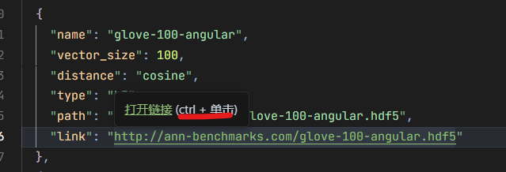

因为在`datasets.json`当中，每一个数据集都有一个下载链接，ctrl+左键单击，就可以用浏览器下载。

比如说点击这个链接http://ann-benchmarks.com/glove-100-angular.hdf5

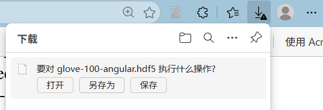

下载到电脑之后，传到服务器的数据集文件夹下，确保以下文件夹下有hdf5文件

```shell
(torch) dyx@server9050:~/VDTuner/vector-db-benchmark-master/datasets/glove-100-angular$ ls
glove-100-angular.hdf5
```

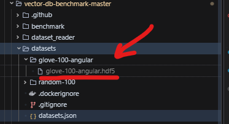

然后重新跑就行了，就会看到类似于这样的结果：

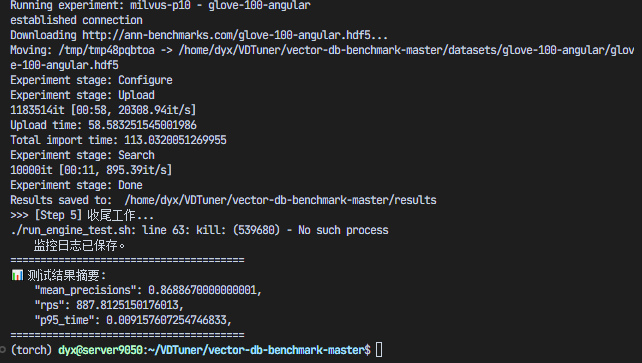

### 跑通论文中的5个数据集

需要在`vector-db-benchmark-master`路径，也就是

```shell
(torch) dyx@server9050:~/VDTuner/vector-db-benchmark-master$ 
```

执行下面的指令

```shell
./run_engine_test.sh milvus-single-node milvus-p10 glove-100-angular
./run_engine_test.sh milvus-single-node milvus-p10 random-match-keyword-100-angular-no-filters
./run_engine_test.sh milvus-single-node milvus-p10 random-geo-radius-2048-angular-no-filters
./run_engine_test.sh milvus-single-node milvus-p10 arxiv-titles-384-angular-no-filters
./run_engine_test.sh milvus-single-node milvus-p10 deep-image-96-angular
```

 我发现后面的4个数据集都下不下来，所以我手动下载

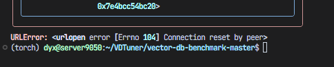

下载之后要从本地电脑上传到服务器，但是上传的时候没有进度条，有一个特别简单的方法，就是ctrl+alt+insert打开任务管理器，然后看性能，就可以看到WLAN，可以看到一边下载，一边上传，速度拉满，说明任务没有断，不用慌。

如果网页下载完成，接收速率会归零。如果上传服务器完成，发送速率会归零。因为网络是“**全双工**的”，可以一边下载一边上传。


之前的glove-100-angular数据集是hdf5格式的，所以可以直接运行。

#### deep-image

对于deep-image，我们下载到的数据集文件叫做`deep-image-96-angular.hdf5`，我们需要在datasets当中新建一个文件夹，叫做`deep-image-96-angular`，然后把`deep-image-96-angular.hdf5`放进去。

构成这种格式：

```shell
(torch) dyx@server9050:~/VDTuner/vector-db-benchmark-master/datasets/deep-image-96-angular$ ls
deep-image-96-angular.hdf5
```

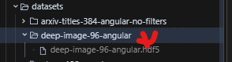

对比一下，会发现我们的路径正好拼接成了datasets.json当中所要求的路径，也就是：

```json
  {
    "name": "deep-image-96-angular",
    "path": "deep-image-96-angular/deep-image-96-angular.hdf5",
  },
```

这解释了手动添加的数据集可以被运行。

因为deep-image-96-angular也是hdf5格式的，所以也可以直接运行，可以发现这个数据集运行比起glove耗时很多，具体来说，大概花了10分钟，相比之下，glove只花了2分钟。

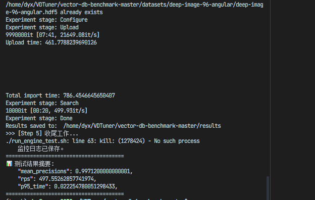

#### 其他3个数据集

其他三个数据集不是`.hdf5`格式的文件，而是一个压缩包，这个压缩包解压之后有很多文件，类似于random-100，而稍微观察一下datasets.json中random-100的结构，会发现它的path正好对应datasets当中的random-100

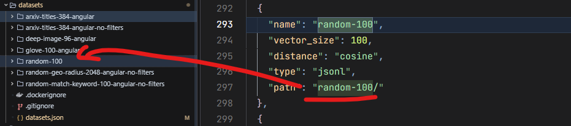

所以，我们知道了，对于这种解压之后有很多文件的数据集，datasets.json中的path指明了文件路径

#### random-match-keyword-100-angular-no-filters

观察datasets.json当中的path，可以发现

```json
    {
    "name": "random-match-keyword-100-angular-no-filters",
    "path": "random-match-keyword-100-angular/random_keywords_1m_no_filters",
    "link": "https://storage.googleapis.com/ann-filtered-benchmark/datasets/random_keywords_1m_no_filters.tgz"
  },
```

我们应该在datasets文件夹下面创建一个`random-match-keyword-100-angular/random_keywords_1m_no_filters`文件夹（文件夹套文件夹）

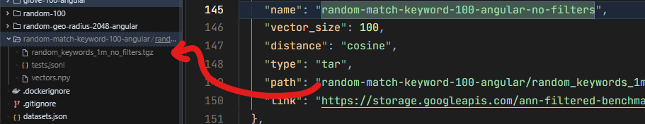

然后把`random_keywords_1m_no_filters.tgz`放进去，并且解压。

```shell
(torch) dyx@server9050:~/VDTuner/vector-db-benchmark-master/datasets/random-match-keyword-100-angular/random_keywords_1m_no_filters$ tar -zxvf random_keywords_1m_no_filters.tgz
vectors.npy
tests.jsonl
```

测试发现跑通了

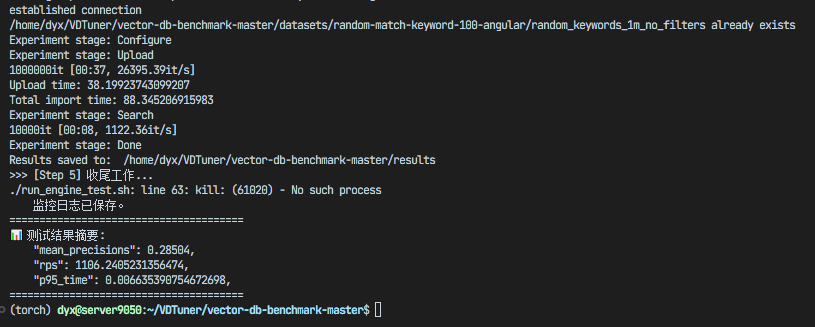

#### random-geo-radius-2048-angular-no-filters

观察datasets.json当中的path，可以发现

```json
    {
    "name": "random-geo-radius-2048-angular-no-filters",
    "path": "random-geo-radius-2048-angular/random_geo_100k_no_filters",
    "link": "https://storage.googleapis.com/ann-filtered-benchmark/datasets/random_geo_100k_no_filters.tgz"
  },
```

我们应该在datasets文件夹下面创建一个`random-geo-radius-2048-angular/random_geo_100k_no_filters`文件夹（文件夹套文件夹）

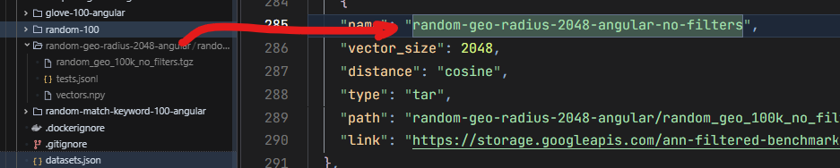

然后把`random_geo_100k_no_filters.tgz`放进去，并且解压。

```shell
(torch) dyx@server9050:~/VDTuner/vector-db-benchmark-master/datasets/random-geo-radius-2048-angular/random_geo_100k_no_filters$ tar -zxvf random_geo_100k_no_filters.tgz
vectors.npy
tests.jsonl
```

测试发现跑通了

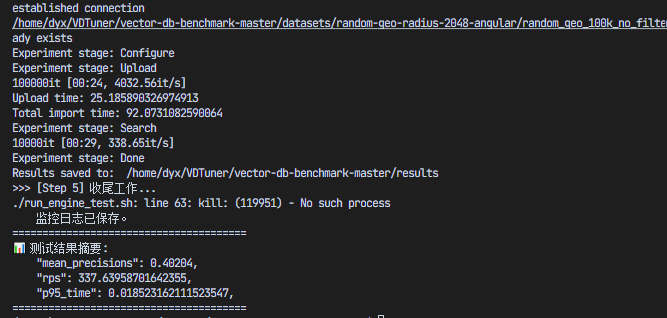

#### arxiv-titles

观察datasets.json当中的path，可以发现

```json
    {
    "name": "arxiv-titles-384-angular-no-filters",
    "path": "arxiv-titles-384-angular/arxiv_no_filters",
    "link": "https://storage.googleapis.com/ann-filtered-benchmark/datasets/arxiv_no_filters.tar.gz"
  },
```

我们应该在datasets文件夹下面创建一个`arxiv-titles-384-angular/arxiv_no_filters`文件夹（文件夹套文件夹），然后把`arxiv_no_filters.tar.gz`放进去，并且解压.

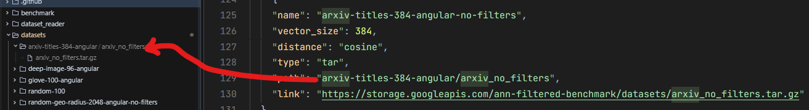

运行解压指令：

```shell
(torch) dyx@server9050:~/VDTuner/vector-db-benchmark-master/datasets/arxiv-titles-384-angular/arxiv_no_filters$ tar -zxvf arxiv_no_filters.tar.gz
._tests.jsonl
tests.jsonl
._vectors.npy
vectors.npy
```

测试发现跑通了：

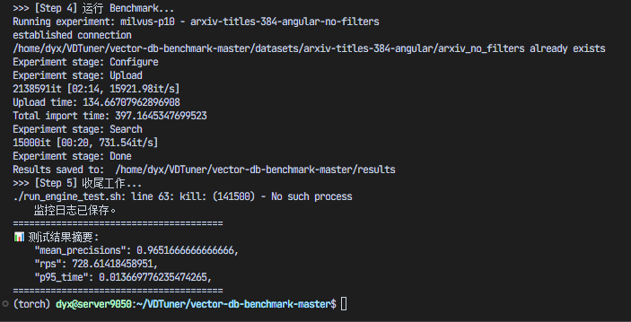

### 5个数据集下载链接整理

```shell
glove/geo_radius/keyword_match/arxiv_titles/deep_image的下载链接依次是：（顺序一致）

http://ann-benchmarks.com/glove-100-angular.hdf5
https://storage.googleapis.com/ann-filtered-benchmark/datasets/random_geo_100k_no_filters.tgz
https://storage.googleapis.com/ann-filtered-benchmark/datasets/random_keywords_1m_no_filters.tgz
https://storage.googleapis.com/ann-filtered-benchmark/datasets/arxiv_no_filters.tar.gz
http://ann-benchmarks.com/deep-image-96-angular.hdf5
```

### 修改VDTuner的配置

下面，为了运行VDTuner，也就是auto-configure文件夹，首先需要修改文件路径

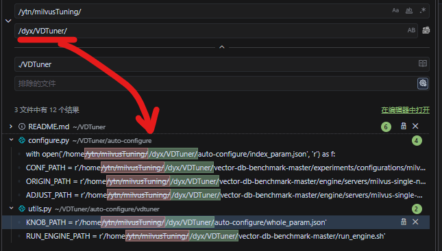

在VDTuner项目当中搜索`/ytn/milvusTuning/`替换为`/dyx/VDTuner/`，也就是自己的路径

替换之后，可以去搜索/ytn/

可以发现没有更多内容，说明替换成功

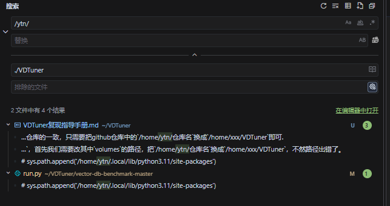

然后在auto-configure文件夹（也就是调优的本体项目），当中，把`run_engine.sh`替换为`run_engine_test.sh`，也就是我们自己配置的这个更好的脚本。

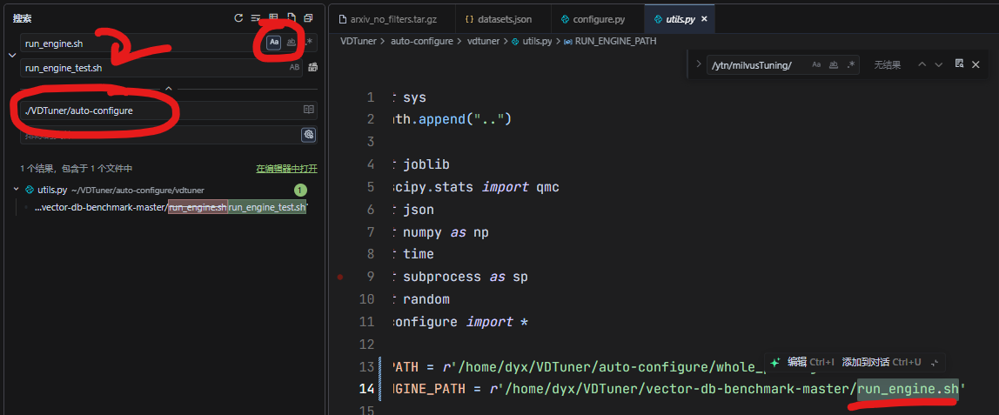

假设我们没有sudo权限，需要把auto-configure中的sudo去掉，在在auto-configure文件夹（也就是调优的本体项目），当中，找到sudo。

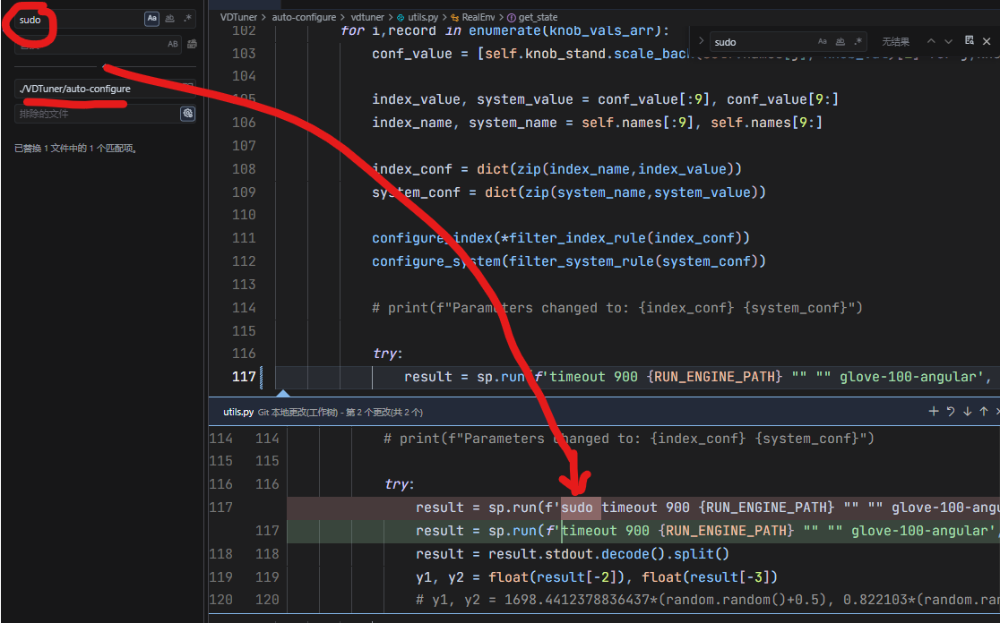

因为我们没有sudo权限，如果没有去掉`sudo timeout`当中的sudo，直接去执行`./main_tuner.py`，大概率会遇到这个错误：

```shell
  File "/home/dyx/VDTuner/auto-configure/vdtuner/utils.py", line 125, in get_state
    y1, y2 = min(self.Y1_record), min(self.Y2_record)
             ^^^^^^^^^^^^^^^^^^^
ValueError: min() iterable argument is empty
```

解释一下这个错误，这里的y1, y2是测试脚本`run_engine_test.sh`测试完成时候，留下来的测试结果数据。如果没有测试完成，或者测试输出的结果格式不对，就会导致没有读取到Y1。

这步搞定之后，需要准备去运行VDTuner的调优主程序，也就是`./main_tuner.py`。

然而，如果直接运行，会遇到一个报错：

```shell
ImportError: cannot import name 'fit_gpytorch_model' from 'botorch.fit' (/home/dyx/.local/lib/python3.12/site-packages/botorch/fit.py). Did you mean: 'fit_gpytorch_mll'?
```

解决方案是去到

```shell
/home/dyx/VDTuner/auto-configure/vdtuner/optimizer_pobo_sa.py
```

然后进行全局替换，将`fit_gpytorch_model`替换为`fit_gpytorch_mll`，总共替换2处。

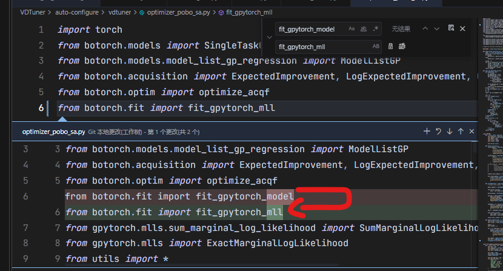

现在，准备可以运行VDTuner了，简单说一下运行的思路：

在`run_engine_test.sh`当中，最后会打印三个数字，分别是recall、rps、p95_time(95%的查询都不超过这个时间)

中间用空行隔开，类似于这样：

```shell
📊 测试结果摘要:
1.0
3.971944672442721
0.09175446551525965
```

而VDTuner当中有一个代码会把输出结果按照空格或者换行作为分割，读取一个列表：
`[1.0, 3.971944672442721, 0.09175446551525965]`，然后读取倒数2、3个数字，得到rps和recall。

### 跑通VDTuner

大功告成，现在可以开始调优了，进入到`~/VDTuner/auto-configure/vdtuner`当中，执行：

```shell
python main_tuner.py 
```

首先会看到一个计时器，类似于：

```shell
1183514it [00:57，20646.62it/s]
10000it [00:14,677.30it/s]
```

其中前面的1183514表示，首先在数据库当中插入了1183514个向量，耗时57秒。

后面的10000表示，在数据库当中查找了10000条数据，耗时14秒。

论文当中提到了glove数据集有1183514个向量，100维，所以正好对上了。


当计时结束后，会看到：

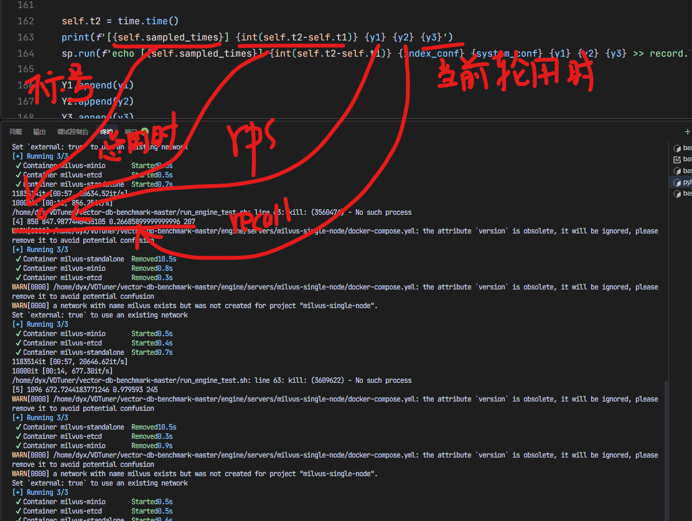

其中每轮都会输出类似于这样的结果：

```shell
[24] 8589 165.60255127556687 0.9838320000000002 261
```

这对应于：

```shell
print(f'[{self.sampled_times}] {int(self.t2-self.t1)} {y1} {y2} {y3}')
[跑的测试集的轮次] 总运行时间(单位是秒) rps recall 单轮运行时间 
```

然后去看日志文件，位于:
```shell
/home/dyx/VDTuner/auto-configure/vdtuner/record.log
```

其中打印的代码位于：

```python
sp.run(f'echo [{self.sampled_times}] {int(self.t2-self.t1)} {index_conf} {system_conf} {y1} {y2} {y3} >> record.log', shell=True, stdout=sp.PIPE)
```

相较于控制台的输出，只多打印了{index_conf}也就是索引参数，例如HNSW这一种，还有`{dataCoord*segment*maxSize: 100}`也就是系统参数。

观察record.log可以发现，确实是轮询调优的，索引类型按照FLAT、IVF_FLAT、SQ8、PQ、HNSW、SCANN、AUTOINDEX这样换着来，7轮之后重新从FLAT开始，这和论文的顺序都是一样的。

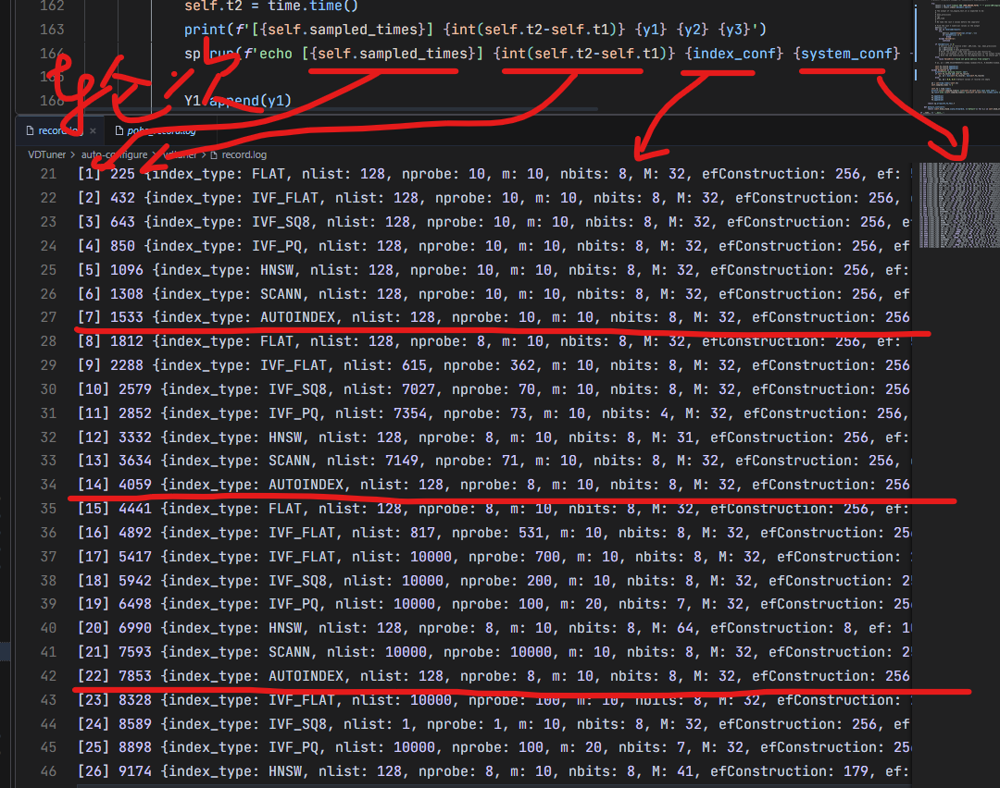

可以注意到，这里是把所有的索引参数都存下来，无论这个索引有没有用到ef参数，都简单的把{index_conf}存储下来。

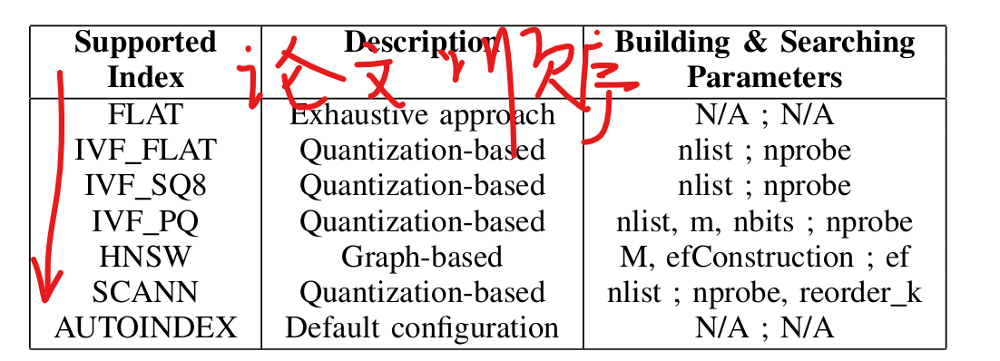

例一旦VDTuner启动之后，就会发现milvus.yaml被修改了。

文件路径`/home/dyx/VDTuner/vector-db-benchmark-master/engine/servers/milvus-single-node/milvus.yaml`

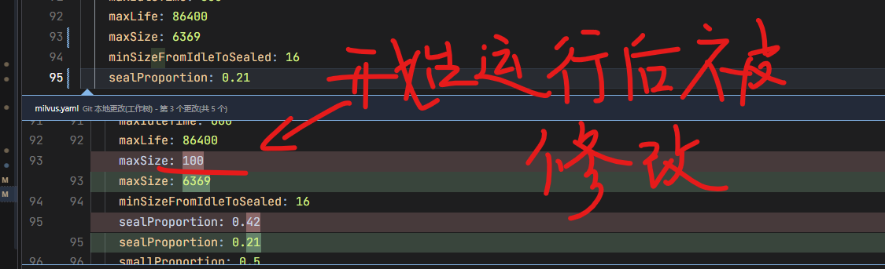

此外还可以注意到：

`milvus-single-node.json`也被修改了

文件路径`/home/dyx/VDTuner/vector-db-benchmark-master/experiments/configurations/milvus-single-node.json`

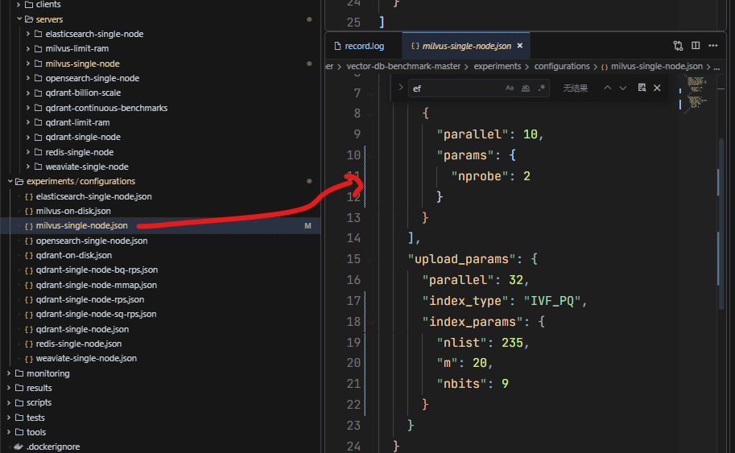

除了`record.log`还会生成一个`pobo_record.log`（其中BO表示贝叶斯优化，而PO表示轮询）的日志记录

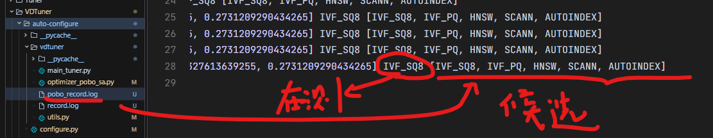

其中的记录类似于

```shell
[926.2929172645963, 0.8567050000000002] [[201.17651094754706, 0.9999849999999999], [645.6624027428785, 0.8484139999999999], [744.1626157028751, 0.810662], [832.6844823392194, 0.42621100000000006], [672.7244183771246, 0.979593], [778.6045669545932, 0.9951139999999999], [926.2929172645963, 0.8567050000000002]] [0.30502073411813696, 0.30502073411813696, 0.30502073411813696, 0.28429327613639255, 0.2731209290434265] IVF_SQ8 [IVF_SQ8, IVF_PQ, HNSW, SCANN, AUTOINDEX]
```

其中的`IVF_SQ8 [IVF_SQ8, IVF_PQ, HNSW, SCANN, AUTOINDEX]`

表示，当前还有的候选索引是` [IVF_SQ8, IVF_PQ, HNSW, SCANN, AUTOINDEX]`，而`IVF_SQ8 `则表示正在被测试的索引。

然后可以看前面的第一个数据，是找到的帕累托最优，后面的是观测数据


观测数据的后面还有一行，是下一个预测的配置（也就是推荐配置），由于进行了归一化，所以值的范围介于0到1之间。

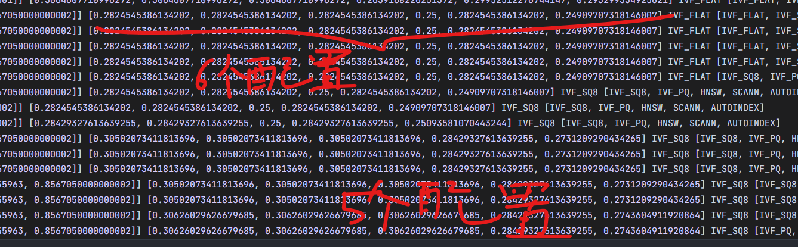

**注意**：仔细观察会发现，前面的几轮调优不生成pobo_record.log，只会生成record.log，这是合理的。因为：

*   **前几轮（具体来说是前 7 轮）**：
    VDTuner 正在遍历 7 种索引类型（FLAT, IVF_FLAT, ... AUTOINDEX），每种跑一次默认配置。这是为了给每种索引类型都搞个“基准分”。
    *   此时，**只有 `record.log` 会更新**（记录了每一次实验的各种参数）。
    *   **`pobo_record.log` 不会生成**。

*   **第 8 轮开始**：
    初始化完成，进入 `model.step()` 循环。
    *   此时，`pobo_record.log` 开始生成，并记录每一轮的优化过程（超体积变化、选了哪个索引等）。

### 根据日志绘制每轮超体积增长的曲线

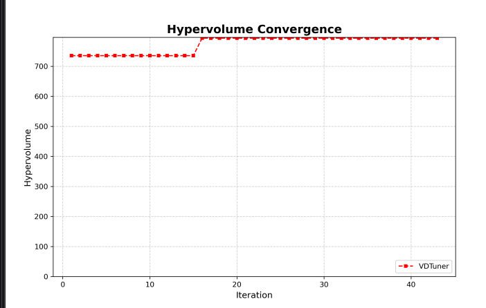

要达到这个效果，需要运行类似于这样的指令：

```shell
(torch) dyx@server9050:~/VDTuner/auto-configure/vdtuner$ python ./draw_hv.py
```

其中画图的代码放到日志相同的目录，取名类似于`draw_hv.py`，代码的思路很简单，就是读取`pobo_record.log`，将其中的第一个项，也就是类似于:

```shell
[869.5144183191475, 0.84578]
[869.5144183191475, 0.84578]
[869.5144183191475, 0.84578]
[926.2929172645963, 0.8567050000000002]
[926.2929172645963, 0.8567050000000002]
...
```

也就是帕累托最优解的超体积算出来，然后画出来。

```python
import re
import matplotlib.pyplot as plt
import os

# 配置路径
LOG_PATH = "pobo_record.log"
OUTPUT_IMAGE = "hypervolume_convergence.png"

def parse_log_and_get_hv(file_path):
    """
    读取日志文件，提取每一行的第一个 [RPS, Recall]，计算超体积
    """
    if not os.path.exists(file_path):
        print(f"错误：找不到文件 {file_path}")
        return []

    hv_history = []
    
    # 正则表达式匹配行首的 [数字, 数字]
    # 格式示例: [869.5144183191475, 0.84578]
    pattern = re.compile(r"^\[([\d\.]+),\s*([\d\.]+)\]")

    print(f"开始读取 {file_path} ...")
    
    with open(file_path, 'r') as f:
        lines = f.readlines()
        
    for line in lines:
        match = pattern.match(line.strip())
        if match:
            # 提取 RPS 和 Recall
            rps = float(match.group(1))
            recall = float(match.group(2))
            
            # 计算超体积 (Hypervolume)
            # 根据 utils.py 和 optimizer 逻辑，对于单个点，RefPoint 为 [0,0]
            # Volume = (RPS - 0) * (Recall - 0)
            hv = rps * recall
            hv_history.append(hv)
            
    return hv_history

def get_monotonic_increase(data):
    """
    将数据转换为单调递增序列（历史最大值）
    """
    if not data:
        return []
        
    monotonic_data = []
    current_max = -1.0
    
    for val in data:
        if val > current_max:
            current_max = val
        monotonic_data.append(current_max)
        
    return monotonic_data

def plot_chart(hv_data):
    """
    绘制折线图
    """
    iterations = range(1, len(hv_data) + 1)
    
    plt.figure(figsize=(10, 6))
    
    # 绘制红色虚线，带标记，模仿VDTuner论文样式
    plt.plot(iterations, hv_data, 
             color='red',           # 红色
             linestyle='--',        # 虚线
             marker='s',            # 方块标记 (square)
             markersize=4,          # 标记大小
             label='VDTuner')       # 图例
    plt.ylim(ymin=0) # 强制设置Y轴的最小值为0，最大值自动适应数据

    plt.title('Hypervolume Convergence', fontsize=16, fontweight='bold')
    plt.xlabel('Iteration', fontsize=12)
    plt.ylabel('Hypervolume', fontsize=12)
    plt.grid(True, linestyle='--', alpha=0.6)
    plt.legend(loc='lower right')
    
    # 保存图片
    plt.savefig(OUTPUT_IMAGE, dpi=300)
    print(f"绘图完成！图片已保存为: {OUTPUT_IMAGE}")
    # 如果有图形界面可以取消注释下面这行
    # plt.show() 

if __name__ == "__main__":
    # 1. 解析数据
    raw_hv_data = parse_log_and_get_hv(LOG_PATH)
    
    if raw_hv_data:
        # 2. 处理为单调递增（历史最优）
        monotonic_hv = get_monotonic_increase(raw_hv_data)
        
        print(f"共解析到 {len(monotonic_hv)} 条数据。")
        print(f"初始超体积: {monotonic_hv[0]:.2f}")
        print(f"最终超体积: {monotonic_hv[-1]:.2f}")
        
        # 3. 绘图
        plot_chart(monotonic_hv)
    else:
        print("日志中未提取到有效数据，请检查 pobo_record.log 格式。")
```

### 用VDTuner跑任意数据集

数据集有以下几个：

```shell
glove-100-angular
random-match-keyword-100-angular-no-filters
random-geo-radius-2048-angular-no-filters
arxiv-titles-384-angular-no-filters
deep-image-96-angular
```

#### geo-radius

其实特别简单，别的都不要修改，只需要修改`/home/dyx/VDTuner/auto-configure/vdtuner/utils.py`当中的调用脚本的一行代码

其中的数据集改为`random-geo-radius-2048-angular-no-filters`即可。

```python
                result = sp.run(f'timeout 900 {RUN_ENGINE_PATH} "" "" random-geo-radius-2048-angular-no-filters', shell=True, stdout=sp.PIPE)
```

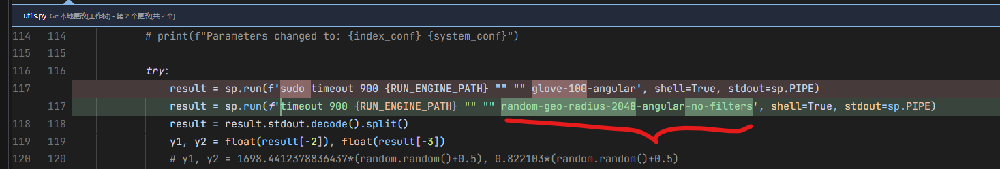

不过，geo-radius这个数据集还有一个有意思的地方，就是它的维度是2048维的。在使用 IVF_PQ索引的时候，有一个参数，叫做m，而这个m必须整除维度。

打开`/home/dyx/VDTuner/auto-configure/index_param.json`，可以看到关于m的配置：

```json
    "m": {
        "class": "building",
        "type": "enum",
        "default": 10,
        "enum_values": [
            1,
            2,
            4,
            5,
            10,
            20,
            25,
            50,
            100
        ]
    },
```

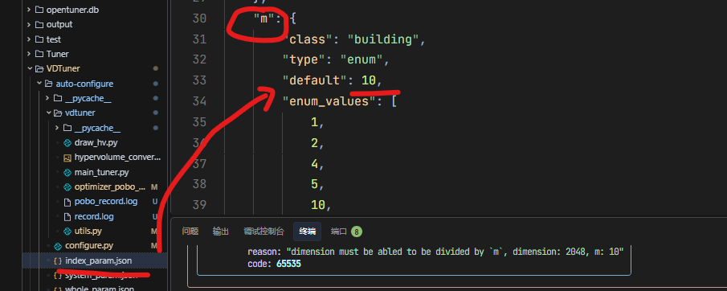

其中的默认值是m=10，但是m=10是无法被2048整除的。仔细观察，会发现这里的m选择了所有能被100整除的数，也就是[1，2，4，5...]。所以，如果我们想要顺畅的运行`geo-radius`数据集，需要把m的枚举范围修改为被2048整除的数，也就是[1, 2, 4, 8, 16, 32, 64, 128, 256, 512, 1024, 2048]。简而言之，切换数据集的时候，如果向量的维度变化了，是需要修改`index_param.json`的，将m修改为所有能整除新的维度的数。

当然，对于其他类型的参数，比如说，`nprobe`，是没有这个困扰的，因为它的类型是`integer`，而不是`enum`，可以在最大值最小值之间取任意整数。

```json
    "nprobe": {
        "class": "searching",
        "type": "integer",
        "default": 8,
        "min": 1,
        "max": 100
    },
```

如果不进行这个修改，就会报错，说m无法整除2048.

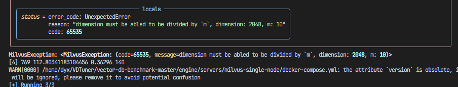

如果运行正常的话，会看到这个：

在数据库当中插入了100000个向量，然后查找了10000个向量。

这和论文中的geo-radius数据集含有100000个向量也是一一对应的。

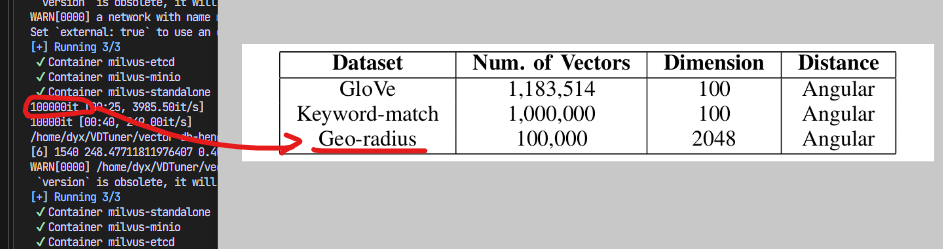

#### keyword-match

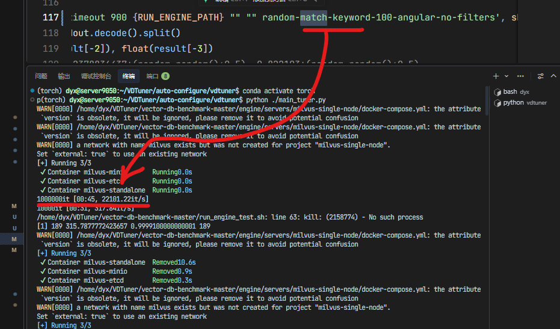

可以发现，总共有1000000个向量插入到了向量数据库，数量也正好就是论文当中说的数量。

#### arxiv-titles

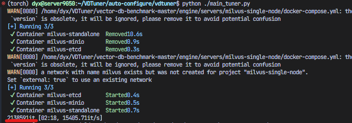

这个数据集有2138591个向量要在一开始的时候插入。

#### deep-image

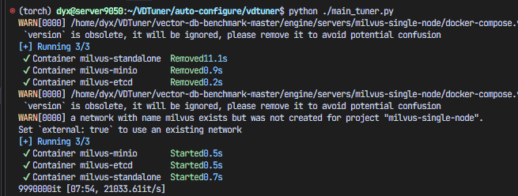

这个数据集有9990000个向量在一开始的时候插入。

###  更加稳健的qEHVI算法

如果用新的版本的`botorch`库，但是使用了`qExpectedHypervolumeImprovement`这个函数，会导致一个警告，这个警告其实无伤大雅，警告的意思是：

原版的qExpectedHypervolumeImprovement数值稳定性有点问题，可以替换为qLogExpectedHypervolumeImprovement提升数值稳定性。

```shell
/home/dyx/VDTuner/vector-db-benchmark-master/run_engine_test.sh: line 63: kill: (2017712) - No such process
[9] 2624 35.63101993501567 0.98015 465
/home/dyx/.local/lib/python3.12/site-packages/botorch/acquisition/multi_objective/monte_carlo.py:110: NumericsWarning: qExpectedHypervolumeImprovement has known numerical issues that lead to suboptimal optimization performance. It is strongly recommended to simply replace

         qExpectedHypervolumeImprovement         -->     qLogExpectedHypervolumeImprovement 

instead, which fixes the issues and has the same API. See https://arxiv.org/abs/2310.20708 for details.
```

不过我试了一下，似乎替换之后跑不起来了，所以目前的打算就是不要替换了。

### VDTuner的热启动模式

虽然 VDTuner 原论文（Section IV-F）中提到了利用历史数据进行热启动（Bootstrapping）以加速不同约束条件下的调优，但经分析源码（main_tuner.py 和 optimizer_pobo_sa.py），**当前开源版本并未包含加载历史数据的功能**。

不过，可以简单改两行代码来实现“伪热启动”，编写一个函数读取 record.log，解析出里面的 X (配置) 和 Y (Recall, RPS)，然后在 main_tuner.py 里，在 init_sample() 之前把这些数据塞给 model.X 和 model.Y，并注释掉 init_sample()。

这里不再赘述。

### VDTuner处理用户偏好

**论文中的说法 (Section IV. F)**

论文明确提出，当用户有特定偏好（例如 `Recall > 0.9`）时，VDTuner 会切换策略：
*   不再使用 EHVI（期望超体积提升，用于多目标）。
*   改为使用 **Constrained EI (约束期望提升)**。
*   **公式**：$\alpha_{CEI} = \text{EI(速度)} \times \text{Probability(召回率 > 阈值)}$。
*   **目的**：引导搜索集中在满足召回率要求的区域，疯狂提升速度，而不在低召回率区域浪费时间。

**代码中的做法 (`optimizer_pobo_sa.py`)**

看 `EHVIBO` 类的 `recommend` 函数，这是生成推荐配置的核心：

```python
# 这里的 rr_cons 就是传入的 Recall Constraint (用户偏好阈值)
def recommend(self, fixed_features, q, rr_cons):
    
    # ... 省略中间代码 ...

    # 【关键点】这里无条件使用了 qExpectedHypervolumeImprovement (qEHVI)
    # 这是多目标优化的核心函数
    acq_func = qExpectedHypervolumeImprovement(
        model=self.model,
        ref_point=REF_POINT,
        partitioning=partitioning,
        sampler=qehvi_sampler,
    )

    # ... 优化采集函数 ...
    candidate, ei = optimize_acqf(acq_func, ...) 

    return new_x.numpy(), ...
```

**证据：**
1.  虽然函数参数里接收了 `rr_cons`（在 `main_tuner.py` 里并没有传，默认是 `None`）。
2.  但是在 `recommend` 函数体内，**`rr_cons` 根本没有被使用**。
3.  代码第 6 行虽然导入了 `ConstrainedExpectedImprovement`：
    ```python
    from botorch.acquisition import ExpectedImprovement, ..., ConstrainedExpectedImprovement
    ```
    但是它**从未被调用**。

**结论**：代码中没有明确处理用户偏好的代码。

由于代码未实现自动约束，在复现时，我们不需要设置阈值。我们只需要运行完 200 轮迭代，查看生成的日志文件，从中手动筛选出满足 `Recall > 用户阈值` 的配置中，`RPS` 最大的那一项即可。这在工程上是等价的，只是搜索效率略有不同。

### VDTuner的成本感知

之前说过，论文当中把QPS和1/cost乘起来，从而把3元多目标优化变成了2元多目标优化。

代码当中有没有呢，并没有这么做，可以看到作者基于的就是recall和rps。所以这个也不讨论了。


### 其他的baseline

这个项目中没有，不讨论了。

### 消融实验

比如，证明轮询策略是有效的，但是这里也没有一个开关，可以控制是否有轮询，不讨论了。
