### VDTuner：面向向量数据管理系统的自动性能调优

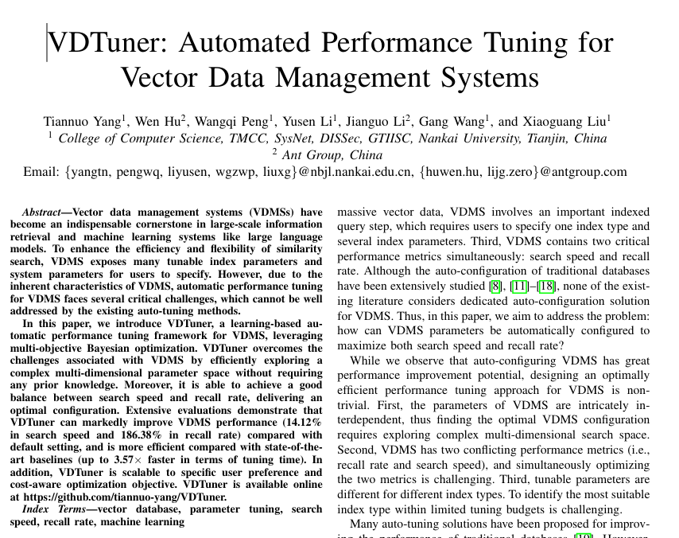

一句话概括这篇论文：

1.  使用了一种比较**合理**的预测模型(**BO**)，去基于向量数据库的**历史配置效果**去推荐**新的配置**。
2.  设计了一种**工作流**，可以处理**多索引需要轮询调优**的问题

[TOC]

## 摘要

向量数据管理系统（VDMSs）已成为大规模信息检索和机器学习系统（如大语言模型）不可或缺的基石。为了增强相似度搜索的效率和灵活性，VDMS 暴露了许多可供用户指定的索引参数和系统参数。然而，由于 VDMS 的固有特性，其自动性能调优面临着几个严峻的挑战，现有的自动调优方法难以很好地解决这些问题。

在本文中，我们介绍了 **VDTuner**，这是一个基于学习的 VDMS 自动性能调优框架，利用了多目标贝叶斯优化（Multi-objective Bayesian Optimization）。VDTuner 通过有效地探索复杂的多维参数空间，克服了与 VDMS 相关的挑战，且无需任何先验知识。此外，它能够在搜索速度（search speed）和召回率（recall rate）之间取得良好的平衡，提供最佳配置。广泛的评估表明，与默认设置相比，VDTuner 可以显著提高 VDMS 的性能（搜索速度提高 14.12%，召回率提高 186.38%），并且与最先进的基线方法相比更加高效（在调优时间方面快高达 3.57倍）。此外，VDTuner 具有可扩展性，支持特定的用户偏好和成本感知（cost-aware）的优化目标。VDTuner 已在 GitHub 开源。

**关键词**——向量数据库，参数调优，搜索速度，召回率，机器学习

---

## I. 引言 (INTRODUCTION)

近年来，大语言模型（LLM）的出现将 AI 技术的发展带到了一个前所未有的繁荣阶段。在 LLM 应用场景中，非结构化的多媒体数据通常被转换为 Embedding 向量，作为强大的知识库来克服对话中的幻觉（hallucination）问题。因此，各种专用的向量数据管理系统（VDMSs）应运而生，以提供高效、可扩展和可靠的向量管理。LLM 应用的蓬勃发展使得高效的 VDMS 成为 LLM 时代的基础设施。许多流行的 VDMS，如 Milvus 和 Qdrant，现在拥有庞大的用户群和特别活跃的社区。

VDMS 有三个显著特征。首先，像许多传统数据库一样，VDMS 通常暴露许多可调的系统参数，这些参数对性能有重大影响。其次，VDMS 专为海量向量数据的相似度搜索而构建，涉及一个重要的索引查询步骤，要求用户指定一种**索引类型（index type）**和若干**索引参数**。第三，VDMS 同时包含两个关键的性能指标：**搜索速度**和**召回率**。虽然传统数据库的自动配置已被广泛研究，但现有的文献均未考虑针对 VDMS 的专用自动配置解决方案。因此，在本文中，我们旨在解决这个问题：**如何自动配置 VDMS 参数以最大化搜索速度和召回率？**

虽然我们观察到自动配置 VDMS 具有巨大的性能提升潜力，但设计一种最优且高效的 VDMS 调优方法并非易事。
1.  首先，VDMS 的参数错综复杂且相互依赖，因此找到最佳 VDMS 配置需要探索复杂的多维搜索空间。
2.  其次，VDMS 有两个相互冲突的性能指标（即召回率和搜索速度），同时优化这两个指标具有挑战性。
3.  第三，不同索引类型的可调参数是不同的。在有限的调优预算内确定最合适的索引类型是一项挑战。

许多自动调优解决方案已被提出用于提高传统数据库的性能。然而，它们在调优 VDMS 的效率和最优性方面均有所欠缺。朴素搜索方法（如随机搜索和模拟退火）缺乏效率，因为它们无法有效利用历史信息。虽然启发式策略通常采用一些数值优化技术，开销很低，但它们通常遭遇性能不稳定和局部最优的问题，因为它们未能考虑参数之间的复杂依赖关系。学习策略，如贝叶斯优化（Bayesian Optimization, BO）和强化学习（RL），在数据库调优中也备受关注。虽然这些学习策略可以学习复杂的配置空间以实现卓越的性能，但在面对 VDMS 调优中相互冲突的目标和不同索引类型的非固定参数空间时，它们仍然缺乏效率。

为了解决上述挑战，我们提出了 **VDTuner**，这是一个针对 VDMS 的自动调优框架，旨在最大化搜索速度和召回率。VDTuner 具有许多非常有益于 VDMS 调优的特性：(1) **它不需要关于 VDMS 的先验知识**；(2) 它能够高效地探索复杂的多维参数空间；(3) 它能够在搜索速度和召回率之间取得良好的平衡。VDTuner 的核心思想是利用多目标贝叶斯优化（MOBO），这是一种广泛用于解决具有昂贵黑盒函数的多目标优化问题的流行技术。然而，将 MOBO 应用于 VDMS 调优并不容易（见第 III-D 节），我们提出了许多新技术来解决这些挑战（第 IV 节）。

我们进行了广泛的实验来评估 VDTuner。结果证明，与默认设置相比，VDTuner 可以显著提高搜索速度和召回率（分别高达 14.12% 和 186.38%），这证实了自动配置 VDMS 的必要性。此外，VDTuner 在 VDMS 性能和调优效率方面均以显著优势（快 1.48倍 到 3.57倍）优于最先进的基线。

总之，我们做出了以下主要贡献：
*   我们进行了广泛的初步研究，确定了 VDMS 调优的主要挑战，并分析了现有解决方案在 VDMS 调优中的缺陷。
*   我们提出了 VDTuner，一个用于 VDMS 的性能调优框架，它利用多目标贝叶斯优化来发现 VDMS 的最佳配置，最大化搜索速度和召回率。
*   我们全面评估了 VDTuner 以验证其性能并分析其高效的原因。我们证明 VDTuner 以显著优势击败了所有基线。

---

## II. 背景与动机 (BACKGROUND AND MOTIVATION)

### A. 向量数据管理系统 (VDMS)

向量数据库管理系统（VDMS）是专为高效管理大规模向量数据而构建的数据管理系统。VDMS 中最常见的操作是相似度搜索，即给定一个新向量，从存储的数据中搜索前 $K$ 个相似向量。VDMS 主要具有以下特点：

**多组件（Multiple Components）：** 为了增强弹性和灵活性，现代 VDMS 架构通常由致力于特定功能的多个层组成（例如，Access, Coordinator, Worker 和 Storage）。每一层都有许多协同工作的组件。例如，在 Milvus 中，数据协调器和索引协调器组件分别管理数据节点和索引节点的拓扑结构。这些组件暴露了许多用户可指定的 VDMS 可调**系统参数**，因为固定的配置可能并不适用于所有场景。

**多种索引类型（Multiple Index Types）：** 相似度搜索以其高复杂度而闻名。除了暴力搜索外，许多近似最近邻搜索（ANNS）算法（例如乘积量化 Product Quantization）被集成到 VDMS 中以提高相似度搜索的性能。每种 ANNS 算法都需要其自己的索引类型，因此，VDMS 通常需要维护多种索引类型。例如，索引类型 `IVF_PQ` 内部采用乘积量化算法，而 `HNSW` 利用基于图的 ANNS 算法，称为分层可导航小世界图（Hierarchical Navigable Small World Graph）。
一个完整的索引查询过程要求用户指定一种**索引类型**（例如 `HNSW`）和若干**索引参数**（例如节点度 $M$ 和搜索范围 `efConstruction`）。通过这种方式，VDMS 极大地加速了大数据集上耗时的相似度搜索。

**多重性能指标（Multiple Performance Metrics）：** 不同的 ANNS 算法表现出不同的搜索速度（即 VDMS 每秒可以处理的请求数）和召回率（即正确检索到的相似向量与实际相似向量总数的比率）。此外，特定 ANNS 算法的不同参数也会导致不同的搜索速度和召回率。因此，VDMS 用户通常同时关心两个指标：搜索速度和召回率。

> *   妹妹在语义空间上最近的5个点是：
>     妈妈、爸爸、爷爷、奶奶、亲人
>     
>     如果算法认为最近的5个点是妈妈、奶奶、爷爷、爸爸，狗狗
>     
>     那么，用正确答案中有多少个被算法选中（4个，即妈妈、奶奶、爷爷、爸爸），除以5，就是召回率
>
> 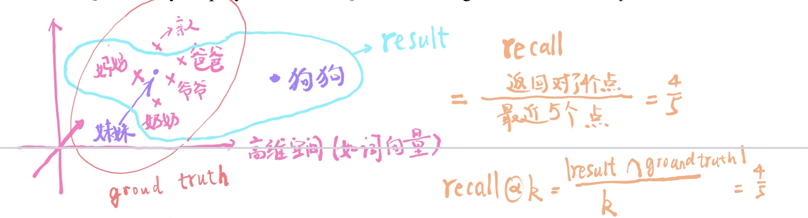
>
> - **暴力搜索（Recall=1.0）：** 就像你为了找“亲人”，把全世界上亿人都看了一遍，肯定能找到“亲人”，把“狗狗”排除掉。但是这太**慢**了（QPS低）。
> - **近似搜索（VDTuner在做的事）：** 数据库为了**快**，它不看全人类，只看“妹妹”住的小区。
>   - 结果：“亲人”因为搬家了，住得远，没被扫到。
>   - “狗狗”虽然物种不同，但因为恰好住在同一个小区（向量空间距离近），被凑数拉进来了。
> - **调优的目的：** 调整参数（比如扩大搜索的小区范围），试图在**不累死**（保持高QPS）的前提下，把“狗狗”踢出去，把“亲人”找回来。

> 如手绘图所示，Recall = $\frac{|Result \cap GroundTruth|}{K}$。
> VDTuner 的目标就是在保证 Recall 足够高（比如 > 0.95，即“狗狗”很少）的前提下，让搜索过程尽可能快。

### B. 自动配置 VDMS 的挑战

虽然 VDMS 的参数设置可以极大地影响其性能，但自动配置 VDMS 面临许多挑战。

**挑战 1：VDMS 参数错综复杂且相互依赖，因此找到最佳 VDMS 配置需要探索复杂的多维搜索空间。**

以流行的 VDMS Milvus 为例，推荐用于性能调优的索引和系统参数共有 16 个维度，且大多数参数的值是连续的。由此产生的空间大得惊人，穷举所有可能的配置变得不可能。一种替代方法是单独考虑每个参数以降低搜索复杂度。不幸的是，这是不可行的，因为 VDMS 配置彼此之间错综复杂地相互依赖。

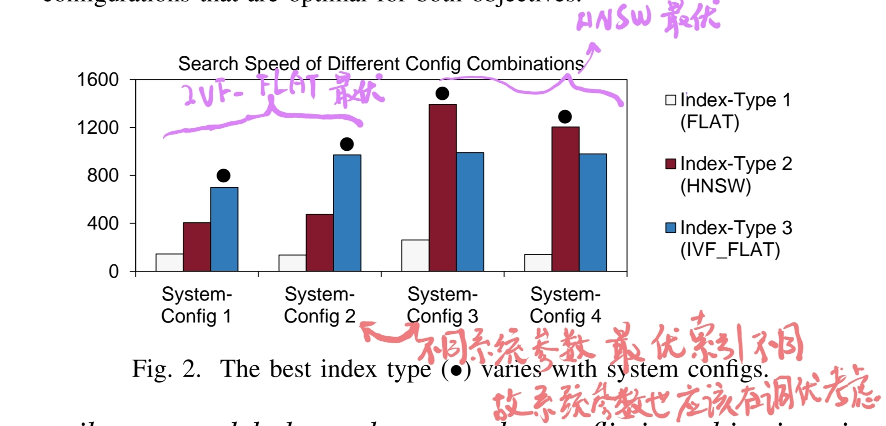

图 1 展示了配置两个系统参数（`segment_maxSize` 和 `segment_sealProportion`）的示例。深色表示更好的搜索速度或召回率。可以看出，一个参数的性能受到另一个参数的影响。同样，索引参数和系统参数之间也存在相互依赖关系。如**图 2** 所示，不同系统配置下的最佳索引类型可以是不同的：对于系统配置 1 和 2，`IVF_FLAT` 是最佳的，而 `HNSW` 在系统配置 3 和 4 下变得更好。这是因为某些索引配置对相似度搜索可能有更高的分段（segment）大小要求。不幸的是，即使对于专家来说，这些相互依赖关系也不容易理解，因为 VDMS 正处于快速发展阶段。因此，一种有前途的方法应该协调地调整这些参数，而无需任何先前的领域知识。

> *   **帕累托前沿的定义：**
>     *   **边缘之内（阴影区）：** 这里面的点叫“Dominated Solution”（被支配的解）。比如图中那个粉色点，它的正上方有一个点（Recall一样，QPS更高），右边有一个点（QPS一样，Recall更高）。**傻子才选里面的点。**
>     *   **边缘之上（阶梯线）：** 这就是帕累托前沿。**到了这里，你想要QPS更高，就必须牺牲Recall；想要Recall更高，就必须牺牲QPS。** 这就是“Trade-off”（权衡）的物理边界。
>
> 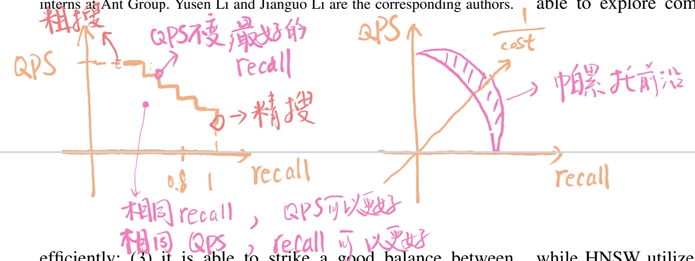

>*   **`segment_maxSize` (分段最大大小)**：
>    *   **比喻：** 你整理书架，是用**大箱子**装书，还是用**小盒子**装书？
>    *   **影响：** 箱子越大（值越大），一次搬运效率越高（QPS可能高），但在箱子里找某本书可能越费劲（或者反之，取决于索引结构）。
>*   **`segment_sealProportion` (分段密封比例)**：
>    *   **比喻：** 箱子装到**多满**你就把它封箱胶带封死？
>    *   **影响：** 如果箱子才装了 10% 你就封箱（值小），那你会有成千上万个半空的箱子，系统处理起来会累死（碎片化严重，影响 QPS）。
>
>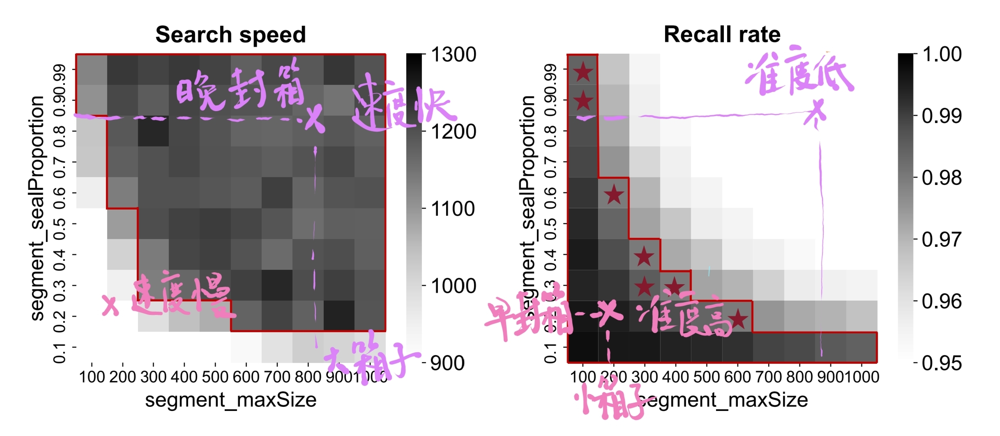
>
>> **图 1. 复杂的配置空间：** 不同系统配置下的搜索速度（左图）和召回率（右图）。
>> *   **红线**标识了“高质量空间”（即帕累托前沿），这里的配置均优于默认设置。
>> *   **星星（Stars）**标记了在两个目标（速度和召回率）上都达到相对最优平衡的配置。
>
>*   **输入端（你的手在拧旋钮）：**
>    *   **X轴 & Y轴**：这是两个互相关联的系统参数（箱子大小、封箱比例）。我们就像在开保险柜，不停地尝试这两个旋钮的组合。
>
>*   **输出端（你的眼睛看仪表盘）：**
>    *   **左图（速度表）：** 只有把旋钮拧到**右上方**（大箱子、晚封箱），QPS才高（颜色深）。
>    *   **右图（准度表）：** 只有把旋钮拧到**左下方**（小箱子、早封箱），recall才高（颜色深）。
>
>*   **核心矛盾（互补与咬合）：**
>    *   你看两张图的深色区域，简直就是**此消彼长**。
>    *   你想往右上角跑去追求速度，召回率立马就“变白”给你看；你想往左下角跑去追求召回率，速度立马就“变白”罢工。
>
>*   **帕累托前沿（红线）：**
>    *   **红线就是那个“咬合的边缘”！**
>    *   它小心翼翼地走在两块深色区域的交界线上。
>    *   在这条红线上，我们试图在“速度变白”之前，尽可能多抓一点“召回的黑”；或者在“召回变白”之前，尽可能多抓一点“速度的黑”。

**挑战 2：VDMS 关注两个重要指标：搜索速度和召回率，要在冲突的目标之间取得良好的平衡具有挑战性。**

如前所述，有两个重要指标来衡量 VDMS 的性能。然而，很难找到一个对两个指标都最优的配置，因为它们本质上是冲突的。如图 1 所示，高搜索速度配置和高召回率配置（由红线标记）彼此非常不同。仅优化一个目标可能会导致另一个目标的性能显著损失。因此，智能方法必须在冲突的目标之间取得平衡，从而找到最佳配置，而不会或尽量少地牺牲任何目标。

缓解这一困难的一种朴素方法是简单地将索引类型固定为“公认最好的一个”。不幸的是，在所有场景中都没有赢家。**图 3** (a) 和 (b) 说明了两个数据集下索引类型的性能。如果用户想在保持召回率高于 0.8 的同时最大化搜索速度，那么在数据集 1 中 `SCANN` 是足够好的选择。然而，在数据集 2 中，`HNSW` 变成了最好的，因为大多数索引类型无法保持合理的召回率。

**表 I：Milvus 中的索引类型及其对应参数**

| 支持的索引类型 (Supported Index) | 描述 (Description)                      | 构建 & 搜索参数 (Building & Searching Parameters) |
| :------------------------------- | :-------------------------------------- | :------------------------------------------------ |
| **FLAT**                         | 穷举法 / 暴力搜索 (Exhaustive approach) | N/A ; N/A                                         |
| **IVF_FLAT**                     | 基于量化 (Quantization-based)           | `nlist` ; `nprobe`                                |
| **IVF_SQ8**                      | 基于量化 (Quantization-based)           | `nlist` ; `nprobe`                                |
| **IVF_PQ**                       | 基于量化 (Quantization-based)           | `nlist`, `m`, `nbits` ; `nprobe`                  |
| **HNSW**                         | 基于图 (Graph-based)                    | `M`, `efConstruction` ; `ef`                      |
| **SCANN**                        | 基于量化 (Quantization-based)           | `nlist` ; `nprobe`, `reorder_k`                   |
| **AUTOINDEX**                    | 默认配置 (Default configuration)        | N/A ; N/A                                         |

**挑战 3：不同索引类型的可调参数是不同的，而在有限的调优预算内确定最合适的索引类型具有挑战性。**

VDMS 中有许多可供选择的索引类型，然而，每种索引类型下的可调参数是不同的。**表 I** 显示了 Milvus 中的可选索引类型以及相应的可调参数。可以看出，虽然某些参数在不同索引类型之间共享，但不同索引类型的可调参数组合非常不同（例如，`IVF_FLAT` 和 `IVF_PQ` 都有参数 `nlist` 和 `nprobe`，而 `IVF_PQ` 有独特的参数 `m` 和 `nbits`）。这给自动配置 VDMS 带来了额外的复杂性，因为大多数现有的调优方法假设一组固定的可调参数。

解决这个问题的一个自然想法是单独调整每种索引类型的参数。然而，这是耗d时的，因为我们最终只选择一种索引类型而忽略其余的。此外，仅优化最佳索引类型也是棘手的，因为很难通过简单的采样方法找到最佳索引类型。**图 3** (c) 显示了每种索引类型的性能随样本数量（通过均匀采样）的变化。这表明识别最合适的索引类型需要远超 10 个样本，因为我们需要为每种索引类型收集多个样本才能进行比较。

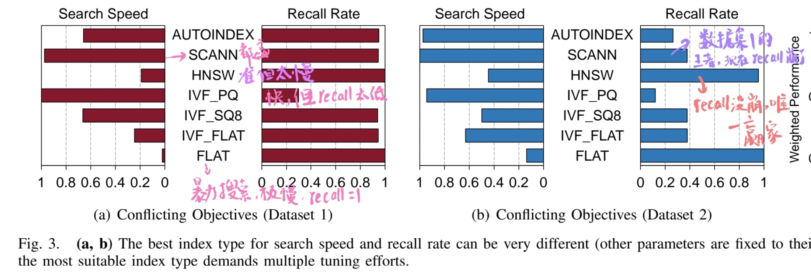

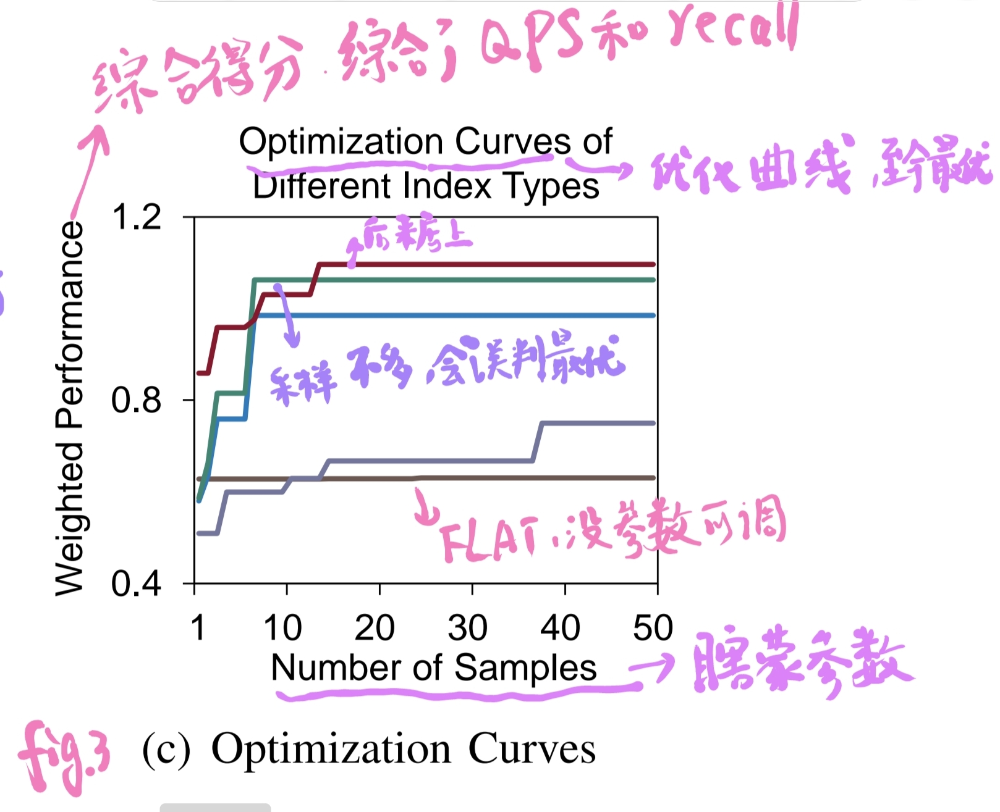

### C. 现有解决方案的局限性 (Limitations of Existing Solutions)

到目前为止，许多自动调优解决方案已被提出用于寻找数据库的高性能配置。然而，由于前面观察到的挑战，现有的解决方案都无法很好地解决 VDMS 调优问题。

**启发式策略 (Heuristic Strategies)：**
启发式策略包括**基于规则 (rule-based)** 和**基于搜索 (search-based)** 的方法。

*   **基于规则的策略**设计搜索规则依赖于专业的领域知识，而在 VDMS 调优中很难预先获得这些知识。
*   **基于搜索的策略**首先对整个配置集的一定比例进行采样，然后围绕这些采样的配置进行优化。虽然基于搜索的策略即使面对数千个维度也只会产生非常低的开销，但它们**缺乏效率**，因为在 VDMS 调优如此巨大的搜索空间内，采样过程很容易错过更好的配置。

**贝叶斯优化策略 (Bayesian Optimization Strategies)：**
贝叶斯优化 (BO) 是一种在线学习方法，已广泛用于传统数据库调优。它采用一个**代理模型 (surrogate model)** 来近似复杂的“配置-性能”函数，并利用一个**采集函数 (acquisition function)** 来推荐有希望的配置。
虽然 BO 可以有效地加速向最佳配置的搜索过程，但现有的基于 BO 的数据库调优解决方案**均无法在 VDMS 调优中平衡搜索速度和召回率**。此外，它们通常假设一组固定的参数，而在 VDMS 调优中，可调参数随指定的索引类型而变化。

**强化学习策略 (Reinforcement Learning Strategies)：**
强化学习 (RL) 通过与数据库系统迭代交互来学习调优策略。虽然基于 RL 的解决方案在高维、查询感知 (query-aware) 和工作负载感知 (workload-aware) 的参数调优方面表现出色，但它们通常需要**非常高的调优开销**或**大量的离线训练**才能获得表现良好的调优智能体 (agent)。
此外，在面对 VDMS 调优中**相互冲突的目标**和**非固定的动作空间**（即参数不固定）时，现有的基于 RL 的数据库调优解决方案会遭受低效和次优性的困扰。

## III. VDTuner：概览 (VDTUNER: AN OVERVIEW)

在本文中，我们提出了 **VDTuner**，一个采用**多目标贝叶斯优化（MOBO）**的框架，用于自动配置 VDMS 以最大化召回率和搜索速度。在本节中，我们将介绍 MOBO 的工作原理，并总结设计高效的基于 MOBO 的自动调优器的优势和挑战。

### A. 贝叶斯优化 (Bayesian Optimization)

> 简单说就是探索一个黑盒的最优配置，使得一个目标最优

贝叶斯优化（BO）[30] 是一种强大的序列模型优化技术，旨在寻找昂贵黑盒函数的全局最优解。BO 及其核心思想是构建一个概率**代理模型（surrogate model）**，通常使用高斯过程（Gaussian processes），来近似未知的目标函数。随着新的函数评估结果的获得，该代理模型会迭代更新，从而允许整合新信息并改进模型的预测。

在每次迭代中，BO 使用一个**采集函数（acquisition function）**，例如期望提升（Expected Improvement, EI）或提升概率（Probability of Improvement），来确定下一个要评估的点。该采集函数平衡了对未探索区域的**探索（exploration）**和对有希望区域的**开发（exploitation）**，使算法能够以有限的函数评估次数高效地搜索全局最优解。

> **什么是“代理模型”和“采集函数”？**
>
> 想象你在玩《扫雷》或者是“战舰棋”，你想找到宝藏（最优配置）：
> 1.  **代理模型（Surrogate Model）：** 这就是你的**脑补地图**。虽然你还没把所有格子都翻开，但你根据已经翻开的格子，在脑子里画了一张图：“这一块大概率有宝藏（性能好），那一块大概率是雷（性能差）”。
> 2.  **采集函数（Acquisition Function）：** 这是你的**决策逻辑**。
>     *   **开发 (Exploitation):** 去挖那些你觉得“肯定有宝藏”的地方，稳赚不赔。
>     *   **探索 (Exploration):** 去挖那些“完全没去过”的黑暗区域，万一有大惊喜呢？
>     *   BO 的精髓就在于平衡这两者：既不当无头苍蝇乱撞，也不死守着一个坑。

### B. 多目标贝叶斯优化 (Multi-Objective Bayesian Optimization)

>  简单说就是探索一个黑盒的最优配置，使得多个(冲突)目标的整体最优

多目标贝叶斯优化（MOBO）[23], [24] 是 BO 的扩展，它解决了具有多个相互冲突目标的问题。它的目标是找到一组代表**帕累托前沿（Pareto front）**的解，即不同目标之间的最佳权衡。

在 MOBO 中，代理模型被扩展以处理多个目标。这通过分别对每个目标进行建模和预测来实现是很直观的。该模型捕捉输入变量与多个目标函数之间的关系，允许预测未观测点的目标值。

在 MOBO 中，采集函数被扩展以选择能在冲突目标之间取得平衡的有希望的解。一种流行的方法是使用**期望超体积提升（Expected Hypervolume Improvement, EHVI）** [24]，这是一种通过估计新解对现有解集的**超体积（hypervolume）**增加的贡献来评估新解质量的指标。

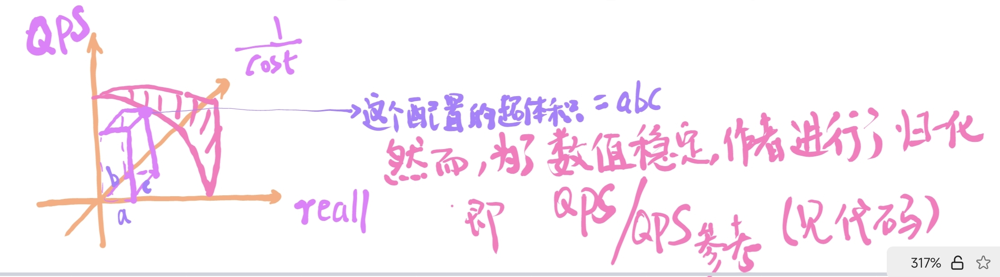

为了计算 EHVI，我们首先需要构建一个**超体积指标**，它量化了当前解集的超体积。然后，通过在目标空间的不确定区域上进行积分并考虑新解的概率分布，计算超体积的期望提升。在所有候选解中，具有最高 EHVI 的解被采集函数优先选择。**图 4** 展示了如何计算 EHVI 的示例。

EHVI 指标不仅考虑了单个目标的改进，还考虑了帕累托前沿的整体覆盖范围，代表了最佳的权衡解。通过优化 EHVI，我们可以引导搜索朝着提高帕累托前沿整体质量和多样性的解发展。

> **图 4 详解 - 什么是 EHVI？**
>
> 这张图是理解 VDTuner 怎么判断“这一步走得好不好”的关键。
>
> 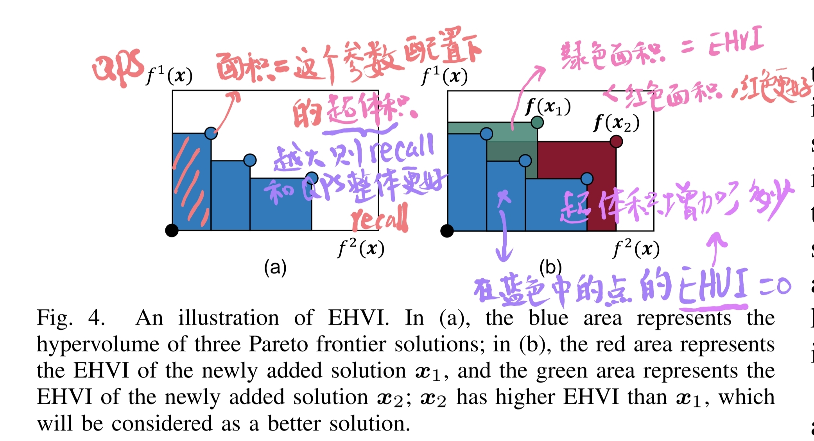
>
> *   **坐标轴：** 纵轴是 $f^1(x)$（比如搜索速度），横轴是 $f^2(x)$（比如召回率）。我们要这两个都越大越好（往右上角跑）。
> *   **蓝色区域（基准）：** 这是我们目前已经找到的“还不错的配置”所围成的**面积（超体积）**。这个面积越大，说明我们的系统性能越强。
> *   **新来的挑战者 $x_1$：**
>     *   它在速度上比现有的好一点点，但在召回率上没有突破。
>     *   它增加的面积（绿色区域）很小。**EHVI 低，不选它。**
> *   **新来的挑战者 $x_2$：**
>     *   它直接突破了当前的边界，使得整个包围的面积增加了一大块（红色区域）。
>     *   它显著扩大了我们的“领土”。**EHVI 高，选它！**
>
> **结论：** VDTuner 不看单个指标，而是看“如果你加入进我的解集，能不能帮我把**总地盘（超体积）**扩大？”

### C. 为什么 MOBO 适合 VDTuner (Why MOBO is Suitable for VDTuner)

VDTuner 采用 MOBO 作为其核心优化引擎，主要原因如下：
1.  **无需先验知识：** MOBO 不需要关于 VDMS 的任何先验知识，这减轻了管理员理解复杂且快速变化的 VDMS 版本的压力。
2.  **昂贵的评估成本：** VDMS 配置的评估是昂贵的，通常需要几分钟甚至几小时，特别是在更改索引类型后**重建向量索引**时。MOBO 可以通过高效且智能地探索复杂的多维参数空间，避免过多的配置评估。
3.  **天然契合多目标：** MOBO 最初就是为优化多个目标而设计的，这与我们需要优化两个目标（搜索速度和召回率）的需求完美契合。

### D. 将 MOBO 应用于 VDMS 调优的挑战 (Challenges in Applying MOBO to VDMS Tuning)

尽管 MOBO 有许多吸引人的优势，但将其应用于 VDMS 调优仍然具有挑战性，原因如下：

1.  **参数空间不固定：** 原始 BO 模型通常需要一组**固定的**调优参数，而 VDMS 中不同索引类型的调优参数**不是固定的**（见前文表 I，HNSW 和 IVF_PQ 参数完全不同）。因此，为了将 BO 应用于 VDMS，需要专门的设计。
2.  **预算分配困难：** 我们的初步研究（图 3(c)）表明，不同索引类型的性能差异明显。因此，将调优预算（时间/计算资源）平均分配给所有索引类型是低效的，需要一种更高效的预算分配方式。
3.  **共享参数的知识迁移：** VDMS 中有一些由所有索引类型共享的全局调优参数（例如系统参数），这意味着从一种索引类型学到的知识也可能对其他索引类型有启发。因此，如何充分利用从不同索引类型学到的知识是值得探索的。

### IV. VDTUNER：设计与实现 (VDTUNER: DESIGN AND IMPLEMENTATION)

**VDTuner 的整体工作流程如图 5 所示。** 基本上，VDTuner 迭代地采样 VDMS 的配置，以学习一个包含所有索引类型的所有可调参数的**整体 BO 模型（Holistic BO Model）**。

在每次迭代中，VDTuner 指定一种索引类型，BO 模型的采集函数（acquisition function）推荐一个针对该指定索引类型的配置进行采样。索引类型是以**轮询（polling）**的方式指定的，但 VDTuner 会通过**逐次淘汰（successively abandons）**性能差的索引类型，以确更重要的索引类型获得更大的预算分配。新采样的配置随后用于更新代理模型。调优过程直到找到足够好的配置为止。

---

### 

---

### A. 为什么使用整体 BO 模型 (Why Use a Holistic BO Model)

VDTuner 旨在找到 VDMS 的最佳配置，包括索引类型和该索引类型的参数设置。然而，与每种索引类型相关的调优参数是不同的。

一种直观的方法是为每种索引类型建立一个**单独的 BO 模型**，并在所有 BO 模型都学习好之后选择最佳的索引类型。然而，这是**低效的**，原因如下：
1.  **参数共享：** 许多参数（例如系统参数）在不同索引类型之间是共享的，单独建模会导致共享参数被重复调优，浪费时间。
2.  **知识隔离：** 如果分开建模，从一种索引类型学到的关于共享参数的知识无法与其他索引类型共享。

鉴于此，VDTuner 将所有索引类型的参数整合到一个**整体模型（Holistic Model）**中（不同索引类型之间的共享参数只有一份副本），并以**轮询（polling）**的方式调整不同索引类型的参数。这更有效，因为共享参数不会被重复调优。此外，由于所有索引类型共享一个 BO 模型，从一种索引类型学到的关于共享参数的知识对其他索引类型也是有用的。

例如，系统参数 `gracefulTime` 由所有索引类型共享，它控制 VDMS 的有界一致性级别。该参数的一个小值会导致严重的请求阻塞，无论选择哪种索引类型。通过使用整体 BO 模型，VDTuner 可以从先前采样的索引类型中学习这一规则，这可以大大提高调优效率。

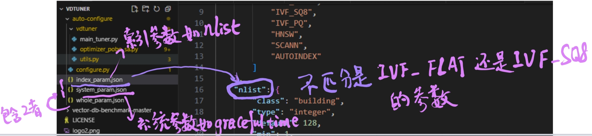

### B. 代理模型 (Surrogate Model)

BO 中的代理模型充当代理，根据可用数据近似未知的目标函数。在我们的上下文中，代理模型用于近似可调参数与 VDMS 性能之间的关系。

常用的代理模型是**高斯过程（Gaussian Process, GP）**，它完全由其均值函数 $m(\boldsymbol{x})$ 和协方差函数 $k(\boldsymbol{x}, \boldsymbol{x}')$ 表征。
$$f(\boldsymbol{x}) \sim GP(m(\boldsymbol{x}), k(\boldsymbol{x}, \boldsymbol{x}')) \quad (1)$$

我们选择 **Matern 5/2** 作为核函数，因为它在对未知函数建模时具有平衡灵活性和平滑度的出色能力 [31]。

在我们的上下文中，输入 $\boldsymbol{x}$ 指的是调优参数的配置，包括索引类型、所有索引类型的索引参数和系统参数。由于我们关注两个性能指标（搜索速度和召回率），VDTuner 采用**多输出 GP（Multi-output GP）**，假设每个输出是独立的。给定输入 $\boldsymbol{x}$，GP 模型可以估计此配置下 VDMS 的性能（搜索速度和召回率）。随着不断采样的配置更新均值和协方差函数，GP 模型将变得越来越准确。

**【关键难点：轮询代理 (Polling Surrogate)】**

尽管 GP 具有理论上的预测能力，但将其粗略地应用于 VDTuner 仍然效率低下。这是因为在学习的早期阶段，不同索引类型之间的性能差异可能非常显著。BO 模型很可能只在表现好的索引类型周围进行**开发（exploit）**，而不去**探索（explore）**表现差的索引类型。

然而，当前表现差的索引类型并不一定真的差，可能只是因为当前的采样非常有限（还没有找到该类型下的好参数），无法准确判断最终性能。这将增加陷入局部最优的风险。

>
> 这就好比一个老师带两个学生：小明（HNSW）和小红（IVF）。
> 小明是天才，随便一考就是90分。小红是潜力股，需要调教，刚开始只能考60分。
> 如果 BO 只是看分数，它会把所有时间和资源都花在小明身上，完全不管小红。
> 但实际上，小红如果参数调好了，可能能考100分！
> 为了防止 BO “势利眼”，我们需要引入下面的**归一化（Normalization）**技术。

为了解决这个问题，VDTuner 采用了一种**轮询代理（Polling Surrogate）**，它通过考虑不同索引类型的性能变异性来**归一化** GP 的输入数据。
我们不直接使用性能值，而是使用改进的**归一化性能提升（Normalized Performance Improvement, NPI）** [17] 来评估配置的性能。

具体来说，对于采样的配置 $\boldsymbol{x}_i$，令 $(y^{spd}_i, y^{rec}_i)$ 表示其性能。$\boldsymbol{x}_i$ 的归一化性能定义为：
$$(\hat{y}^{spd}_i, \hat{y}^{rec}_i) = (\frac{y^{spd}_i}{\bar{y}^{spd}_t}, \frac{y^{rec}_i}{\bar{y}^{rec}_t}) \quad (2)$$

其中 $(\bar{y}^{spd}_t, \bar{y}^{rec}_t)$ 是索引类型 $t$ 的**基准性能值**，它是基于索引类型 $t$ 实现的最平衡的非支配（non-dominated）配置设置的。

**轮询代理（Polling Surrogate）**使用归一化性能训练 GP 模型，这反映了候选配置相对于特定索引类型当前最佳配置的**相对改进**。因此，它可以消除不同索引类型之间的性能差异，有效防止 BO 陷入局部最优。

---

> 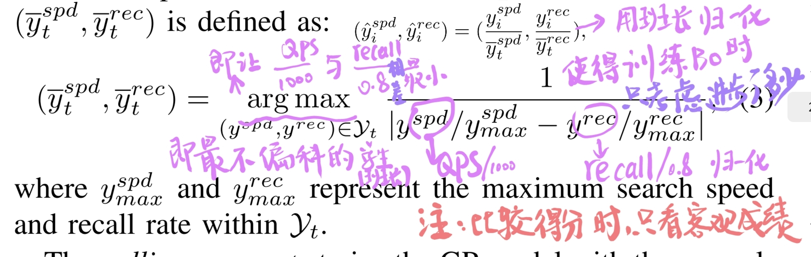

---

### C. 采集函数 (Acquisition Function)

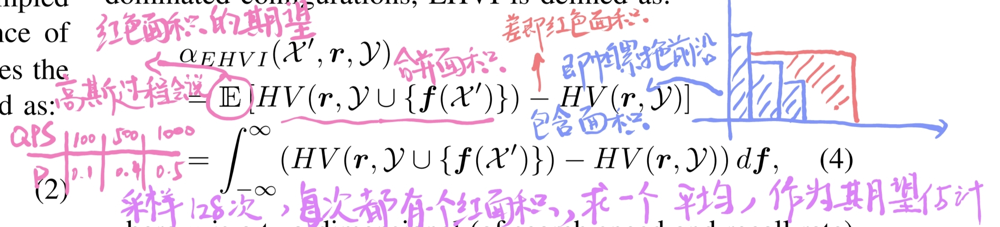

在我们的上下文中，采集函数用于**推荐**针对**指定索引类型**进行采样的配置。为此，采集函数首先将索引类型设置为指定的类型，并将不属于该索引类型的参数设置为其默认值，然后根据代理模型的预测，推荐属于该索引类型的参数配置，以实现最大效用值。

对于单目标优化，通常应用**期望提升（Expected Improvement, EI）**。由于我们要关注两个目标，VDTuner 采用 EI 的多目标泛化形式——**期望超体积提升（Expected Hypervolume Improvement, EHVI）** [23], [24]。

$$ \alpha_{EHVI}(\mathcal{X}', \boldsymbol{r}, \mathcal{Y}) = \int_{-\infty}^{\infty} (HV(\boldsymbol{r}, \mathcal{Y} \cup \{f(\mathcal{X}')\}) - HV(\boldsymbol{r}, \mathcal{Y})) d\boldsymbol{f} \quad (4) $$

其中 $\boldsymbol{r}$ 是二维参考点（搜索速度和召回率）；$HV()$ 函数测量观测数据的超体积；$f(\mathcal{X}')$ 表示代理模型预测的性能值。因此，$\alpha_{EHVI}$ 量化了在 $\mathcal{X}'$ 中添加每个候选配置的**预期超体积改进**。

我们使用蒙特卡洛积分来估计公式 4。我们将参考点 $\boldsymbol{r}$ 设置为每个索引类型 $t$ 的 $0.5 \cdot (\bar{y}^{spd}_t, \bar{y}^{rec}_t)$。这意味着我们不希望感兴趣的配置的目标值低于最平衡配置所达到值的一半。这向 VDTuner 表明，不赞成通过牺牲另一个目标来实现极高的单目标。

### D. 索引类型间的预算分配 (Budget Allocation Among Index Types)

如前所述，仔细分配调优预算（Tuning Budgets，即尝试不同配置的机会次数）对于 VDTuner 的效率至关重要。

一种简单有效的方法是遵循**轮询规则（Round-Robin）**：循环分配索引类型，确保每个索引类型按顺序轮流进行，不偏袒任何一方。虽然轮询非常适合没有提供索引类型先验信息的场景，但它仍然缺乏效率，因为它无法识别好的索引类型（即“平均主义”害死人）。

> 

VDTuner 执行一种**逐次淘汰策略（Successive Abandon Strategy）**来改进轮询。在此策略中，索引类型通过设计的函数动态评分，最差的一个在调优过程中被逐次淘汰。随着 VDTuner 对配置空间了解的加深，它逐渐将探索重心集中在那些有希望的索引类型上。为了有效地做到这一点，评分函数应该公平地评估每个索引类型对“在两个目标之间进行权衡的高性能采样”的贡献。

我们根据每个索引类型对过去观测到的性能的**超体积（HV）**的影响构建评分函数。具体来说，如果在排除某个索引类型的数据后，计算出的 HV 值显著降低，这意味着该索引类型对找到好的配置贡献很大。

对于每个索引类型 $t \in \{1, .., T\}$，其非支配配置的观测性能为 $\mathcal{Y}_t$，则 $t$ 的 HV 影响力计算如下（差值形式）：

$$ \Delta HV = HV(\boldsymbol{r}, \mathcal{Y}) - HV(\boldsymbol{r}, \mathcal{Y}/\mathcal{Y}_t) \quad (5) $$

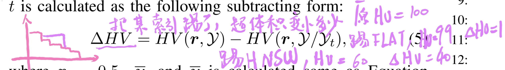

其中 $\boldsymbol{r} = 0.5 \cdot \bar{\boldsymbol{y}}$，$\bar{\boldsymbol{y}}$ 的计算与公式 3 相同，只是 $\mathcal{Y}_t$ 被整个非支配配置集 $\mathcal{Y}$ 替换。显然，更高的 $\Delta HV$ 表明索引类型 $t$ 的贡献更大。
在实现中，由于公式 5 中的 $HV(\boldsymbol{r}, \mathcal{Y})$ 对于所有索引类型 $t$ 都是相同的，我们只需要计算分数如下：

$$ Score(t) = \max_{t' \in \{1, .., T\}} (HV(\boldsymbol{r}, \mathcal{Y}/\mathcal{Y}_{t'})) - HV(\boldsymbol{r}, \mathcal{Y}/\mathcal{Y}_t) \quad (6) $$

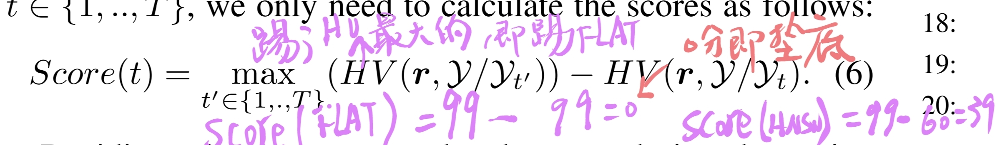

决定何时执行淘汰对性能也很重要。过早放弃可能会导致优秀的索引类型在调整好之前就被丢弃；而过晚放弃可能会降低预算分配的效果。VDTuner 采用**窗口方差度量（Windowed Variance Metric）**作为放弃的触发条件。具体来说，如果某个索引类型的排名在固定长度的迭代窗口内一直是**最差的**（根据公式 6），它将被放弃。

---

### E. 算法整合 (Putting Them Together)

总体而言，我们在**算法 1** 中报告了 VDTuner 的轮询贝叶斯优化的伪代码。

对于给定的工作负载（例如，一批相似度搜索请求），VDTuner 首先对所有索引类型执行**初始采样**（第 1-5 行），采样的配置作为 VDTuner 的初步训练数据。

在每次调优迭代中（第 6-23 行）：
1.  如果剩余的索引类型不止一个，VDTuner 首先对索引类型进行**评分**，并据此决定是否**淘汰**最差的索引类型（第 7-14 行）；
2.  然后，VDTuner 使用来自所有索引类型的数据构建一个专门的 **GP 代理模型**（第 15-18 行）；
3.  之后，对于当前轮询的索引类型，VDTuner 推荐一个最大化采集函数的有希望的配置（第 19-21 行）；
4.  最后，评估推荐的配置，并用反馈更新 VDTuner 的知识库（第 22 行）。

VDTuner 的终止条件不固定，可以灵活指定，例如最大样本数。

> **【算法 1：VDTuner 的轮询贝叶斯优化（伪代码讲解）】**
>
> **输入：** 索引类型集合 {HNSW, IVF...}，参数空间，工作负载。
>
> 1.  **初始化阶段 (Line 1-5)：**
>     *   不管三七二十一，先把每种索引类型的**默认配置**都跑一遍。
>     *   目的：先拿到一点点数据，别让模型两眼一抹黑。
>
> 2.  **大循环 (Line 6-23)：** 只要没喊停，就一直跑。
>     *   **淘汰裁判环节 (Line 7-14)：**
>         *   如果场上剩下的选手 > 1 个：
>         *   计算每个选手的得分 `Score(t)`（看谁对帕累托前沿贡献大）。
>         *   **关键判断：** 如果某个选手在最近几轮一直表现最差（满足窗口方差条件），直接**淘汰**（Remove from `Tremain`）。
>     
>     *   **模型训练环节 (Line 15-18)：**
>         *   把所有选手的数据都拿来（不管是被淘汰的还是留下的）。
>         *   **归一化（Normalize）：** 用公式2把大家拉到同一起跑线，防止模型因为某个索引类型天生分高就偏心。
>         *   建立多目标 GP 代理模型。
>     
>     *   **推荐环节 (Line 19-21)：**
>         *   `t_poll`：轮到哪位选手了？（在剩下的选手中轮询）。
>         *   `X'`：确定搜索空间。
>         *   `x_new`：用采集函数（EHVI）算出一个该选手最有希望的配置。
>     
>     *   **实测环节 (Line 22)：**
>         *   去数据库里真的跑一下这个配置，拿到真实的（速度，召回率）。
>         *   存入数据库 `D`。

---

### F. 处理用户偏好 (Handling User Preference)

**约束模型 (Constraint Model)：**
到目前为止，我们假设用户对 VDMS 调优的任一目标没有偏好。然而，在某些场景中，用户可能会要求优化搜索速度，同时保持**召回率高于定义的阈值**（例如 Recall > 0.9），这是 EHVI 采集函数无法捕捉的。

因此，VDTuner 引入了一个**约束模型**来引导搜索在召回率约束区域内进行。约束模型量化了候选配置满足约束的**概率**。具体来说，当面对用户定义的召回率约束（例如 `rlim` > 0.85）时，我们将公式 4 替换为**约束 EI (Constraint EI)** 采集函数：

$$ \alpha_{CEI}(\mathcal{X}_{cand}, rlim) = \alpha_{EI}(\mathcal{X}_{cand}) \cdot Pr(f^{rec}(\mathcal{X}_{cand}) > rlim) $$
$$ = \mathbb{E}(\max(f^{spd}(\mathcal{X}_{cand}) - best\_f, 0)) \cdot Pr(f^{rec}(\mathcal{X}_{cand}) > rlim) \quad (7) $$

约束采集函数 $\alpha_{CEI}$ 是一个 **EI 函数**（衡量预期的搜索速度提升）和一个**概率函数**（衡量实现高于 `rlim` 的召回率的可能性）的乘积。此外，公式 2 中的基准值 $\bar{y}$ 被修改为索引类型 $t$ 获得的最大函数值。这指示 VDTuner 放松同时实现高搜索速度和召回率的目标，而是专注于在约束区域内最大化搜索速度。

**利用先前数据进行热启动 (Bootstrapping with Previous Data)：**
对于更一般的情况，用户可能有波动的召回率偏好。直观地说，为每个新的召回率约束从头开始学习是低效的，因为先前采样的数据可能包含可以共享的有用信息。特别是，旧召回率约束的初期采样可能反映了配置空间的粗略性能分布，即使 VDTuner 随后逐渐专注于在约束区域内进行优化。因此，VDTuner 通过使用不同召回率约束的**先前采样数据（如果有）**来预热代理模型，从而实现自动调优的热启动（Bootstrap）。

> 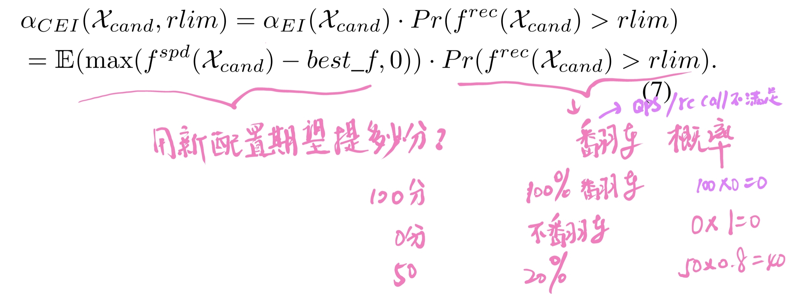
>
> $$ \text{得分} = \text{速度提升} \times \text{不翻车概率} $$
>
> 为什么要相乘？因为这是一票否决制：
>
> 1.  **场景 A（莽夫）：**
>     *   速度提升：超级大（100分）。
>     *   不翻车概率：极低（1%）。
>     *   **总分：** $100 \times 0.01 = 1$。 **（淘汰）**
>
> 2.  **场景 B (老头乐)：**
>     *   速度提升：很小甚至为0（0分）。
>     *   不翻车概率：超级稳（100%）。
>     *   **总分：** $0 \times 1.0 = 0$。 **（淘汰）**
>
> 3.  **场景 C (车神)：**
>     *   速度提升：不错（50分）。
>     *   不翻车概率：还可以（80%）。
>     *   **总分：** $50 \times 0.8 = 40$。 **（录用！）**
>
> *   **普通模式 (EHVI)：** 给我找一个“又快又准”的配置。
> *   **偏好模式 (Constraint)：** 我不管别的，**准确率必须 > 0.9**！在这个前提下，越快越好。
> *   **怎么做？** 公式 (7) 告诉模型：推荐配置时，先算算这个配置“准确率 > 0.9”的概率大不大？如果概率很小，哪怕它速度飞快，也别推荐给我（乘以一个很小的概率系数，得分变低）。
> *   **热启动 (Bootstrapping)：** 昨天你刚跑完“准确率 > 0.8”的任务，今天我要跑“准确率 > 0.9”。别把昨天的数据扔了！昨天的经验虽然不完全适用，但至少能告诉你哪些参数是大坑，可以让你少走弯路

---

## V. 评估 (EVALUATION)

### A. 实验设置 (Experiment Setting)

**平台 (Platform)**。我们在一个流行的 VDMS——Milvus（版本 2.3.1）[7] 上评估 VDTuner，运行平台如表 II 所示。用于性能调优的评估参数总共有 16 维，包括索引类型、8 个索引参数（如表 I 所示）和 7 个系统参数（根据 Milvus 文档推荐）。

**工作负载 (Workloads)**。我们使用 `vector-db-benchmark` [32] 生成工作负载，并测试表 III 中所示的三个代表性数据集。默认情况下，并发搜索请求数设置为 10。对于每个数据集，我们发送搜索前 100 个相似向量的请求，并通过与正确结果进行比较来计算召回率（recall rate）。搜索速度（search speed）通过吞吐量（即每秒请求数，QPS）来衡量。

**基线方法 (Baselines)**。VDTuner 与一组最先进的自动配置方法进行了比较。

> 这个基线设置的意思是，比默认的好，比随机的好，比流行的自动配置工具好，同样是预期超体积提升，VDTuner也更好

*   **Default（默认）**：指不对自动配置 VDMS 做任何努力，而是应用 VDMS 中的默认配置。
*   **Random（随机）** [33]：采样方法可以作为评估调优算法的强力基线，因为它们简单且有效。具体来说，我们采用拉丁超立方采样（LHS）[34] 作为基线方法，这是一种空间填充方法，旨在将样本点均匀分布在整个值空间中。
*   **OpenTuner** [20]：是一个流行的自动配置工具，它使用一组数值方法探索配置空间，并由 AUC Bandit 元技术进行协作。为了扩展 OpenTuner 以适应 VDMS 调优场景，我们将模型的奖励（reward）设置为归一化后的搜索速度和召回率的加权和。
*   **OtterTune** [11]：采用基于高斯过程回归（Gaussian Process Regression）的优化来自动配置 DBMS。同样，我们使用加权和方法来优化搜索速度和召回率。
*   **qEHVI** [24]：通过测量候选配置的预期超体积提升（expected hypervolume improvement）在多个目标之间进行权衡。默认情况下，qEHVI 将每个目标的参考点设置为零。

由于之前没有工作致力于调整不同索引类型下的非固定参数，我们假设性地将索引类型作为一个搜索维度，以使基线方法适合同时优化多个索引。VDTuner 的“逐次淘汰”（successive abandon）的触发条件设置为：最差表现的索引类型持续出现 10 次迭代。对于 OtterTune 和 qEHVI，我们使用 LHS 均匀采样的 10 个配置来初始化底层 BO 模型。工作负载回放（workload replay）的最大时间限制设置为 15 分钟。对于失败的配置（超过此时间限制或导致 VDMS 崩溃），我们将反馈值设置为历史最差值，以避免缩放问题（scaling problem）[35], [36]。默认情况下，我们对每种方法运行 200 次迭代。

### 表 II：实验测试平台配置 (Experimental Testbed)

| 组件 (Component)          | 规格 (Specification)               |
| :------------------------ | :--------------------------------- |
| **处理器**                | Intel(R) Xeon(R) Gold 5220 CPU     |
| **处理器主频**            | 2.10GHz                            |
| **逻辑处理器核心数**      | 72 核 (36 个物理核)                |
| **独占 L1 & L2 缓存大小** | 每个核心 32 KB 和 1024 KB          |
| **共享 L3 缓存大小**      | 24.75 MB                           |
| **内存容量**              | 125 GB                             |
| **操作系统**              | CentOS 7.9.2009 (Linux 内核 5.5.0) |

---

### 表 III：评估的数据集 (Evaluated Datasets)

| 数据集 (Dataset)  | 向量数量 (Num. of Vectors) | 维度 (Dimension) | 距离度量 (Distance) |
| :---------------- | :------------------------- | :--------------- | :------------------ |
| **GloVe**         | 1,183,514                  | 100              | Angular (角度/余弦) |
| **Keyword-match** | 1,000,000                  | 100              | Angular (角度/余弦) |
| **Geo-radius**    | 100,000                    | 2048             | Angular (角度/余弦) |

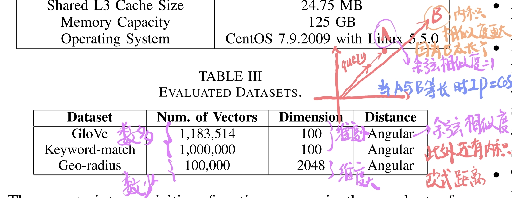

### B. 自动配置的收益 (Benefit of Auto-Configuration)

我们首先展示 VDTuner 对 VDMS 自动配置的收益。我们报告 VDTuner 与 Default 相比的性能提升，定义为在不牺牲召回率（或搜索速度）的情况下，相对于默认性能的搜索速度（或召回率）的最大增强。结果呈现在表 IV 中。我们有几个观察结果。

首先，默认的 VDMS 配置有相当大的改进空间，而 VDTuner 可以显著提高性能，搜索速度最高提升 14.12%，召回率最高提升 186.38%。其次，不同数据集呈现出不同的改进程度（在我们的案例中 Geo-radius > Keyword-match > GloVe）。这是因为相似度搜索的难度取决于许多因素，如数据分布和向量维度。Geo-radius 具有特别大的向量维度（2048），其中一个好的配置（而不是“通常使用”的默认设置）非常关键，因此，自动配置显示出最高的性能提升。结果再次证实了自动配置 VDMS 的必要性。

| 指标 (Metric)                       | GloVe  | Keyword-match | Geo-radius |
| :---------------------------------- | :----: | :-----------: | :--------: |
| **速度提升 (Speed Improvement)**    | 10.46% |    11.17%     |   14.12%   |
| **召回率提升 (Recall Improvement)** | 17.16% |    62.61%     |  186.38%   |

*   **Geo-radius 的数据最夸张：** 召回率提升了 186%，这说明默认配置在这个高维数据集（2048维）上完全“翻车”了，如果不调优，可能根本搜不到想要的东西。这也反向证明了 VDTuner 的价值。
*   **GloVe 提升较小：** 因为 GloVe 维度低（100维），比较简单，默认配置跑得也不算太差，所以提升空间没那么大。
*   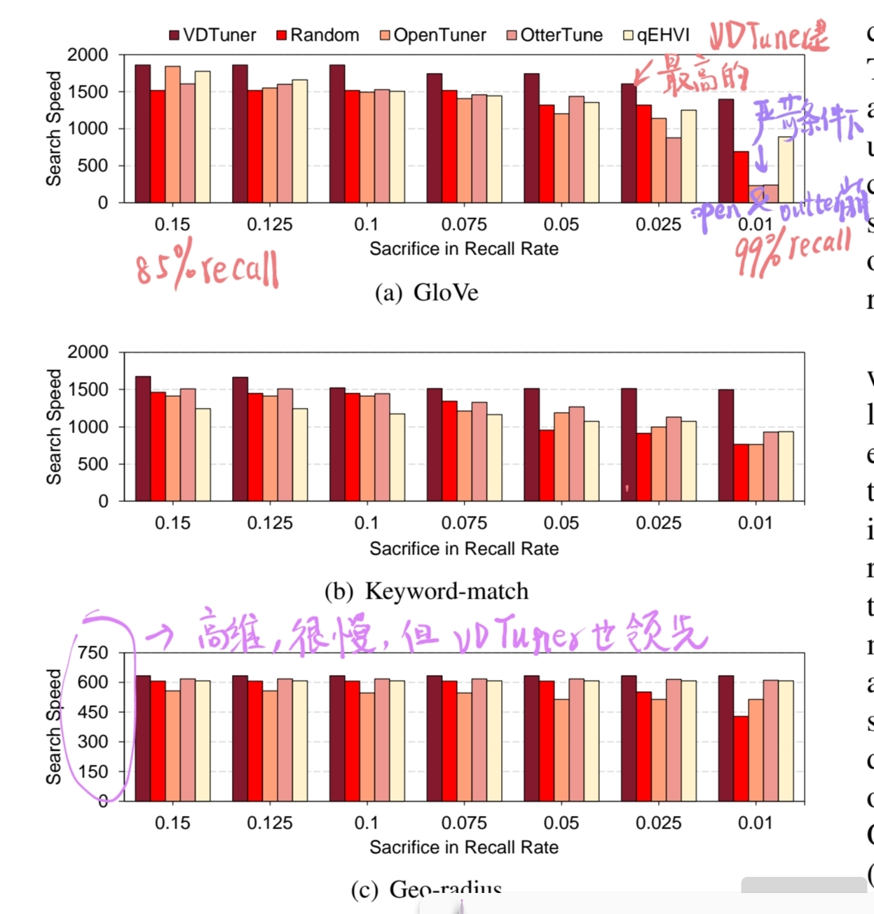

### C. 调优效率 (Tuning Efficiency)

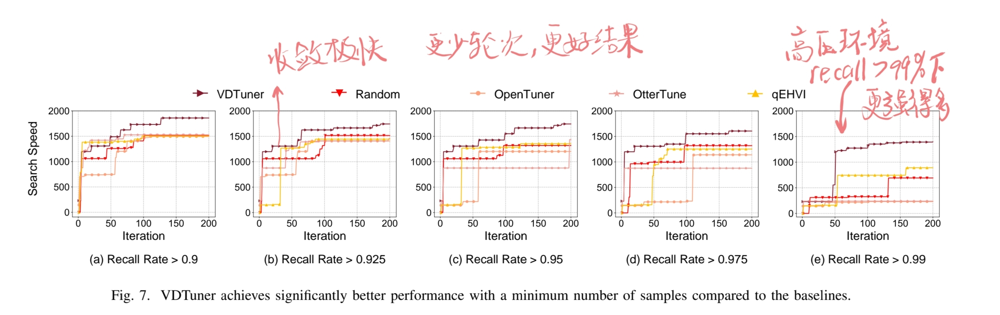

在这个实验中，我们比较 VDTuner 和其他竞争基线的调优效率。图 6 报告了不同方法在不同召回率牺牲（从 0.85 到 0.99，步长为 0.025）下实现的最佳搜索速度。注意，我们没有展示召回率低于 0.85 的配置，因为过低的召回率在实际应用场景中通常是不可接受的。我们有几个观察结果。

**VDTuner 在搜索速度和召回率之间取得了平衡，在两个目标方面都超越了基线。** 我们首先注意到，在不同的召回率牺牲水平下，VDTuner 始终能达到最佳的搜索速度。例如，在 Keyword-match 数据集中，当召回率牺牲从 0.15 到 0.01 时，与最具竞争力的基线相比，VDTuner 实现了搜索速度提升分别为 11.15%, 10.35%, 4.53%, 12.19%, 18.84%, 33.32% 和 59.54%。总体而言，Random 未能找到足够好的配置，因为它无法利用历史信息。OpenTuner 采用了许多假设调优参数彼此独立的数值优化技术，而 VDMS 参数之间的相互依赖性可能导致非常不均匀的配置空间，OpenTuner 很容易陷入局部最优。OtterTune 采用单目标 BO 模型来自动调优 VDMS 配置，无法在冲突的搜索速度和召回率之间提供合理的权衡。尽管 qEHVI 可以在目标之间取得平衡，但由于未意识到 VDMS 的非结构化索引配置（unstructured index configurations），它仍然缺乏效率。

此外，我们发现 VDTuner 在召回率受到严格限制的**极端困难区域**通常表现更好。对于所有三个数据集，随着召回率牺牲从 0.15 收紧到 0.01，VDTuner 相对于最具竞争力的基线的相对优势呈现上升趋势，分别为 1.03% 到 56.95%，11.15% 到 59.54% 和 2.64% 到 3.82%。这表明 VDTuner 在平衡搜索速度和召回率方面具有卓越的能力。为了进行更定量的分析，我们要衡量所有方法的**权衡能力（tradeoff ability）**，定义为不同召回率牺牲下搜索速度的标准差。较低的偏差意味着目标之间更好的权衡。权衡能力的顺序（从好到坏）是 VDTuner, qEHVI, OtterTune, OpenTuner 和 Random。这验证了 EHVI（被 VDTuner 和 qEHVI 使用）在权衡搜索速度和召回率方面起着重要作用。

**与竞争基线相比，VDTuner 识别出更好配置的速度明显更快。** 图 7 显示了 GloVe 数据集下不同方法的搜索速度优化曲线。我们观察到 VDTuner 用最少的样本数和调优时间找到了足够好的配置（即性能优于最具竞争力的基线的配置）。具体来说，对于 0.1, 0.075, 0.05, 0.025 和 0.01 的召回率牺牲，与基线相比，VDTuner 仅需要 92%, 64%, 50%, 69%, 32% 的采样数量；而调优时间的优势甚至更大：67%, 47%, 38%, 49%, 28%（即快高达 3.57 倍）。结果证明，VDTuner 不仅表现出最高的调优效率，而且执行了更高质量的采样，其配置不会导致 VDMS 崩溃或不合理的索引构建时间。

### D. 为什么 VDTuner 工作高效 (Why VDTuner Works Effectively)

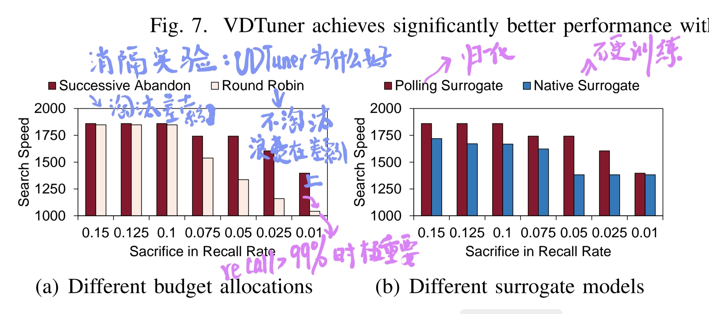

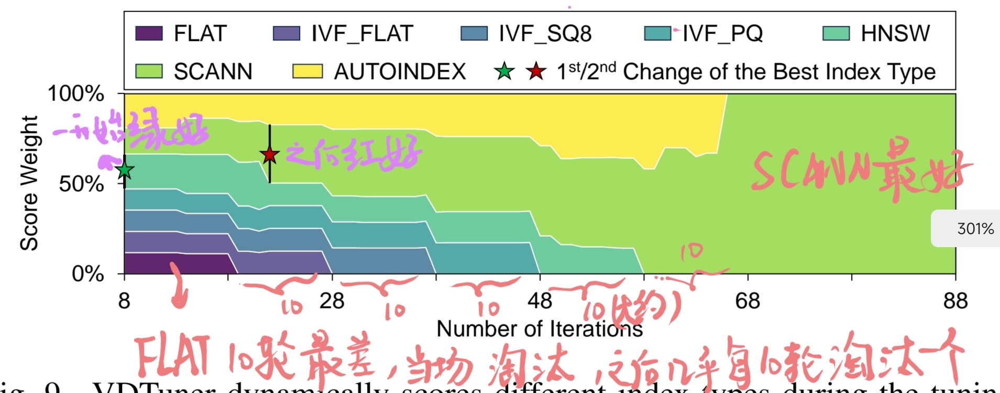

在本节中，我们要深入分析 VDTuner 如此高效的原因。我们首先检查 VDTuner 中的主要组件，即预算分配和代理模型，然后验证 VDTuner 的整体 BO 模型（holistic BO model）的有效性。

**预算分配的有效性。** 图 8 (a) 报告了 VDTuner 的“逐次淘汰策略”（Successive Abandon Strategy）及其简化版本“轮询”（Round Robin）所实现的性能（在 GloVe 数据集中）。可以看出，逐次淘汰策略在不同的召回率牺牲下带来了搜索速度的提升，最高可达 34%。这可以归因于 VDTuner 识别最合适索引类型的能力，这通过动态评分函数（dynamic score function）来衡量。为了更详细的观察，图 9 可视化了动态评分过程，描述了随着样本数量增加，每种索引类型的权重。可以观察到，虽然初始采样后 HNSW 的得分最高，但 VDTuner 在学习了更多 VDMS 配置信息后，逐渐识别出真正的最佳索引类型 SCANN。

**代理模型的有效性。** 接下来我们研究 VDTuner 的“轮询代理模型”（Polling Surrogate Model）的有效性。图 8 (b) 显示了轮询代理相对于原生高斯过程代理（Native Gaussian Process Surrogate）的性能提升。我们观察到，在不同的召回率牺牲下，轮询代理带来了明显的搜索速度提升（最高 26%）。为了更详细的观察，我们在图 10 中描绘了两种方法采样的所有配置。我们有几个观察结果。第一，两种代理都选择了更多的 SCANN, AUTOINDEX 和 HNSW 作为它们的索引类型。第二，轮询代理探索了更广泛的不同召回率值的空间，而原生代理呈现出更相似的性能采样（每种索引类型显示出簇状形状）。第三，结果是，轮询代理引导了更高质量的搜索，其中搜索速度和召回率都很高（由红色矩形标记）。结果表明，VDTuner 有效地联合学习了多种索引类型，从而实现了更好的性能。

**整体 BO 模型 VS 单独优化每种索引类型。** 随后，我们将 VDTuner 与单独调整每种索引类型参数的方法进行了比较。结果表明，在我们选择的实验场景中，VDTuner 选择的索引类型与单独调整每种索引类型参数的方法所选择的相同，并且这两种方法生成的参数非常接近。例如，它们都选择 SCANN 作为最佳索引类型，对于超过 80% 的参数，两种方法生成的参数之间的差异小于 5%（差异定义为绝对差值除以该参数的尺度）。注意，两种方法生成的参数不一定非要完全相同，因为最优参数配置不只有一种。

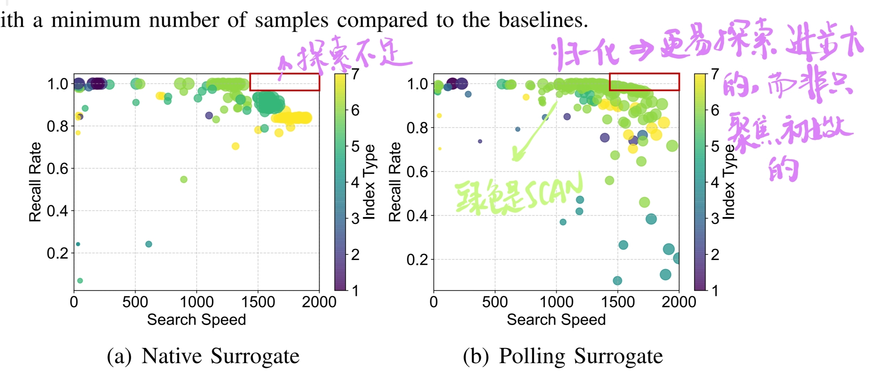

为了理解不同数据集中索引选择和参数的变化，我们在表 V 中总结了 VDTuner 针对不同数据集推荐的索引类型和代表性参数。我们观察到，选定的索引类型随不同数据集而变化（GloVe 和 Keyword-match 选择了 SCANN，ArXiv-titles 选择了 HNSW）。这是因为数据特征（如维度、分布和密度）会影响不同索引类型的效率和有效性，使得某些索引类型比其他类型更适合特定数据集。我们还观察到，VDTuner 生成的参数在不同数据集之间差异很大，即使对于具有相同索引类型的数据集（例如 GloVe 和 Keyword-match）。原因是不同的数据特征需要不同的参数设置才能达到最佳性能。例如，对于维度间相关性较低的数据集（例如 Keyword-match），向量搜索更具挑战性，需要更高的 `nprobe`（控制搜索时查询中使用的候选聚类中心数量的参数）来扩大搜索范围以实现高召回率。结果证实了针对不同工作负载进行 VDMS 性能调优的必要性。

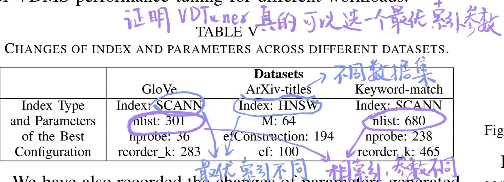

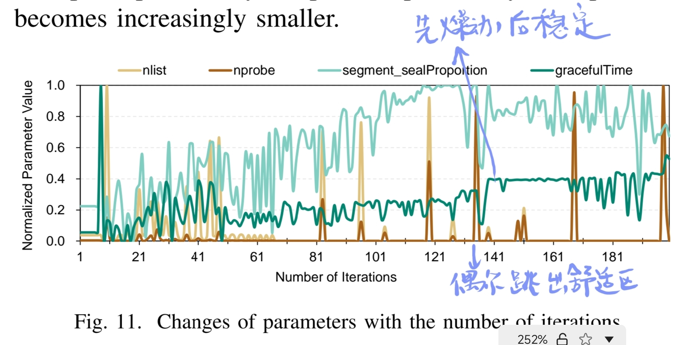

### E. 可扩展性 (Scalability)

**更大的数据集。** 我们接下来验证 VDTuner 在更大数据集（deep-image，比 GloVe 大 10 倍）上的有效性。我们将 VDTuner 的性能与我们选定场景中表现最好的基线（即 qEHVI）进行比较。结果表明，VDTuner 仍然保持着显著的性能优势。具体来说，当召回率牺牲为 0.99 时，VDTuner 实现了 159% 的搜索速度性能提升，并且在达到相同性能水平时，调优速度快 8.1 倍。

**处理用户偏好。** 接下来，我们验证当用户对召回率有特定偏好时 VDTuner 的有效性。考虑了三个版本：(1) **VDTuner without constraint model and bootstrapping**（无约束模型和热启动的 VDTuner），这意味着不建模用户的召回率偏好（而是直接优化两个目标），并且不使用历史数据（即先前出现的召回率调优数据）；(2) **VDTuner without bootstrapping**（无热启动的 VDTuner），这意味着不使用历史数据；(3) **VDTuner**，即完整版本。我们考虑按顺序优化偏好召回率 > 0.85 和 > 0.9 的场景，每个场景进行 200 次迭代。结果如图 12 所示。

首先，我们观察到约束模型带来了显著更好的调优效率。对于召回率 > 0.85 和 > 0.9，带约束模型的 VDTuner 分别只需要 49% 和 75% 的样本（在调优时间方面快 1.87 倍和 1.30 倍）即可达到与无约束模型的 VDTuner 相同的性能。这是因为带约束模型的 VDTuner 只要发现召回率高于阈值，就可以更专注于优化搜索速度，而忽略这一预定义阈值可能导致对不同召回率水平的更广泛探索，因此更慢。我们还注意到，约束模型的优势在较宽松的召回率约束下（召回率 > 0.85）相对更大。这是因为更严格的约束导致可行区域减少和搜索难度增加，因此即使 VDTuner 对约束进行了建模，也需要更多的调优工作。

此外，可以看出，热启动（bootstrapping）技术在带约束模型的 VDTuner 基础上进一步提高了自动配置效率。VDTuner 的完整版本仅需要 66% 的样本（而不使用热启动的值为 75%）即可完成召回率 > 0.9 的任务（与无约束模型和热启动的 VDTuner 相比）。这是因为 VDTuner 通过利用优化召回率 > 0.85 的历史数据来热启动自动配置以预热代理模型，这提供了高质量的初始配置和近似的探索空间分布。

**成本效益优化 (Cost-Effectiveness Optimization)。** 在某些实际场景中，用户可能不太需要极端优化的搜索速度。相反，他们更关心成本效益（性价比），这需要额外考虑 VDMS 中的内存使用情况。为此，我们研究了一个成本效益优化案例，其中搜索速度（QPS）的目标被成本效益（`QP$`）所取代。我们简单地假设内存使用量按线性收费，每秒·GiB 为 $\eta$ 美元，则 `QP$` 定义为：
$$ \text{Cost-Eff.} = \frac{\text{Search Speed (query/sec)}}{\text{Price (\$/sec)}} = \frac{\text{Search Speed}}{\eta \cdot \text{Memory Usage}}. \quad (8) $$

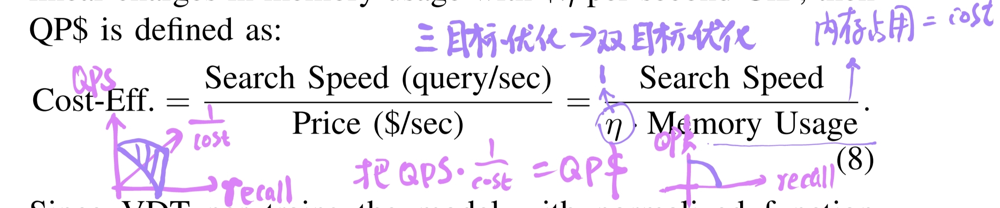

由于 VDTuner 使用归一化的函数值训练模型，$\eta$ 的值不会影响结果。在实现中，我们设置 $\eta = 1$。注意，通过修改 Cost-Eff 的定义，优化其他资源和价格函数是微不足道的。我们的工作不受任何特定资源或价格函数的限制。

为了比较这两个优化目标，我们分别记录了优化 `QP$` 和 QPS 的性能和内存使用情况（针对 Geo-radius 数据集）。如图 13 (a) 所示，我们观察到优化 `QP$` 导致了明显更高的 `QP$`（高达 13%）和更低的 QPS（高达 5%），证明了 `QP$` 对内存使用是可感知的。我们进一步比较了优化 `QP$` 和 QPS 采样的所有配置的内存使用情况。正如预期的那样，优化 `QP$` 导致的内存使用量明显低于优化 QPS（3.89 GiB ± 1.75 VS. 5.19 GiB ± 2.44）。

为了深入探究，我们使用博弈论方法 SHAP path [37] 来分别评估每个参数对性能和内存使用情况的影响。如图 13 (b) 所示，对内存使用和搜索速度最重要的参数分别是 `segment_maxSize` (+3.09 GiB) 和 `index_type` (+119 QPS)。搜索速度优化版本推荐了一个大的 `segment_maxSize` 以获得更高的搜索速度，无论它会导致多高的内存使用。相比之下，成本效益优化版本在搜索速度和内存使用之间进行了权衡，并推荐了一个相对较小的 `segment_maxSize`，这显著减少了内存使用，同时牺牲了一点探索高 QPS 的机会。结果表明，VDTuner 能够扩展到成本感知的优化目标。

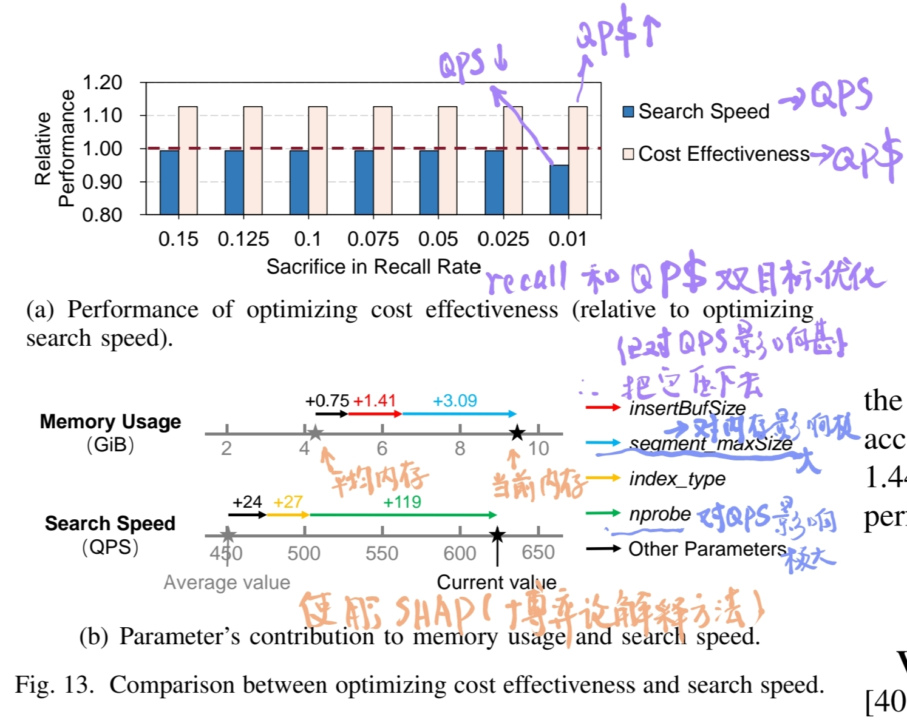

### F. 开销 (Overhead)

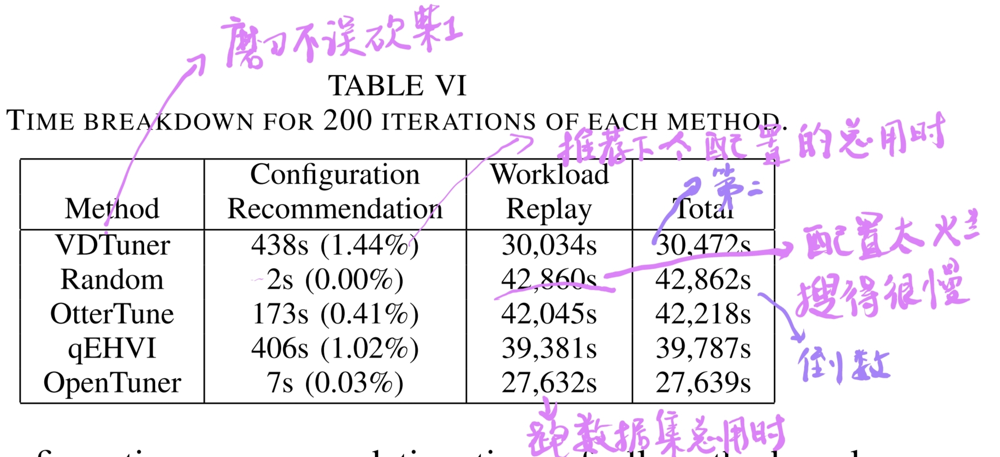

我们接下来评估 VDTuner 的多目标贝叶斯优化引擎的开销。我们记录了 GloVe 数据集中每种方法进行 200 次迭代的调优时间分解（包括目标工作负载回放和配置推荐）。结果报告在表 VI 中。我们有几个观察结果。

首先，Random 具有最长的总调优时间，这意味着它缺乏找到高质量配置的能力（通常伴随着合理的数据加载/索引构建时间）。OpenTuner 的总调优时间比 VDTuner 略短，因为它采样了更多次优的索引类型，这些索引类型尽管性能较差，但索引构建时间略短。其次，VDTuner 的配置推荐时间与 qEHVI 相似，并且略多于 OtterTune，这归因于 VDTuner 的组件：分别是预算分配和多目标采集函数。第三，所有方法的配置推荐时间仅占总调优时间的一小部分（例如，VDTuner 为 1.44%），考虑到 VDTuner 的卓越性能，这是可以接受的。

---

### 参考文献

### 1. 我们调优的对象 (The "Patient")

*   **[7] Milvus** (2021 SIGMOD):
    *   **角色：** 本文的实验平台。
    *   **讲解要点：** 这是目前最流行的开源向量数据库之一。本文所有的实验都是在 Milvus 2.3.1 版本上跑的。如果你要复现，得先去装个 Milvus。
*   **[39] HNSW** (2018 TPAMI):
    *   **角色：** 核心算法。
    *   **讲解要点：** 这是目前向量检索中最主流的图算法。文中提到的 `M`, `efConstruction`, `ef` 全是这篇论文定义的参数。不懂 HNSW 就看不懂这些参数在调什么。

### 2. 我们的竞争对手 (The Baselines)
*   **[11] OtterTune** (2017 SIGMOD):
    *   **角色：** 数据库自动调优的鼻祖（CMU 做的）。
    *   **讲解要点：** 它原本是调传统数据库（如 MySQL, PostgreSQL）的。它是单目标的（只能盯着一个指标优化），所以本文用它来反衬“多目标优化（同时管速度和召回率）”的重要性。
*   **[20] OpenTuner** (2014 PACT):
    *   **角色：** 通用的自动调优框架。
    *   **讲解要点：** 它就像个万金油，什么都能调。它假设参数之间是独立的（不相关的），但本文证明了向量数据库参数是“牵一发而动全身”的，所以 OpenTuner 在这里效果不好。
*   **[24] qEHVI** (2020 NeurIPS):
    *   **角色：** 数学大佬，本文的理论基础。
    *   **讲解要点：** Facebook (Meta) 团队搞出来的。本文的核心数学公式（期望超体积提升 EHVI）就是基于这篇论文改进的。它很强，但它不懂向量数据库有“多种索引类型”这回事，所以本文（VDTuner）比它更懂业务。

### 3. 我们用的工具 (The Tools)
*   **[32] Vector-db-benchmark**:
    *   **角色：** 实验工具箱。
    *   **讲解要点：** 这是 Qdrant 团队开源的一个跑分工具。本文的数据集（GloVe, Deep-image等）和发请求的代码，大概率都是基于这个改的。复现实验时，我们需要去 GitHub 上找这个库。
