## OpenTuner复现指导手册

[TOC]

### 假设和心理预期

**假设**：已经跑通了VDTuner，已经学会了OpenTuner的配置方法。

**注意**：VDTuner运行的时候不可以运行opentuner，这是因为VDTuner/OpenTuner 都会修改 milvus.yaml 并重启 Docker。如果 VDTuner 刚设置好配置 A 准备跑测试，OpenTuner 突然把配置改成 B 并重启了服务，VDTuner 的测试结果就会完全错误（或者直接报错）

### pip安装opentuner

指令非常简单：

```shell
 pip install opentuner
```

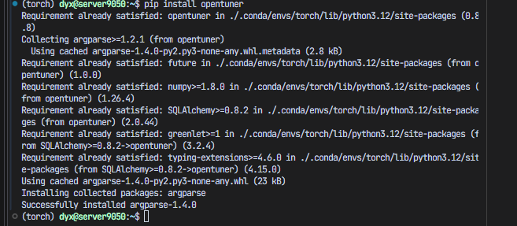

### 下载opentuner的仓库

github链接：

[jansel/opentuner: An extensible framework for program autotuning](https://github.com/jansel/opentuner)

下载方式：

```shell
git clone https://github.com/jansel/opentuner
```

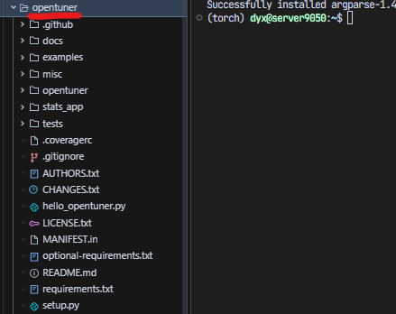

### 使用OpenTuner去调向量数据库时的配置

使用Opentuner的思路特别简单，就是把VDTuner当中可以调的所有参数都放到add_parameter当中，包括索引类型。

仔细观察一下`/home/dyx/VDTuner/auto-configure/whole_param.json`当中，有索引类型、索引参数，系统参数。

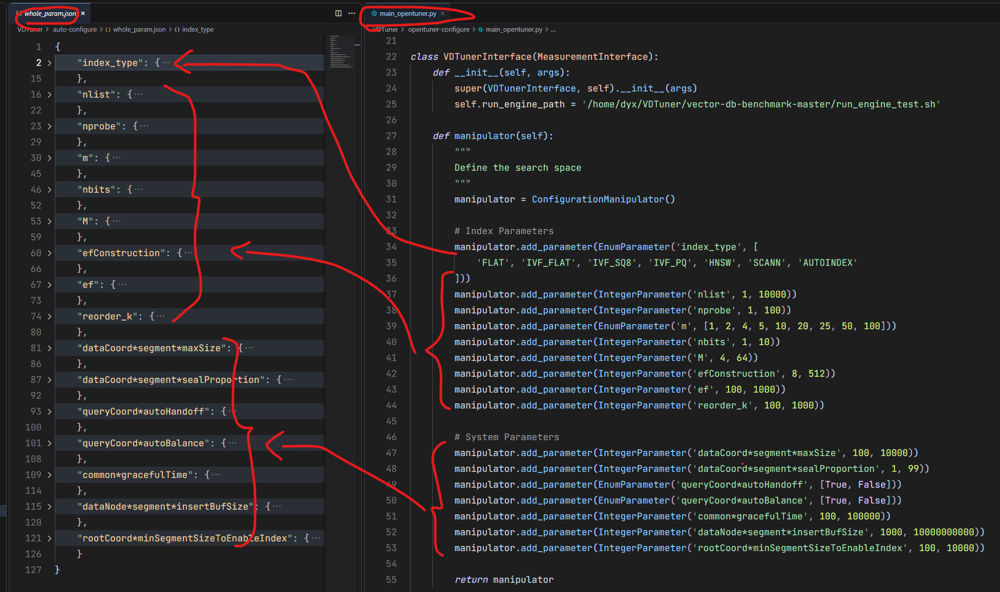

仔细观察就会发现，VDTuner当中的配置类型其实只有：Enum（枚举型）和Integer（整数类型）。

比如说，这里的`nprobe`就是整数类型，范围在1、2、3...100。

而m就是枚举类型，因为必须整除向量维度100，所以枚举的范围就是1、2、4...100

而另外的2种参数，浮点参数和2的幂参数并不涉及。

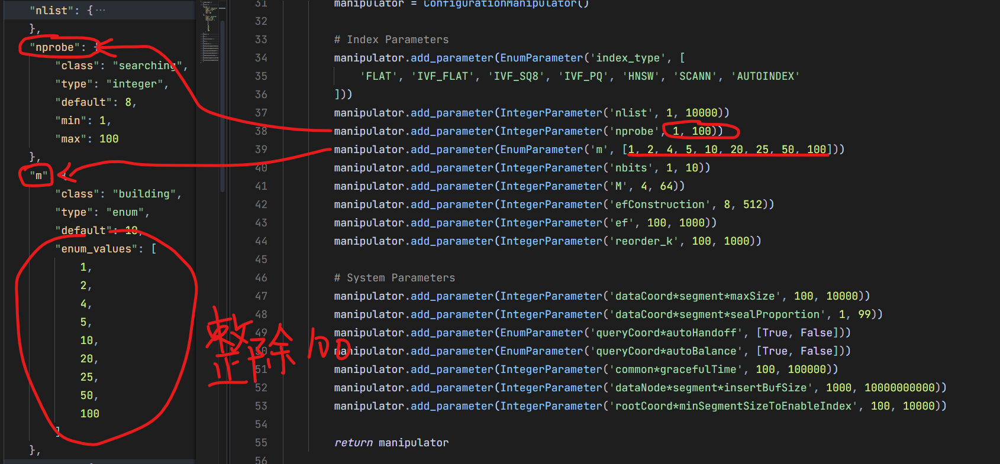

### 如何用OpenTuner去调用VDTuner的接口

显然，如果我们自己写一个opentuner的测试脚本去测数据集，显然是很麻烦的。

所以，应该**直接调用VDTuner写好的接口**，那就是`VDTuner/auto-configure`目录下的`configure.py`文件，当中有一个接口叫做`configure_index`，传入索引参数。

还有一个接口，叫做`configure_system`，传入系统参数(filter_system_rule函数，里面传入一个system_conf字典)，这个函数的效果就是去修改milvus.yaml。

然后**调用run_engine**，就可以按新的参数重启milvus，去测试修改了参数的向量数据库的效果。

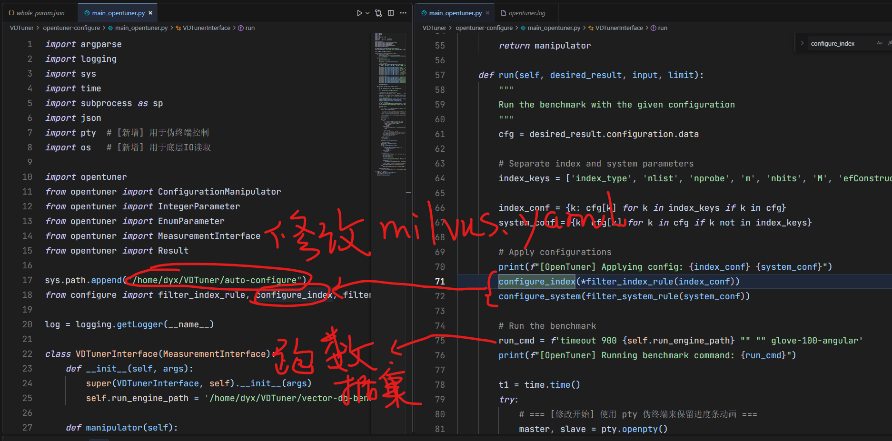

读取recall和rps的方法相同，还是从控制台读取。

OpenTuner会最小化time，而我们希望的是最大化rps，所以我们可以让time = -rps，这样最小化time就可以最大化rps。

注意！OpenTuner是一个**单目标优化器**，如果**time = -rps**，那么被优化的只有rps，没有precision，虽然precision作为一个accuracy字段会被插入到数据库。

所以，我们为了防止完全牺牲recall，例如recall=0.3，提升rps，例如rps=1000，我们必须加上一个额外的限制。

比如，当 **recall小于90%**的时候，time就是无穷大，相当于一个非常烂的结果（time越小越好)。

这是代码当中采取的方案(**带约束的单目标优化**)，相当于在recall>90%的时候，尽量优化rps，只要recall>90%，不考虑具体recall如何。

还有一种方案，是让**time = -rps * precision**，最小化time，就是最大化rps * precision，就回到了一开始的最大化面积的思路。

不过，这样可能找到一个recall=0.7, rps=1000的解，可能没有recall=0.9的好。

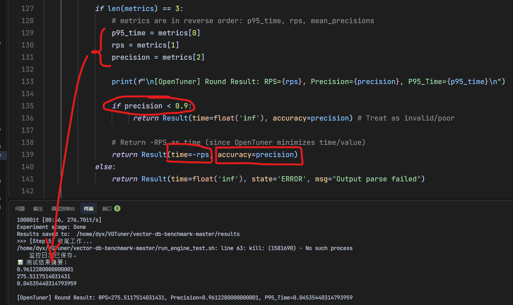

完整代码，需要粘贴到`/home/dyx/VDTuner/opentuner-configure/main_opentuner.py`

```python
import argparse
import logging
import sys
import time
import subprocess as sp
import json
import pty  # [新增] 用于伪终端控制
import os   # [新增] 用于底层IO读取

import opentuner
from opentuner import ConfigurationManipulator
from opentuner import IntegerParameter
from opentuner import EnumParameter
from opentuner import MeasurementInterface
from opentuner import Result

sys.path.append("/home/dyx/VDTuner/auto-configure")
from configure import filter_index_rule, configure_index, filter_system_rule, configure_system

log = logging.getLogger(__name__)

class VDTunerInterface(MeasurementInterface):
    def __init__(self, args):
        super(VDTunerInterface, self).__init__(args)
        self.run_engine_path = '/home/dyx/VDTuner/vector-db-benchmark-master/run_engine_test.sh'

    def manipulator(self):
        """
        Define the search space
        """
        manipulator = ConfigurationManipulator()
        
        # Index Parameters
        manipulator.add_parameter(EnumParameter('index_type', [
            'FLAT', 'IVF_FLAT', 'IVF_SQ8', 'IVF_PQ', 'HNSW', 'SCANN', 'AUTOINDEX'
        ]))
        manipulator.add_parameter(IntegerParameter('nlist', 1, 10000))
        manipulator.add_parameter(IntegerParameter('nprobe', 1, 100))
        manipulator.add_parameter(EnumParameter('m', [1, 2, 4, 5, 10, 20, 25, 50, 100]))
        manipulator.add_parameter(IntegerParameter('nbits', 1, 10))
        manipulator.add_parameter(IntegerParameter('M', 4, 64))
        manipulator.add_parameter(IntegerParameter('efConstruction', 8, 512))
        manipulator.add_parameter(IntegerParameter('ef', 100, 1000))
        manipulator.add_parameter(IntegerParameter('reorder_k', 100, 1000))

        # System Parameters
        manipulator.add_parameter(IntegerParameter('dataCoord*segment*maxSize', 100, 10000))
        manipulator.add_parameter(IntegerParameter('dataCoord*segment*sealProportion', 1, 99))
        manipulator.add_parameter(EnumParameter('queryCoord*autoHandoff', [True, False]))
        manipulator.add_parameter(EnumParameter('queryCoord*autoBalance', [True, False]))
        manipulator.add_parameter(IntegerParameter('common*gracefulTime', 100, 100000))
        manipulator.add_parameter(IntegerParameter('dataNode*segment*insertBufSize', 1000, 10000000000))
        manipulator.add_parameter(IntegerParameter('rootCoord*minSegmentSizeToEnableIndex', 100, 10000))

        return manipulator

    def run(self, desired_result, input, limit):
        """
        Run the benchmark with the given configuration
        """
        cfg = desired_result.configuration.data
        
        # Separate index and system parameters
        index_keys = ['index_type', 'nlist', 'nprobe', 'm', 'nbits', 'M', 'efConstruction', 'ef', 'reorder_k']
        
        index_conf = {k: cfg[k] for k in index_keys if k in cfg}
        system_conf = {k: cfg[k] for k in cfg if k not in index_keys}

        # Apply configurations
        print(f"[OpenTuner] Applying config: {index_conf} {system_conf}")
        configure_index(*filter_index_rule(index_conf))
        configure_system(filter_system_rule(system_conf))

        # Run the benchmark
        run_cmd = f'timeout 900 {self.run_engine_path} "" "" glove-100-angular'
        print(f"[OpenTuner] Running benchmark command: {run_cmd}")
        
        t1 = time.time()
        try:
            # === [修改开始] 使用 pty 伪终端来保留进度条动画 ===
            master, slave = pty.openpty()
            
            # 使用 slave 作为子进程的 stdout/stderr，这样子进程会认为它是 TTY
            # close_fds=True 确保除了 std 句柄外不传递其他句柄
            process = sp.Popen(run_cmd, shell=True, stdout=slave, stderr=slave, close_fds=True)
            
            # 父进程已经拿到了 master 句柄，不需要 slave 句柄了，关闭它以免死锁
            os.close(slave) 

            stdout_lines = []
            
            while True:
                try:
                    # 从 master 读取数据，每次读 1024 字节
                    # os.read 是阻塞的，直到有输出或者 EOF
                    output = os.read(master, 1024)
                    if not output:
                        break
                except OSError:
                    # 子进程结束时可能会抛出 I/O 错误（Input/output error），跳出循环
                    break
                
                # 解码并实时打印
                # end='' 防止 print 自动加换行符
                # flush=True 强制刷新缓冲区，确保进度条立刻显示
                text = output.decode('utf-8', errors='replace')
                print(text, end='', flush=True)
                stdout_lines.append(text)
            
            # 等待进程完全结束
            process.wait()
            # === [修改结束] ===
            
            stdout_str = "".join(stdout_lines)
            
            # 解析逻辑保持不变
            result_lines = stdout_str.split()
            metrics = []
            for val in reversed(result_lines):
                try:
                    metrics.append(float(val.strip(',')))
                    if len(metrics) == 3:
                        break
                except ValueError:
                    continue
            
            if len(metrics) == 3:
                # metrics are in reverse order: p95_time, rps, mean_precisions
                p95_time = metrics[0]
                rps = metrics[1]
                precision = metrics[2]
                
                print(f"\n[OpenTuner] Round Result: RPS={rps}, Precision={precision}, P95_Time={p95_time}\n")
                
                if precision < 0.9:
                     return Result(time=float('inf'), accuracy=precision) # Treat as invalid/poor

                # Return -RPS as time (since OpenTuner minimizes time/value)
                return Result(time=-rps, accuracy=precision)
            else:
                return Result(time=float('inf'), state='ERROR', msg="Output parse failed")

        except Exception as e:
             return Result(time=float('inf'), state='ERROR', msg=str(e))

if __name__ == '__main__':
    argparser = opentuner.default_argparser()
    args = argparser.parse_args()
    
    VDTunerInterface.main(args)
```


### 查看调优结果

安装sqlite viewer插件，然后直接查看生成的数据表

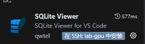

可以发现，time就是-rps，当准确率小于90%的时候，time就是无穷大，这和我们的预期相同。

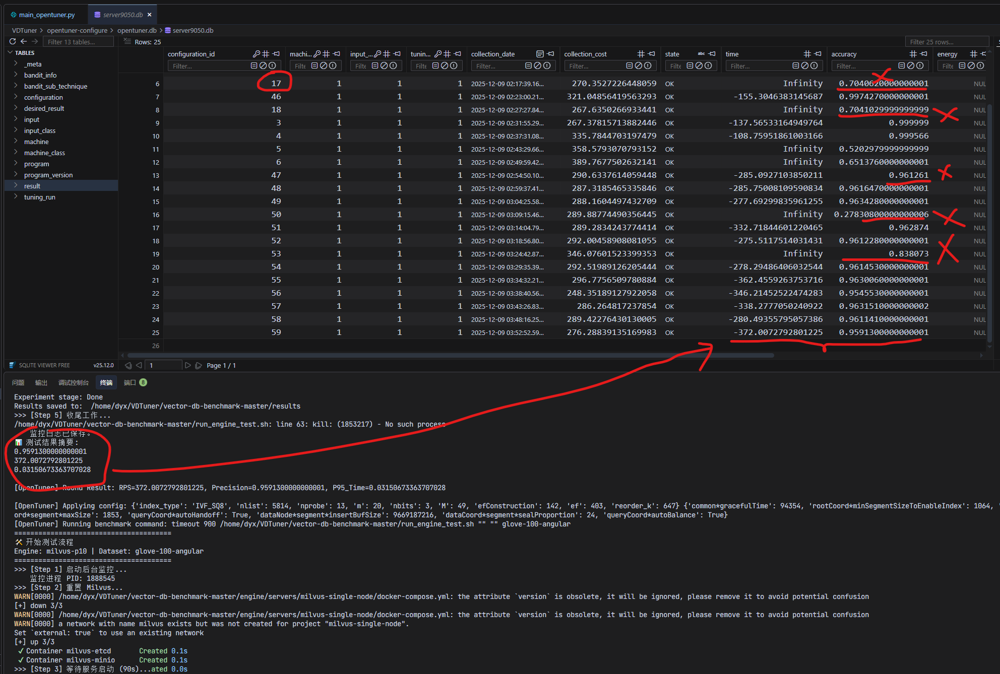

查看配置会发现没有人可以读的数据，我们需要把配置id和配置信息，还有rps、precision对应起来

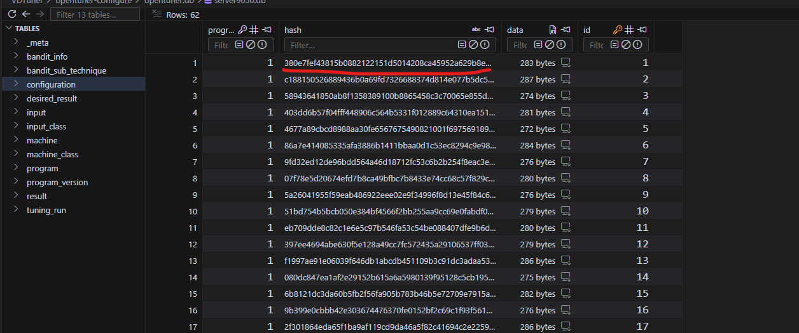

所以，这里写了一个脚本，读取目录下的数据库文件，然后把配置信息解析出来，和性能表现(recall/rps)都打印出来。

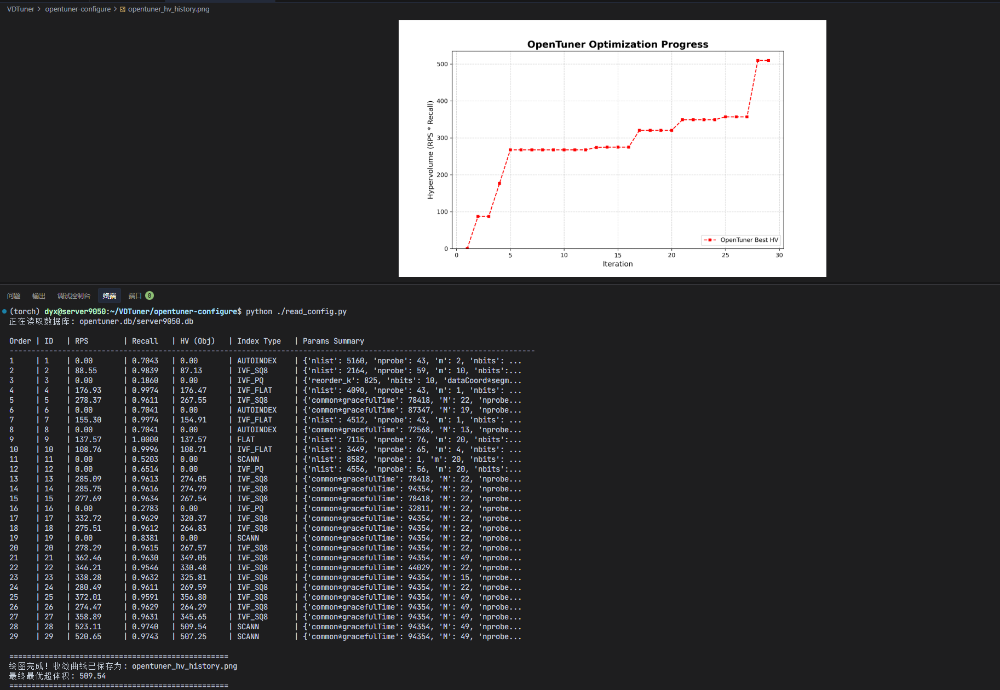

把recall>90%的rps设置为0，然后求出历史最优的超体积，可以看到这样的一条增长曲线

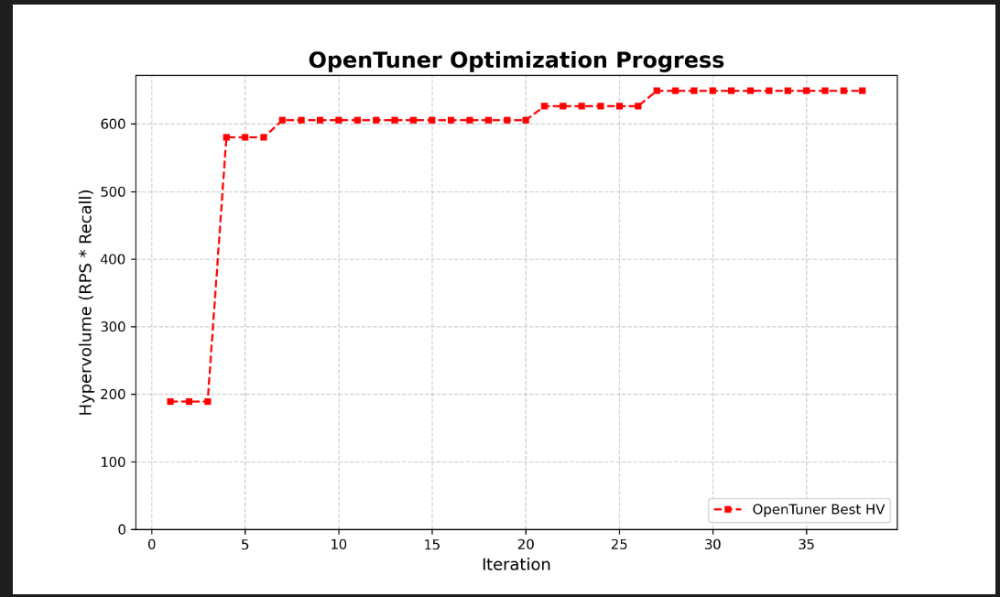

完整代码，粘贴到`/home/dyx/VDTuner/opentuner-configure/read_config.py`

```python
import sqlite3
import pickle
import os
import sys
import zlib
import matplotlib.pyplot as plt

# ---------------------------------------------------------
# 配置部分
# ---------------------------------------------------------
DB_FOLDER = "opentuner.db"
OUTPUT_IMAGE = "opentuner_hv_history.png"

# ---------------------------------------------------------
# 1. 自动定位数据库文件
# ---------------------------------------------------------
try:
    if not os.path.exists(DB_FOLDER):
         raise FileNotFoundError
    db_filename = [f for f in os.listdir(DB_FOLDER) if f.endswith('.db')][0]
except (IndexError, FileNotFoundError):
    print(f"错误：在 {DB_FOLDER} 目录中找不到 .db 文件")
    sys.exit(1)

db_path = os.path.join(DB_FOLDER, db_filename)
print(f"正在读取数据库: {db_path}\n")

# ---------------------------------------------------------
# 2. 连接数据库 & 查询
# ---------------------------------------------------------
conn = sqlite3.connect(db_path)
cursor = conn.cursor()

# 修改点：按照 collection_date (收集时间) 正序排列
sql = """
SELECT 
    r.id, 
    r.time, 
    r.accuracy, 
    c.data,
    r.collection_date
FROM 
    result r
JOIN 
    configuration c ON r.configuration_id = c.id
WHERE 
    r.state = 'OK' 
ORDER BY 
    r.collection_date ASC;
"""

cursor.execute(sql)
rows = cursor.fetchall()
conn.close()

# ---------------------------------------------------------
# 3. 数据处理与打印
# ---------------------------------------------------------
print(f"{'Order':<5} | {'ID':<4} | {'RPS':<10} | {'Recall':<8} | {'HV (Obj)':<10} | {'Index Type':<12} | {'Params Summary'}")
print("-" * 120)

history_best_hv = []
current_max_hv = 0.0
valid_iterations = []

for idx, row in enumerate(rows):
    run_id = row[0]
    time_val = row[1]   # OpenTuner 存的是 -RPS
    recall = row[2]
    blob_data = row[3]
    
    # --- A. 反序列化配置 ---
    config_dict = {}
    try:
        config_dict = pickle.loads(blob_data)
    except Exception:
        try:
            decompressed_data = zlib.decompress(blob_data)
            config_dict = pickle.loads(decompressed_data)
        except Exception:
            config_dict = {"error": "decode_fail"}

    # --- B. 计算指标 ---
    # 处理 RPS 为无穷大的异常情况
    if time_val == float('inf') or time_val == float('-inf'):
        real_rps = 0.0
    else:
        real_rps = -time_val # 还原 RPS
    
    # 计算超体积 Hypervolume = Recall * RPS
    hypervolume = real_rps * recall
    
    # --- C. 维护历史最优 (Monotonic Increase) ---
    if hypervolume > current_max_hv:
        current_max_hv = hypervolume
    
    history_best_hv.append(current_max_hv)
    valid_iterations.append(idx + 1)

    # --- D. 打印表格 ---
    # 提取索引类型
    index_type = config_dict.get('index_type', 'Unknown')
    
    # 简化打印：只打印除了 index_type 之外的前3个参数，防止表格太长
    # 实际写论文时可以把 config_dict 全部打出来
    simple_params = {k: v for k, v in config_dict.items() if k != 'index_type'}
    param_str = str(simple_params)
    if len(param_str) > 50:
        param_str = param_str[:47] + "..."

    print(f"{idx+1:<5} | {run_id:<4} | {real_rps:<10.2f} | {recall:<8.4f} | {hypervolume:<10.2f} | {index_type:<12} | {param_str}")

# ---------------------------------------------------------
# 4. 绘图 (仿照 VDTuner 风格)
# ---------------------------------------------------------
if len(history_best_hv) > 0:
    plt.figure(figsize=(10, 6))
    
    plt.plot(valid_iterations, history_best_hv, 
             color='red',           # 红色
             linestyle='--',        # 虚线
             marker='s',            # 方块标记
             markersize=4,
             label='OpenTuner Best HV')
    
    plt.ylim(ymin=0) 
    plt.title('OpenTuner Optimization Progress', fontsize=16, fontweight='bold')
    plt.xlabel('Iteration', fontsize=12)
    plt.ylabel('Hypervolume (RPS * Recall)', fontsize=12)
    plt.grid(True, linestyle='--', alpha=0.6)
    plt.legend(loc='lower right')
    
    plt.savefig(OUTPUT_IMAGE, dpi=300)
    print("\n" + "="*50)
    print(f"绘图完成！收敛曲线已保存为: {OUTPUT_IMAGE}")
    print(f"最终最优超体积: {current_max_hv:.2f}")
    print("="*50)
else:
    print("\n没有读取到有效数据，无法绘图。")
```


### 对比VDTuner

VDTuner收敛更快，更容易找到优秀的解。


### 选看：复用OpenTuner的sqlite数据库存储调优结果

粘贴`db_manager.py`到下载的opentuner的GitHub仓库的同级目录。

然后运行`db_manager.py`，这个代码模拟了一个空的Tuner，但是因为调用了OpenTuner，会生成一个.db文件。

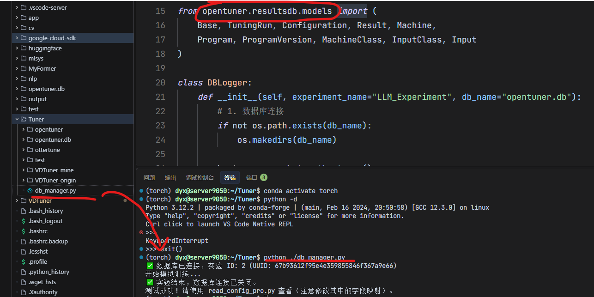

```python
import sys
import os
import time
import socket
import pickle
import uuid
import hashlib
from sqlalchemy import create_engine
from sqlalchemy.orm import sessionmaker, scoped_session

# 关键：把 opentuner 加入路径
sys.path.append(os.path.join(os.path.dirname(__file__), 'opentuner'))

# 引入 OpenTuner 的模型
from opentuner.resultsdb.models import (
    Base, TuningRun, Configuration, Result, Machine, 
    Program, ProgramVersion, MachineClass, InputClass, Input
)

class DBLogger:
    def __init__(self, experiment_name="LLM_Experiment", db_name="opentuner.db"):
        # 1. 数据库连接
        if not os.path.exists(db_name):
            os.makedirs(db_name)
        
        hostname = socket.gethostname()
        db_url = f'sqlite:///{db_name}/{hostname}.db'
        
        self.engine = create_engine(db_url, echo=False)
        Base.metadata.create_all(self.engine)
        
        self.Session = scoped_session(sessionmaker(bind=self.engine))
        self.session = self.Session()
        
        # 2. 初始化必要的元数据 (Program, Version, MachineClass 等)
        # 这是为了满足 TuningRun 的外键约束
        self._init_metadata(experiment_name)
        
        # 3. 创建本次实验 (TuningRun)
        self.tuning_run = TuningRun(
            uuid=uuid.uuid4().hex, # 源码要求 uuid
            program_version=self.program_version,
            machine_class=self.machine_class,
            input_class=self.input_class,
            name=experiment_name,
            args={'cmd': sys.argv}, # 存一下命令行参数
            state='RUNNING',
        )
        self.session.add(self.tuning_run)
        self.session.commit()
        print(f"✅ 数据库已连接，实验 ID: {self.tuning_run.id} (UUID: {self.tuning_run.uuid})")

    def _init_metadata(self, name):
        """初始化 OpenTuner 复杂的层级依赖"""
        hostname = socket.gethostname()
        
        # 1. Program & Version
        self.program = Program.get(self.session, project="LLM_Tuner", name=name)
        self.program_version = ProgramVersion.get(self.session, project="LLM_Tuner", name=name, version="1.0")
        
        # 2. Machine & MachineClass
        # 这里简化处理，把 hostname 作为 Class 名
        self.machine_class = MachineClass.get(self.session, name="Generic_GPU_Server")
        
        # 检查 Machine 是否存在，不存在则创建
        self.machine = self.session.query(Machine).filter_by(name=hostname).first()
        if not self.machine:
            self.machine = Machine(
                name=hostname, 
                machine_class=self.machine_class,
                cpu="Unknown", cores=1, memory_gb=1 # 填一些默认值
            )
            self.session.add(self.machine)
        
        # 3. Input & InputClass (必须有输入集定义)
        self.input_class = InputClass.get(self.session, program=self.program, name="default")
        self.input_obj = self.session.query(Input).filter_by(input_class=self.input_class).first()
        if not self.input_obj:
            self.input_obj = Input(input_class=self.input_class)
            self.session.add(self.input_obj)
            
        self.session.commit()

    def log(self, config_dict, metrics_dict):
        """
        记录一次训练结果
        :param config_dict: 超参数字典
        :param metrics_dict: 结果字典 (loss, acc, etc.)
        """
        # 1. 处理配置 (Configuration)
        # OpenTuner 需要计算 hash 来去重
        config_data = config_dict # sqlalchemy 会自动 pickle
        # 手动计算 hash (为了兼容 get 方法)
        dumped_data = pickle.dumps(config_data)
        config_hash = hashlib.sha256(dumped_data).hexdigest()
        
        # 使用 models.py 提供的 get 方法获取或创建 Configuration
        config = Configuration.get(self.session, self.program, config_hash, config_data)
        
        # 2. 提取主要指标
        # 我们约定：把最重要的 loss 存入 time (因为 OpenTuner 默认最小化 time)
        # 把 accuracy 存入 accuracy
        # 其他所有指标存入 extra 字段
        
        primary_loss = metrics_dict.get('loss', 0.0)
        primary_acc = metrics_dict.get('accuracy', 0.0)
        
        # 3. 创建结果
        result = Result(
            tuning_run=self.tuning_run,
            configuration=config,
            machine=self.machine,
            input=self.input_obj,
            state='OK',
            time=primary_loss,      # 存 Loss
            accuracy=primary_acc,   # 存 Accuracy
            collection_cost=0.0
        )
        
        # 关键：利用 models.py 定义的 extra 字典存其他任意数据
        # 源码 class Result: extra = Column(MutableDict.as_mutable(PickleType...))
        result.extra = metrics_dict
        
        self.session.add(result)
        self.session.commit()
        # print(f"  -> 已保存: Loss={primary_loss}")

    def close(self):
        self.tuning_run.state = 'COMPLETE'
        self.tuning_run.end_date = func.now() # 使用数据库时间
        self.session.commit()
        self.session.close()
        print("✅ 实验结束，数据库连接已关闭。")
        
# 引入 func 用于获取时间
from sqlalchemy import func

# --- 测试代码 ---
if __name__ == "__main__":
    # 使用方式：
    logger = DBLogger(experiment_name="Llama3_FineTuning")
    
    import random
    print("开始模拟训练...")
    for i in range(3):
        # 1. 定义你的 LLM 参数
        cfg = {
            'lr': 0.0001 * (i+1),
            'batch_size': 32,
            'optimizer': 'adamw'
        }
        
        # 2. 模拟得到结果
        metrics = {
            'loss': 2.5 - i*0.5,
            'accuracy': 0.8 + i*0.05,
            'perplexity': 10.5 - i,  # 额外指标
            'gpu_mem': '12GB'       # 额外指标
        }
        
        # 3. 记录
        logger.log(cfg, metrics)
        
    logger.close()
    print("测试成功！请使用 read_config_pro.py 查看（注意修改其中的字段映射）。")
```

