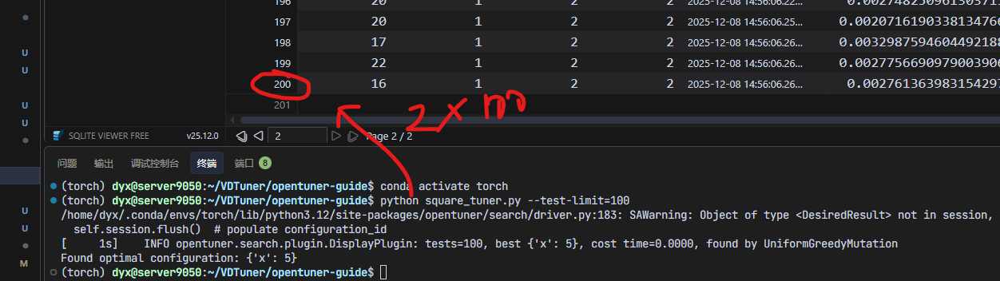
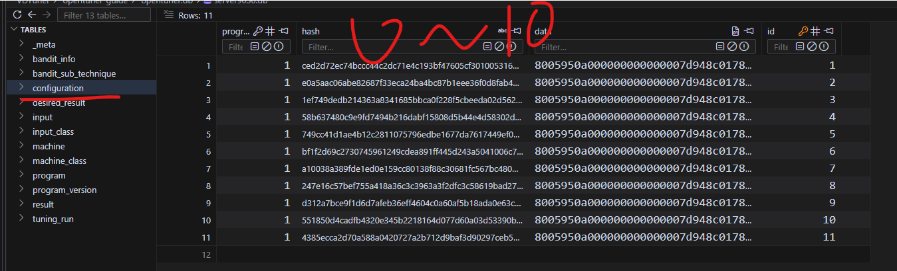
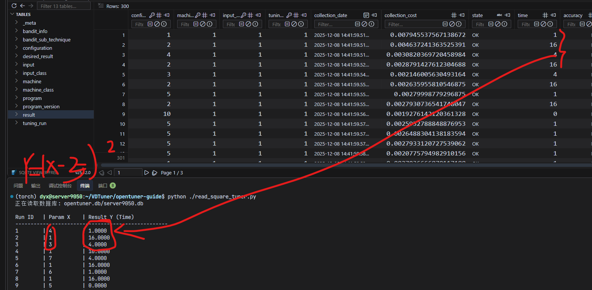

# OpenTuner：你的智能调优伙伴 🚀

欢迎来到 OpenTuner 的世界！把它想象成一位不知疲倦、极其聪明的“调参大师”，它能帮助你的程序找到最佳的运行参数，让性能“飞”起来！

---

## 1. OpenTuner 是什么？🤔

简单来说，OpenTuner 是一个**自动化的软件调优框架**。

- **“调优”** 是什么？就是调整程序的各种参数（比如缓存大小、线程数、编译选项等），以达到最佳性能（比如运行得更快、占用内存更少）。
- **“自动化”** 意味着你不需要手动去尝试成千上万种参数组合。你只需告诉 OpenTuner：
    1.  **哪些参数可以调？**（比如，一个范围在 1 到 100 的整数）
    2.  **如何衡量“好”与“坏”？**（比如，程序的运行时间，越短越好）

然后，OpenTuner 就会施展它的“魔法”，利用复杂的搜索算法（比如遗传算法、模拟退火等），高效地在巨大的参数空间中寻找“最优解”。

就像你告诉一位大厨：“你可以调整盐、糖、醋的用量，目标是让这道菜的评分最高。” 大厨会根据经验和不断尝试，快速找到那个黄金配比。OpenTuner 就是这样一位“算法大厨”。

---

## 2. 核心三步：如何使用 OpenTuner？

使用 OpenTuner 非常简单，只需要三步：

### 第一步：定义你的“参数菜单” (Configuration)

你需要告诉 OpenTuner 哪些参数是可变的。这些参数就像菜单上的菜品，OpenTuner 会从中选择组合。

常见的参数类型有：

- `IntegerParameter('x', 0, 10)`：一个名为 `x` 的整数，范围从 0 到 10。
- `FloatParameter('y', 0.0, 1.0)`：一个名为 `y` 的浮点数，范围从 0.0 到 1.0。
- `EnumParameter('z', ['on', 'off'])`：一个名为 `z` 的枚举值，只能是 'on' 或 'off'。
- `PowerOfTwoParameter('p', 1, 256)`：一个名为 `p` 的参数，值是 2 的幂（1, 2, 4, 8, ..., 256）。

### 第二步：编写你的“品尝函数” (run)

这是最关键的一步。你需要编写一个 `run` 函数，这个函数会：

1.  接收 OpenTuner 给定的一组参数（我们称之为 `configuration`）。
2.  使用这组参数来运行你的程序。
3.  测量程序的性能（比如运行时间）。
4.  返回一个 `Result` 对象，告诉 OpenTuner 这次尝试的结果。

```python
from opentuner.resultsdb.models import Result

def run(self, configuration, result):
    # 1. 从 configuration 中获取参数
    x = configuration.data['x']

    # 2. 运行你的程序（这里我们用一个简单的数学函数代替）
    # 假设我们要找 y = (x-5)^2 的最小值
    value = (x - 5)**2

    # 3. 返回结果，告诉 OpenTuner 这次跑了多久（或得到了什么值）
    return Result(time=value)
```

**请注意：** 在上面的例子中，我们把要优化的值 `value` 赋给了 `time`。在 OpenTuner 中，**目标永远是最小化 `time`**。所以，如果你想最大化某个值（比如准确率），你需要把它转换一下，比如返回 `Result(time = 1.0 - accuracy)`。

### 第三步：启动“调优大师”

最后，写一个主程序来启动 OpenTuner。

```python
import opentuner
from opentuner.search.manipulator import (ConfigurationManipulator,
                                         IntegerParameter)
from opentuner.search.objective import MinimizeTime
from opentuner.resultsdb.models import Result
from opentuner import MeasurementInterface
from opentuner import TuningRun

class MyTuner(MeasurementInterface):

    def manipulator(self):
        # ... 在这里定义你的参数 ...
        manipulator = ConfigurationManipulator()
        manipulator.add_parameter(IntegerParameter('x', 0, 10))
        return manipulator

    def run(self, configuration, result):
        # ... 在这里编写你的运行和评估逻辑 ...
        x = configuration.data['x']
        value = (x - 5)**2
        return Result(time=value)

    # (可选) 你可以定义一个 save_final_config 函数
    # 当调优结束时，OpenTuner 会调用它来保存最佳配置
    def save_final_config(self, configuration):
        print("找到的最佳参数:", configuration.data)

if __name__ == '__main__':
    # 启动调优
    arg_parser = opentuner.default_argparser()
    MyTuner.main(arg_parser.parse_args())
```

---

## 3. 一个最小化的例子：寻找二次函数的最小值

为了让你有更直观的感受，我们来看一个最简单的例子：用 OpenTuner 找到函数 `y = (x-5)^2` 在 `x` 取值 `[0, 1, 2, 3, 4, 5, 6, 7, 8, 9, 10]` 范围内的最小值。

我们都知道，当 `x` 为 `5` 时，`y` 取得最小值。让我们看看 OpenTuner 能不能帮我们找到这个答案！

这个例子就在旁边的 `square_tuner.py` 文件里。

```python
#!/usr/bin/env python
import opentuner
from opentuner import ConfigurationManipulator
from opentuner import IntegerParameter
from opentuner import MeasurementInterface
from opentuner import Result

class SquareTuner(MeasurementInterface):

  def manipulator(self):
    """
    定义搜索空间。
    """
    manipulator = ConfigurationManipulator()
    manipulator.add_parameter(
      IntegerParameter('x', 0, 10))
    return manipulator

  def run(self, desired_result, input, limit):
    """
    运行一个给定的配置并返回性能。
    """
    cfg = desired_result.configuration.data
    x_value = cfg['x']

    # 一个简单的目标函数，OpenTuner会尝试最小化它
    objective_value = (x_value - 5)**2

    return Result(time=objective_value)

  def save_final_config(self, configuration):
    """在调优结束时调用"""
    print("Found optimal configuration:", configuration.data)

if __name__ == '__main__':
  argparser = opentuner.default_argparser()
  SquareTuner.main(argparser.parse_args())
```

你可以这样运行它：

```bash
# 安装 opentuner (如果还没安装的话)
pip install opentuner

# 运行我们的调优程序，--test-limit=100 表示让它测试 100 次
python square_tuner.py --test-limit=100
```

当你运行它时，你会看到 OpenTuner 不断地尝试不同的 `x` 值，并记录每次的结果。它会从一个比较大的范围开始探索，然后慢慢地、智能地找到最优解 `5` 。

最终，它会告诉你它找到的最佳 `x` 值，你会发现这个值就是 `5`！

注意：这里的`--test-limit=100`是必须的，否则**程序无法停下**。


每次运行opentuner，都会在执行的路径下生成一个`opentuner.db`文件。

```shell
(torch) dyx@server9050:~/VDTuner/opentuner-guide/opentuner.db$ ls
server9050.db
```

有时候会因为这个数据库锁死导致卡死，提示数据库相关的报错，此时，只需要把opentuner.db文件夹删掉就行。


因为使用的是sqlite，可以用vscode插件，叫做sqlite viewer，去查看数据表的结构


关键是要看result，其中的time就是要优化到最小的对象，也就是(x-5)^2

而这里的configuration_id并不是x，而是配置号的意思。这里可以看到正好有100条配置和对应的time。


值得注意的是，这个数据库是追加写，而不是覆盖写，这意味着，每次调优之前需要把之前的数据库移除（文件夹删掉），否则调优记录就混在一起了。

比如这里，程序运行两次之后，记录就增加到了200条。



我们可以在configuration看到配置号和配置的对应关系，但是这里用序列化数据表示，所以我们也无法直接读取x，不过可以使用一个脚本来打印一下



把这个脚本`read_square_tuner.py`放到square_tuner的同级目录

```python
import sqlite3
import pickle
import os
import sys
import zlib

# ---------------------------------------------------------
# 1. 自动定位数据库文件
# ---------------------------------------------------------
db_folder = "opentuner.db"
try:
    if not os.path.exists(db_folder):
         raise FileNotFoundError
    # 找到文件夹里唯一的 .db 文件
    db_filename = [f for f in os.listdir(db_folder) if f.endswith('.db')][0]
except (IndexError, FileNotFoundError):
    print(f"错误：在 {db_folder} 目录中找不到 .db 文件")
    sys.exit(1)

db_path = os.path.join(db_folder, db_filename)
print(f"正在读取数据库: {db_path}\n")

# ---------------------------------------------------------
# 2. 连接数据库 & 查询
# ---------------------------------------------------------
conn = sqlite3.connect(db_path)
cursor = conn.cursor()

# 联合查询 result 和 configuration
# 按照 ID 排序，这样能看到 OpenTuner 是如何一步步尝试的
sql = """
SELECT 
    r.id, 
    r.time, 
    c.data 
FROM 
    result r
JOIN 
    configuration c ON r.configuration_id = c.id
WHERE 
    r.state = 'OK'
ORDER BY 
    r.id ASC;
"""

cursor.execute(sql)
rows = cursor.fetchall()
conn.close()

# ---------------------------------------------------------
# 3. 数据处理与打印
# ---------------------------------------------------------
print(f"{'Run ID':<8} | {'Param X':<10} | {'Result Y (Time)':<20}")
print("-" * 50)

best_y = float('inf')
best_x = None

for row in rows:
    run_id = row[0]
    y_val = row[1]   # 在 SquareTuner 里，time 就是 y = (x-5)^2
    blob_data = row[2]

    # --- 反序列化配置 (解码 X) ---
    config_dict = {}
    try:
        config_dict = pickle.loads(blob_data)
    except Exception:
        try:
            # 尝试 zlib 解压
            decompressed_data = zlib.decompress(blob_data)
            config_dict = pickle.loads(decompressed_data)
        except Exception as e:
            print(f"ID {run_id} 解析失败: {e}")
            continue

    # 提取 X
    x_val = config_dict.get('x', 'N/A')

    # 打印一行数据
    print(f"{run_id:<8} | {x_val:<10} | {y_val:<20.4f}")

    # 记录最优解
    if isinstance(y_val, (int, float)) and y_val < best_y:
        best_y = y_val
        best_x = x_val

print("-" * 50)
print(f"【总结】\nOpenTuner 找到的最小值 (Best Y): {best_y}")
print(f"对应的参数 (Best X): {best_x}")
```

运行这个代码就可以把配置(x)和目标值(time)都打印出来。



